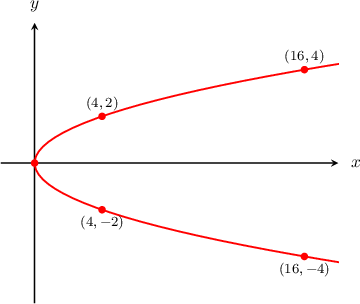
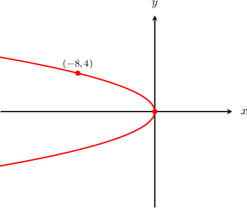
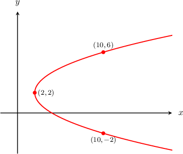
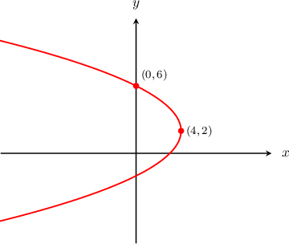

# Left and Right Opening Parabolas

Source: https://www.mathacademy.com/topics/1124?courseId=51
Topic ID: 1124

## Prerequisites

- [Upward and Downward Opening Parabolas](./1125-upward-and-downward-opening-parabolas.md)
- [Plotting X as a Function of Y](./2978-plotting-x-as-a-function-of-y.md)

## Lesson

### Introduction

The equation $y^2=x$ represents a parabola whose vertex is $(0,0)$ and whose arms open to the right. Its graph is shown below:

We can verify that this graph is correct by checking some points on the curve:

The general standard equation of a parabola whose vertex is $(0,0)$ and whose arms open right or left is given by

$$

y^2 = 4px,

$$

where $p$ is a constant.

The value of $p$ describes some features of the parabola. For example,

- when $p > 0,$ the arms of the parabola open to the right, and

- when $p < 0,$ the arms of the parabola open to the left.

Notice that we can rewrite the equation $y^2=x$ as

$$

y^2 = 4 \left( \dfrac{1}{4} \right) x.

$$

So we have $p=\dfrac{1}{4}.$ For $p> 0,$ the arms of the parabola open to the right, as we see in our diagram above.

### Example: Finding the Equation of a Left or Right-Opening Parabola with Vertex at the Origin Given a Graph

#### Question

What is the equation of the parabola shown above?

#### Explanation

From the diagram, we see that the arms of the parabola open to the left. The parabola has its vertex at $(0,0)$ and passes through the point $(-8,4).$

The general standard equation of a parabola whose vertex is $(0,0)$ and whose arms open right or left is given by

$$

y^2 = 4px.

$$

Since we know the given parabola passes through the point $(-8,4),$ we can substitute $x = -8$ and $y = 4$ into the standard equation and solve for $p\mathbin{:}$

$$

\begin{aligned}𝑦^{2} & =4𝑝𝑥 \\ 4^{2} & =4𝑝(−8) \\ 16 & =−32𝑝 \\ 𝑝 & =−\frac{1}{2}\end{aligned}

$$

So, the equation of the parabola is

$$

\begin{aligned}𝑦^{2} & =4𝑝𝑥 \\ 𝑦^{2} & =4(−\frac{1}{2})𝑥 \\ 𝑦^{2} & =−2𝑥.\end{aligned}

$$

Notice that the arms of the parabola open to the left since $p = -\dfrac{1}{2}$ is negative.

### Example: Finding the Equation of a Left or Right-Opening Parabola with Vertex at the Origin Given Another Point

#### Question

Find the equation of the right-opening parabola that has its vertex at $(0,0)$ and passes through the point $(4,4).$

#### Explanation

The general standard equation of a parabola whose vertex is $(0,0)$ and whose arms open right or left is given by

$$

y^2 = 4px.

$$

Since we know the given parabola passes through the point $(4,4),$ we can substitute $x=4$ and $y=4$ into the standard equation and solve for $p\mathbin{:}$

$$

\begin{aligned}𝑦^{2} & =4𝑝𝑥 \\ 4^{2} & =4𝑝(4) \\ 16 & =16𝑝 \\ 𝑝 & =1\end{aligned}

$$

So, the equation of the parabola is

$$

\begin{aligned}𝑦^{2} & =4𝑝𝑥 \\ 𝑦^{2} & =4(1)𝑥 \\ 𝑦^{2} & =4𝑥.\end{aligned}

$$

### Left and Right-Opening Parabolas with Vertex at (h,k)

The equation $(y-2)^2=2(x-2)$ represents a parabola whose vertex is $(2,2)$ and whose arms open to the right. Its graph is shown below:

We can verify that this graph is correct by checking some points on the curve:

The general standard equation of a parabola whose vertex is $(h,k)$ and whose arms open to the right or left is given by

$$

(y-k)^2 = 4p(x-h),

$$

where $p$ is a constant. As usual,

- when $p > 0$, the arms of the parabola opens to the right, and

- when $p < 0$, arms of the parabola open to the left.

Notice that we can rewrite the equation of our parabola $(y-2)^2=2(x-2)$ as

$$

(y-2)^2=4 \left( \dfrac{1}{2} \right)(x-2).

$$

So we have $p=\dfrac{1}{2}.$ For $p > 0,$ the arms of the parabola open to the right, as we see in the diagram above.

### Example: Finding the Equation of a Left or Right-Opening Parabola Given a Graph

#### Question

What is the equation of the parabola shown above?

#### Explanation

From the diagram we see that the arms of the parabola open to the left. The parabola has its vertex at $(4,2)$ and passes through the point $(0,6).$

The general standard equation of a parabola whose vertex is $(h, k)$ and whose arms open right or left is given by

$$

\begin{aligned}(𝑦−𝑘)^{2} & =4𝑝(𝑥−ℎ).\end{aligned}

$$

Since we know that the given parabola has its vertex at $(h, k) = (4,2),$ we substitute $h=4$ and $k=2$ into the equation above and get

$$

\begin{aligned}(𝑦−2)^{2} & =4𝑝(𝑥−4).\end{aligned}

$$

We also know that the given parabola passes through the point $(0,6),$ so we can substitute $x=0$ and $y=6$ into the equation above and solve for $p\mathbin{:}$

$$

\begin{aligned}(𝑦−2)^{2} & =4𝑝(𝑥−4) \\ (6−2)^{2} & =4𝑝(0−4) \\ 16 & =−16𝑝 \\ 𝑝 & =−1\end{aligned}

$$

So, the equation of the parabola is

$$

\begin{aligned}(𝑦−2)^{2} & =4𝑝(𝑥−4) \\ (𝑦−2)^{2} & =4(−1)(𝑥−4) \\ (𝑦−2)^{2} & =−4(𝑥−4).\end{aligned}

$$

Notice that the arms of the parabola open to the left since $p = -1$ is negative.

### Example: Finding the Equation of a Left or Right-Opening Parabola Given the Vertex and Another Point

#### Question

Find the equation of the left-opening parabola that has its vertex at $(2,-2)$ and passes through the point $(-6,2).$

#### Explanation

The general standard equation of a parabola whose vertex is $(h, k)$ and whose arms open right or left is given by

$$

\begin{aligned}(𝑦−𝑘)^{2} & =4𝑝(𝑥−ℎ).\end{aligned}

$$

Since we know that the given parabola has its vertex at $(h, k) = (2,-2),$ we substitute $h=2$ and $k=-2$ into the equation above and get

$$

\begin{aligned}(𝑦+2)^{2} & =4𝑝(𝑥−2).\end{aligned}

$$

We also know that the given parabola passes through the point $(-6, 2),$ so we can substitute $x=-6$ and $y=2$ into the equation above and solve for $p\mathbin{:}$

$$

\begin{aligned}(𝑦+2)^{2} & =4𝑝(𝑥−2) \\ (2+2)^{2} & =4𝑝(−6−2) \\ 16 & =−32𝑝 \\ 𝑝 & =−\frac{1}{2}\end{aligned}

$$

So, the equation of the parabola is

$$

\begin{aligned}(𝑦+2)^{2} & =4𝑝(𝑥−2) \\ (𝑦+2)^{2} & =4(−\frac{1}{2})(𝑥−2) \\ (𝑦+2)^{2} & =−2(𝑥−2).\end{aligned}

$$
