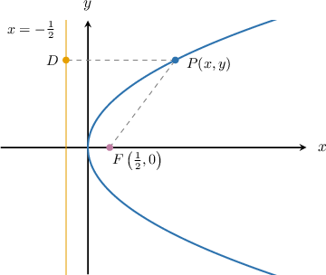
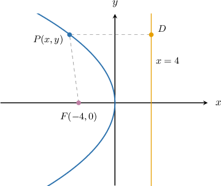
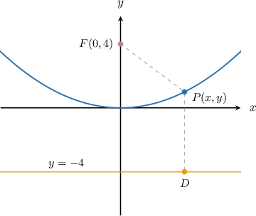

# The Focus-Directrix Property of a Parabola

Source: https://www.mathacademy.com/topics/1155?courseId=51
Topic ID: 1155

## Prerequisites

- [The Distance Formula](../geometry/459-the-distance-formula.md)
- [Calculating the Vertex of a Parabola by Completing the Square](./3534-calculating-the-vertex-of-a-parabola-by-completing-the-square.md)

## Lesson

### Introduction

A parabola can be defined as a set of points that satisfy the **focus-directrix property.**

To demonstrate this property, consider the diagram below.

The point $F\left(\dfrac12,0\right)$ is called the **focus,** and the vertical line $x=-\dfrac 1 2$ is known as the **directrix**. Every parabola has a *unique* focus and a *unique* directrix associated with it.

The focus-directrix property states that for any point $P(x,y)$ on a parabola, the distance from $P$ to the focus $F$ equals the perpendicular distance from $P$ to the directrix line, i.e.,

$$

|PF| = |PD|.

$$

Let's use this to determine the equation of the parabola on the diagram above.

First, we find $|PF|^2$ using the distance formula.

$$

\begin{aligned}|𝑃𝐹|^{2} & =(𝑥−\frac{1}{2})^{2}+(𝑦−0)^{2} \\ & =(𝑥−\frac{1}{2})^{2}+𝑦^{2}\end{aligned}

$$

Then, we determine $|PD|^2$:

$$

\begin{aligned}|𝑃𝐷|^{2} & =(𝑥−(−\frac{1}{2}))^{2} \\ & =(𝑥+\frac{1}{2})^{2}.\end{aligned}

$$

Using the focus-directrix property, we have $|PF| = |PD|$. Hence,

$$

\begin{aligned}|𝑃𝐹|^{2} & =|𝑃𝐷|^{2} \\ (𝑥−\frac{1}{2})^{2}+𝑦^{2} & =(𝑥+\frac{1}{2})^{2} \\ 𝑥^{2}−𝑥+\frac{1}{4}+𝑦^{2} & =𝑥^{2}+𝑥+\frac{1}{4} \\ 𝑦^{2} & =2𝑥.\end{aligned}

$$

The parabola on the diagram has the equation $y^2 = 2x.$

### Example: Finding the Equation of a Left-Opening or Right-Opening Parabola From a Diagram

#### Question

The diagram above shows a parabola with focus $F(-4,0)$ and directrix $x=4.$ What is the equation of the parabola?

#### Explanation

The focus-directrix property states that any parabola can be defined as the set of points $P(x,y)$ which are the same distance from both the focus and the directrix, i.e.,

$$

|PF| = |PD|.

$$

Let's use this to determine the equation of the parabola shown in the diagram above.

First, we find $|PF|^2$ using the distance formula:

$$

\begin{aligned}|𝑃𝐹|^{2} & =(𝑥−(−4))^{2}+(𝑦−0)^{2} \\ & =(𝑥+4)^{2}+𝑦^{2}\end{aligned}

$$

Then, we determine $|PD|^2$:

$$

\begin{aligned}|𝑃𝐷|^{2} & =(𝑥−4)^{2}\end{aligned}

$$

Using the focus-directrix property, we have $|PF| = |PD|.$ Hence,

$$

\begin{aligned}(𝑥+4)^{2}+𝑦^{2} & =(𝑥−4)^{2} \\ 𝑥^{2}+8𝑥+16+𝑦^{2} & =𝑥^{2}−8𝑥+16 \\ 𝑦^{2} & =−16𝑥\end{aligned}

$$

Therefore, the equation of the parabola is $y^2 =-16x.$

### Example: Finding the Equation of a Upward-Opening or Downward-Opening Parabola From a Diagram

#### Question

The parabola shown above has focus $F\left(0,4\right)$ and directrix $y=-4.$ What is the equation of the parabola?

#### Explanation

The focus-directrix property states that any parabola can be defined as the set of points $P(x,y)$ which are the same distance from both the focus and the directrix, i.e.,

$$

|PF| = |PD|.

$$

Let's use this to determine the equation of the parabola shown in the diagram above.

First, we find $|PF|^2$ using the distance formula:

$$

\begin{aligned}|𝑃𝐹|^{2} & =(𝑥−0)^{2}+(𝑦−4)^{2} \\ & =𝑥^{2}+(𝑦−4)^{2}\end{aligned}

$$

Then, we determine $|PD|^2{:}$

$$

\begin{aligned}|𝑃𝐷|^{2} & =(𝑦−(−4))^{2} \\ & =(𝑦+4)^{2}\end{aligned}

$$

Using the focus-directrix property, we have $|PF| = |PD|.$ Hence,

$$

\begin{aligned}𝑥^{2}+(𝑦−4)^{2} & =(𝑦+4)^{2} \\ 𝑥^{2}+𝑦^{2}−8𝑦+16 & =𝑦^{2}+8𝑦+16 \\ 𝑥^{2} & =16𝑦.\end{aligned}

$$

Therefore, the equation of the parabola is $x^2 =16y.$

### Example: Finding the Equation of a Left-Opening or Right-Opening Parabola Given Its Focus and Directrix

#### Question

A parabola has focus $F\left(3, 0\right)$ and directrix $x = -1.$ What is the equation of the parabola?

#### Explanation

The focus-directrix property states that any parabola can be defined as the set of points $P(x,y)$ which are the same distance from both the focus and the directrix, i.e.,

$$

|PF| = |PD|.

$$

Let's use this to determine the equation of the parabola.

First, we find $|PF|^2$ using the distance formula:

$$

\begin{aligned}|𝑃𝐹|^{2} & =(𝑥−3)^{2}+(𝑦−0)^{2} \\ & =(𝑥−3)^{2}+𝑦^{2}\end{aligned}

$$

Then, we determine $|PD|^2 \mathbin{:}$

$$

\begin{aligned}|𝑃𝐷|^{2} & =(𝑥+1)^{2}\end{aligned}

$$

Using the focus-directrix property, we have $|PF| = |PD|.$ Hence,

$$

\begin{aligned}(𝑥−3)^{2}+𝑦^{2} & =(𝑥+1)^{2} \\ 𝑥^{2}−6𝑥+9+𝑦^{2} & =𝑥^{2}+2𝑥+1 \\ 𝑦^{2} & =8𝑥−8 \\ 𝑦^{2} & =8(𝑥−1).\end{aligned}

$$

Therefore, the equation of the parabola is $y^2 = 8(x -1).$

### Example: Finding the Equation of an Upward-Opening or Downward-Opening Parabola Given Its Focus and Directrix

#### Question

A parabola has focus $F\left(0,4\right)$ and directrix $y=-4.$ What is the equation of the parabola?

#### Explanation

The focus-directrix property states that any parabola can be defined as the set of points $P(x,y)$ which are the same distance from both the focus and the directrix, i.e.,

$$

|PF| = |PD|.

$$

Let's use this to determine the equation of the parabola on the diagram above.

First, we find $|PF|^2$ using the distance formula:

$$

\begin{aligned}|𝑃𝐹|^{2} & =(𝑥−0)^{2}+(𝑦−4)^{2} \\ & =𝑥^{2}+(𝑦−4)^{2}\end{aligned}

$$

Then, we determine $|PD|^2 \mathbin{:}$

$$

\begin{aligned}|𝑃𝐷|^{2} & =(𝑦−(−4))^{2} \\ & =(𝑦+4)^{2}\end{aligned}

$$

Using the focus-directrix property, we have $|PF| = |PD|.$ Hence,

$$

\begin{aligned}𝑥^{2}+(𝑦−4)^{2} & =(𝑦+4)^{2} \\ 𝑥^{2}+𝑦^{2}−8𝑦+16 & =𝑦^{2}+8𝑦+16 \\ 𝑥^{2} & =16𝑦.\end{aligned}

$$

Therefore, the equation of the parabola is $x^2 = 16y.$
