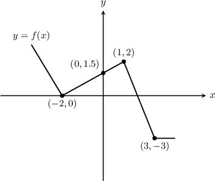
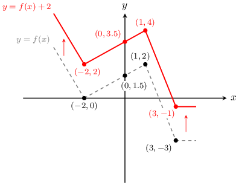
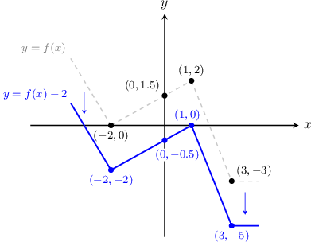
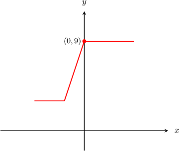
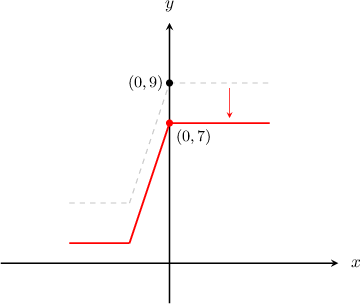
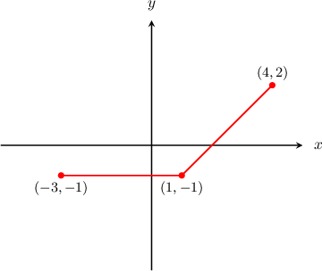
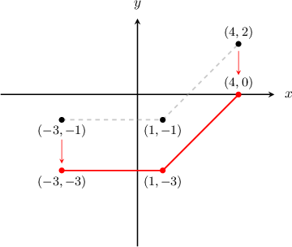
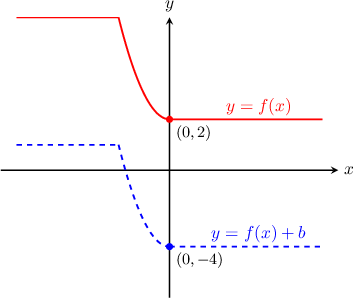
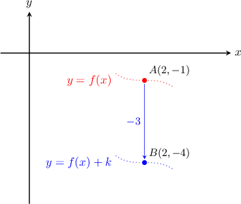
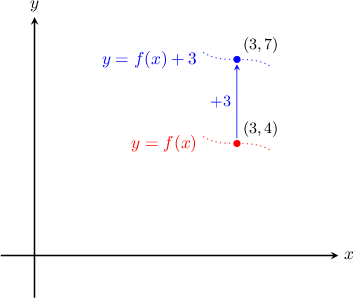

# Vertical Translations of Functions

Source: https://www.mathacademy.com/topics/1251?courseId=51
Topic ID: 1251

## Prerequisites

- [Graphs of Functions](../algebra-i/3821-graphs-of-functions.md)

## Lesson

### Introduction

Suppose that we have the graph of $y=f(x)$ shown below. What would the graph of $y=f(x)+2$ look like, and how does it relate to the original curve?

For each point on the graph of $y=f(x)$ there is a corresponding point on the graph of $y=f(x)+2$ with the same $x$-value and a $y$-value that is two units greater. So let's create a table of points.

$$

\begin{aligned}Points on y=f(x) & Points on y=f(x)+2 \\ (−2,0) & (−2,2) \\ (0,1.5) & (0,3.5) \\ (1,2) & (1,4) \\ (3,−3) & (3,−1)\end{aligned}

$$

Every point on the graph of $y=f(x)+2$ is precisely two units above a point on the graph of $y=f(x)$. The graph of $y=f(x)+2$ is an **upward vertical translation** of the graph of $y=f(x)$ by two units.

On the other hand, for each point on the graph of $y=f(x)$ there is a corresponding point on the graph of $y=f(x)-2$ with the same $x$-value and a $y$-value that is two units smaller. So let's create a table of points.

$$

\begin{aligned}Points on y=f(x) & Points on y=f(x)-2 \\ (−2,0) & (−2,−2) \\ (0,1.5) & (0,−0.5) \\ (1,2) & (1,0) \\ (3,−3) & (3,−5)\end{aligned}

$$

Every point on the graph of $y=f(x)-2$ is two units below a point on the graph of $y=f(x)$. The graph of $y=f(x)-2$ is a **downward vertical translation** of the graph of $y=f(x)$ by two units.

### Example: Identifying the Graph of a Translated Function

#### Question

The graph of $y=f(x)$ is shown below and the point $(0,9)$ lies on the curve. Sketch the graph of $y=f(x)-2.$

#### Explanation

The graph of $y = f(x)$ passes through the point $(0, 9)$ as shown in the diagram.

The graph of $y=f(x)-2$ can be obtained from $y=f(x)$ by translating it by $2$ units **. So, it must pass through the point $(0,7).$

The correct graph is shown below.

### Example: Identifying the Graph of an Original Function Given a Translated Function

#### Question

The graph of $y=f(x) +2$ is shown below. Sketch the graph of $y=f(x)?$

#### Explanation

The graph of $y = f(x) + 2$ can be obtained from the graph of $y = f(x)$ by translating $2$ units **.

So, the graph $y = f(x)$ would be $2$ units ** the graph of $y = f(x) + 2.$

### Identifying the Shift

Consider the solid curve $y=f(x)$ and the dashed curve $y=f(x)+b$ shown below. What is the value of $b?$

The graph of $y=f(x)+b$ can be obtained from the graph of $y=f(x)$ by translating it $6$ units down. So, $b=-6.$

### Example: Identifying the Vertical Shift of a Translated Function

#### Question

The point $A$ with coordinates $(2,-1)$ lies on the curve $y = f(x)$ and the point $B$ with coordinates $(2,-4)$ lies on the curve $y = g(x).$ If the curve $y = g(x)$ is related to $y = f(x)$ via the transformation $g(x) = f(x) + k$, then what is the value of $k?$

#### Explanation

First, notice that the point $B(2, -4)$ lies $3$ units ** the point $A(2, -1).$ So, the graph of $y = g(x)$ can be obtained from the graph of $y = f(x)$ by shifting it $3$ units **.

As a result, $k = -3.$

### Example: Identifying Points that Must Lie on a Translated Curve

#### Question

The point $P$ with coordinates $(3,4)$ lies on the curve $y=f(x)$. Find a point that must lie on $y=f(x)+3$?

#### Explanation

****

The graph of $y = f(x)+3$ is obtained by translating the graph of $y=f(x)$ by $3$ units **.

Hence, if the point $(3,4)$ lies on $y=f(x)$, then the point

$$

(3,4+3) = (3,7)

$$

lies on $y=f(x) + 3.$

****

As $(3,4)$ lies on $y = f(x)$, we have that $f(3) = 4.$

Now, if $x = 3$ then

$$

\begin{aligned}𝑦 & =𝑓(3)+3 \\ & =4+3 \\ & =7.\end{aligned}

$$

So, the point $(3,7)$ must lie on $y = f(x) + 3.$
