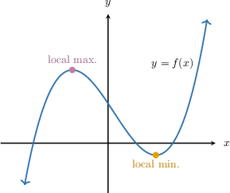
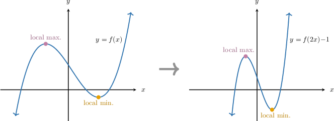
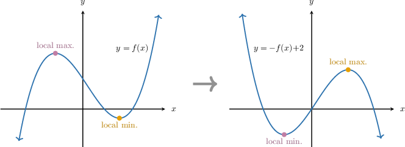
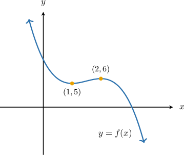

# Finding Points on Transformed Curves

Source: https://www.mathacademy.com/topics/141?courseId=51
Topic ID: 141

## Prerequisites

- [Local Extrema of Functions](./2707-local-extrema-of-functions.md)
- [Combining Reflections With Other Graph Transformations](./2841-combining-reflections-with-other-graph-transformations.md)

## Lesson

### Introduction

Suppose we know that the point $(- 1, 2)$ lies on the graph of $y = f (x).$ What point *must* lie on the graph of $y = - f (x) + 3?$ This problem can be solved using one of two methods.

**Method 1 - Transform the Point Using Graph Transformations**

To plot $y = -f(x) + 3,$ we apply the following steps:

- First, we take the graph $y=f(x).$

- Then, we reflect the graph across the $x$-axis and get the graph of $y=-f(x).$ After this transformation, the point $(-1,2)$ will be mapped to the point

- Finally, we shift the result by $3$ units up and obtain the graph of $y = -f(x) + 3.$ After this transformation, the point $(-1,-2)$ will be mapped to the point

**Method 2 - Evaluate the Transformed Function**

Since the point $(-1, 2)$ lies on the graph of $y = f(x),$ we have that $f(-1) = 2.$

Now, consider the graph of $y=-f(x)+3.$ Substituting $x = {\color{blue}-1}$, we get

$$

\begin{aligned}𝑦 & =−𝑓(−1)+3 \\ & =−(2)+3 \\ & =−2+3 \\ & =1.\end{aligned}

$$

Therefore, the point $\color{blue}(-1, 1)$ must lie on $y = -f(x) + 3.$

So, both methods give the same result.

### Example: Finding a Point That Lies on a Transformed Curve

#### Question

The point $(a,b)$ lies on the curve $y=x^4.$ Which of the following points **** lie on $y = (x-2)^4-6?$

1. $(a-2, b-6)$

2. $(a+2,b+ 6)$

3. $(a+2, b-6)$

4. $(a-2,b+ 6)$

#### Explanation

****

To plot $y = (x-2)^4-6,$ we apply the following steps:

- First, we take the graph $y=x^4.$

- Then, we shift the graph horizontally by $2$ units to the right and get the graph of $y=(x-2)^4.$ After this transformation, the point $(a,b)$ will be mapped to the point

- Finally, we shift the result vertically by $6$ units down and obtain the graph of $y = (x-2)^4-6.$ After this transformation, the point $(a+2,b)$ will be mapped to the point

****

We are told that the point $(a, b)$ lies on the graph of $y = x^4$, which means:

$$

b=a^4

$$

Now, we want to find which point must lie on the graph of:

$$

y = (x-2)^4-6

$$

Let’s test what happens when we substitute $x = a + 2$ into this new equation:

$$

\begin{aligned}𝑦 & =(𝑎+2−2)^{4}−6 \\ & =𝑎^{4}−6 \\ & =𝑏−6.\end{aligned}

$$

So, when $x = a + 2$, we get $y = b - 6.$

Therefore, the correct answer is "III only."

### Example: Finding a Point That Lies on a Transformed Curve Given Another Transformed Curve

#### Question

The point $(3, 0)$ lies on the curve $y = f(x) - 1.$ What point **** lie on $y = -f(x) + 3?$

#### Explanation

****

To plot $y = -f(x) + 3,$ we apply the following steps:

- First, take the graph $y = f(x) - 1.$

- Then, we shift the graph by $1$ unit up and get the graph of $y=f(x).$ After this transformation, the point $(3,0)$ will be mapped to the point

- Next, we reflect the result across the $x$-axis and get the graph of $y=-f(x).$ After this transformation, the point $(3,1)$ will be mapped to the point

- Finally, shift the result by $3$ units up and obtain the graph of $y = -f(x) + 3.$ After this transformation, the point $(3,-1)$ will be mapped to the point

****

Since the point $(3, 0)$ lies on the graph of $y = f(x)-1$, we have that

$$

f(3)-1 = 0 \qquad\Longrightarrow\qquad f(3)=1.

$$

Now consider the graph of $y = -f(x) + 3.$ Substituting $x = 3$, we get

$$

\begin{aligned}𝑦 & =−𝑓(3)+3 \\ & =−1+3 \\ & =2.\end{aligned}

$$

Therefore, the point $(3, 2)$ must lie on $y = -f(x) + 3.$

### Mapping Maxima and Minima

Consider the function $y=f(x)$ shown below.

This function has a local minimum point, and a local maximum point, as shown.

Notice that if we perform the graph transformation $y=f(2x)-1,$ then

- the local *maximum* point on the original graph is mapped to a local *maximum* point on the transformed curve, and

- the local *minimum* point on the original graph is mapped to a local *minimum* point on the transformed curve.

So, this transformation maps maximums (local and global) to maximums and minimums (local and global) to minimums.

Is this always the case? In other words, does *any* graph transformation map maximums to maximums and minimums to minimums?

To answer this, let's consider another example.

### Cases With Vertical Reflection

Consider the transformation $y=-f(x)+2,$ which contains a reflection about the $x$-axis.

Notice that

- the local *maximum* point on the original graph is mapped to a local ****** point on the transformed curve, and

- the local *minimum* point on the original graph is mapped to a local ****** point on the transformed curve.

So, due to the presence of vertical reflection, this transformation maps maximums (local and global) to minimums and minimums (local and global) to maximums.

### A Summary

We can summarize our findings by the following theorem:

*If a transformation does **** contain a reflection across the $x$-axis, then the transformation maps local (or global) maximums to local (or global) maximums, and maps local (or global) minimums to local (or global) minimums.*

In the case where we do have a vertical reflection, we have the following theorem.

*If a transformation contains a reflection across the $x$-axis, then the transformation maps local (or global) maximums to local (or global) minimums, and maps local (or global) minimums to local (or global) maximums.*

### Example: Identifying Extrema on Transformed Curves

#### Question

The diagram above shows the local minimum and maximum of the function $y=f(x).$ What is the local maximum of $y=f(2x)-1?$

#### Explanation

Notice that the graph of $y=f(2x)-1$ can be obtained from the graph of $y=f(x)$ by

- stretching it by a scale factor of $\dfrac{1}{2}$ parallel to the $x$-axis, and then

- translating it by $1$ unit down.

Since these transformations do not flip the graph across the $x$-axis, the combined transformation maps the local maximum of $y=f(x)$ to the local maximum of $y=f(2x)-1.$ So, we need to find the image of $(2,6),$ the local maximum of $y=f(x),$ under the transformation.

To plot $y = f(2x)-1,$ we apply the following steps:

- First, we take the graph $y=f(x)$ that passes through $(2,6).$

- Then, we stretch the result along the $x$-axis by a scale factor of $\dfrac{1}{2}$ and get the graph of $y=f(2x).$ After this transformation, the point $(2,6)$ will be mapped to the point

- Finally, we shift the result vertically by $1$ unit downward and get the graph of $y = f(2x)-1.$ After this transformation, the point $(1,6)$ will be mapped to the point

Therefore, the local maximum of $y=f(2x)-1$ is $(1,5).$
