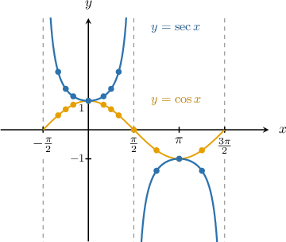
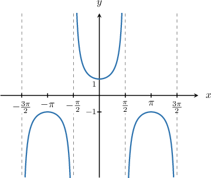
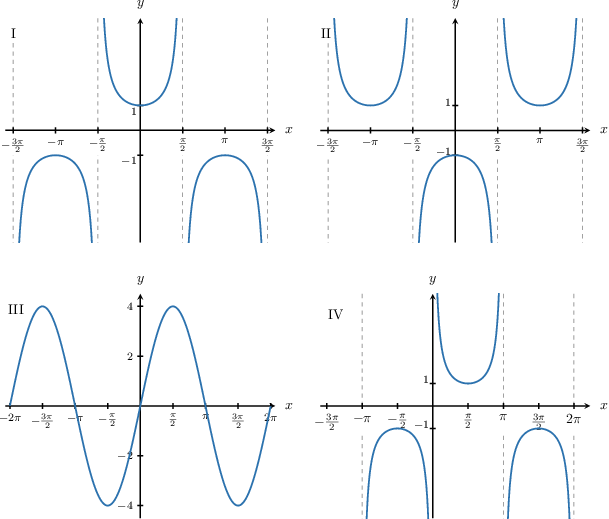
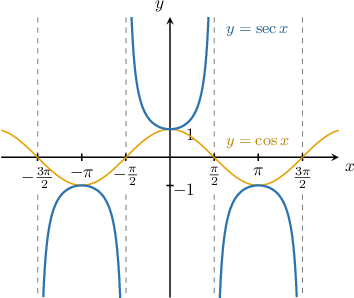
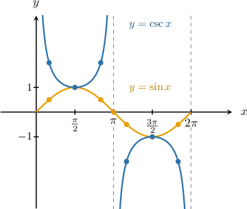
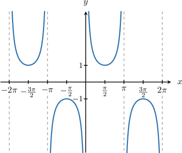
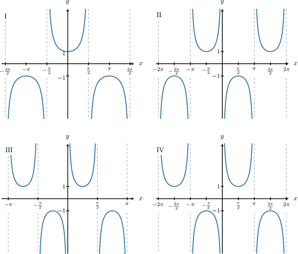
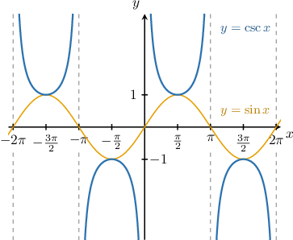

# Graphing Secant and Cosecant

Source: https://www.mathacademy.com/topics/1573?courseId=51
Topic ID: 1573

## Prerequisites

- [Graphing Sine and Cosine](./1491-graphing-sine-and-cosine.md)
- [Unbounded Behavior of Functions Near a Point](./2046-unbounded-behavior-of-functions-near-a-point.md)
- [Local Extrema of Functions](./2707-local-extrema-of-functions.md)
- [The Range of a Function: Advanced Cases](../algebra-i/3728-the-range-of-a-function-advanced-cases.md)

## Lesson

### Introduction

The **secant** is the reciprocal of the cosine:

$$

\sec x = \dfrac{1}{\cos x}.

$$

To plot the graph of $y=\sec x,$ with $x$ in radians, we create a table with some known values:

Plotting these points, we get the following curve:

Since the period of $\cos x$ is $2\pi,$ the period of $\sec x$ is also $2\pi.$ Since $\cos x$ is an even function, the function $\sec x$ is even. So we extend the plot with this periodicity property.

Some key characteristics about $y=\sec x$ are:

- The domain of the function is almost $x\in (-\infty,\infty)$ except for the points where the function is undefined, namely $x=\pm\dfrac{\pi}{2},\pm\dfrac{3\pi}{2},\dots$

- The range of the function is $y\in (-\infty,-1] \cup [1, +\infty).$

- The period of the function is $2\pi.$

- It has no zeros and no global extrema.

- The branches of the function alternate between positive and negative, with a positive branch in $\left(-\dfrac{\pi}{2}, \dfrac{\pi}{2}\right).$

- The graph has vertical asymptotes at the points not in the domain: $x=\pm\dfrac{\pi}{2},\pm\dfrac{3\pi}{2},\dots.$

### Example: Graphing the Secant Function

#### Question

Which of the following plots is the graph of $y = \sec x?$

#### Explanation

Let's recall some of the basic properties of $y=\sec x\mathbin{:}$

- The domain of the function is almost $x\in (-\infty,\infty)$ except for the points where the function is undefined, namely $x=\pm\dfrac{\pi}{2},\pm\dfrac{3\pi}{2},\dots$

- The range of the function is $y\in (-\infty,-1] \cup [1, +\infty).$

- The period of the function is $2\pi.$

- It has no zeros and no global extrema.

- The branches of the function alternate between positive and negative, with a positive branch in $\left(-\dfrac{\pi}{2}, \dfrac{\pi}{2}\right).$

- The graph has vertical asymptotes at the points not in the domain: $x=\pm\dfrac{\pi}{2},\pm\dfrac{3\pi}{2},\dots.$

Of the given plots, the only one that has all of these properties is I.

### Example: Identifying Characteristics of the Secant Function

#### Question

Which of the following values is in the range of $y=\sec x?$

1. $0$

2. $1$

3. $2$

#### Explanation

Let's recall the graph of $y=\sec x.$

Note that the range of the function is $(-\infty, -1] \cup [1, \infty),$ so $y=\sec x$ takes any value $y\leq -1$ and any value $y\geq 1.$

Therefore, the values $y=1$ and $y=2$ belong to the range, $y=0$ is not in the range.

### Graphing the Cosecant Function

The **cosecant** is the reciprocal of the sine:

$$

\csc x = \dfrac{1}{\sin x}

$$

To plot the graph of $y=\csc x,$ with $x$ in radians, we create a table with some known values:

Plotting these points, we get the following curve:

Since the period of $\sin x$ is $2\pi,$ the period of $\csc x$ is also $2\pi.$ So we can copy the graph in subsequent intervals.

Some key characteristics of $y=\csc x$ are:

- The domain of the function is all real numbers except the points where the function is undefined: $x=0,\pm\pi, \pm2\pi, \ldots$

- The range of the function is $y\in (-\infty,-1] \cup [1, +\infty).$

- The period of the function is $2\pi.$

- It has no zeros and no global extrema.

- The branches of the function alternate between positive and negative, with a positive branch for $x\in(0,\pi).$

- The graph has vertical asymptotes at the points that are not in the domain: $x=0,\pm\pi, \pm2\pi, \ldots$

### Example: Plotting the Graph of the Cosecant Function

#### Question

Which of the following plots is the graph of $y=\csc x?$

#### Explanation

Let's recall some of the basic properties of $y=\csc x\mathbin{:}$

- The domain of the function is all real numbers except the points where the function is undefined: $x=0,\pm\pi, \pm2\pi, \dots$

- The range of the function is $y\in (-\infty,-1] \cup [1, +\infty).$

- The period of the function is $2\pi.$

- It has no zeros and no global extrema.

- The branches of the function alternate between positive and negative, with a positive branch for $x\in(0, \pi).$

- The graph has vertical asymptotes at the points that are not in the domain: $x=0,\pm\pi, \pm2\pi, \dots$

Of the given functions, the only one that has all of these properties is IV.

### Example: Identifying Characteristics of the Cosecant Function

#### Question

Which of the following values is a zero of $y=\csc x?$

1. $0$

2. $\dfrac{\pi}{2}$

3. $\pi$

#### Explanation

Let's recall the graph of $y=\csc x.$

Note that the graph never intersects the $x$-axis. Therefore, the function $y=\csc x$ has no zeros, which means that none of the given values is a zero of $y=\csc x.$
