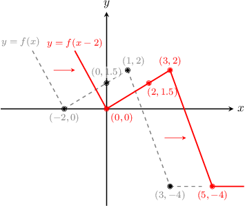
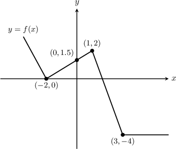
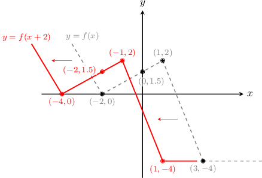
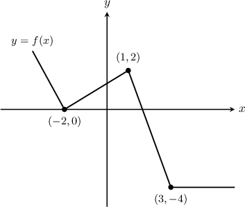
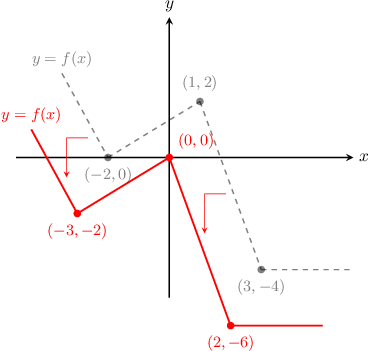

# Horizontal Translations of Functions

Source: https://www.mathacademy.com/topics/1584?courseId=51
Topic ID: 1584

## Prerequisites

- [Vertical Translations of Functions](./1251-vertical-translations-of-functions.md)

## Lesson

### Introduction

In general, for $k>0,$

- the graph of $y=f(x-k)$ is a horizontal translation of $y=f(x)$ by $k$ units to the *right*, while

- the graph of $y=f(x+k)$ is a horizontal translation of $y=f(x)$ by $k$ units to the *left*.

**Watch out!** It may seem counterintuitive that subtracting $k$ moves the graph to the right, while adding $k$ moves the graph to the left. However, this is in fact true.

To see why, let's consider the graph of $y=f(x)$ shown below. Let's use this graph to plot the graph of $y=f(x-2).$

Let's take some points on the graph of $y=f(x)$ and find the corresponding points on the graphs of $y=f(x-2).$

For example, take the point $(3,-4).$ The fact that it's on the graph of $y=f(x)$ means that $f(3)=-4.$ Then if $x={\color{red}5},$ we have

$$

f(x-2) = f({\color{red}5}-2) = f(3) = -4,

$$

which means that $({\color{red}5},-4)$ is on the graph of $y=f(x-2).$

For each point on the graph of $y=f(x)$ there is a corresponding point on the graph of $y=f(x-2)$ with the same $y$-value and a $x$-value that is $2$ units *greater*! Several more examples of points are shown below.

$$

\begin{aligned}Points on y=f(x) & Points on y=f(x-2) \\ (3,−4) & (5,−4) \\ (1,2) & (3,2) \\ (0,1.5) & (2,1.5) \\ (−2,0) & (0,0)\end{aligned}

$$

Now, let's plot both curves.

We see that every point on the graph of $y=f(x-2)$ is shifted $2$ units *to the right* of the corresponding point on the graph of $y=f(x).$

### Example: Plotting a Horizontal Translation of a Given Graph

#### Question

Plot the graph $y=f(x+2)$ for $y=f(x)$ given below.

#### Explanation

The graph of $y=f(x+2)$ is a horizontal translation of the graph of $y=f(x)$ by $2$ units to the **. So, every point on the graph of $y=f(x+2)$ is two units ** of the corresponding point on the graph of $y=f(x).$

### Example: Finding a Corresponding Point on a Horizontally Translated Function

#### Question

The point $P$ with coordinates $(-2,0)$ lies on the curve $y=f(x)$. Find a point that must lie on $y=f(x-7).$

#### Explanation

The graph of $y=f(x-7)$ is a translation of the graph of $y=f(x)$ by $7$ units to the **. So the $y$-coordinate remains unchanged while the $x$-coordinate increases by $7.$

We know that the point $(-2,0)$ lies on $y=f(x).$ Therefore, the point $(-2+7,0) = (5,0)$ must lie on $y=f(x-7).$

### Combining Vertical and Horizontal Translations

When graphing a function, we can combine vertical and horizontal translations. In general, the graph of

$$

y = f(x-h)+k

$$

is a translation of the graph of $y=f(x)$ by $h$ units to the right and $k$ units up.

It doesn't matter which translation we do first, but it's often easiest to start with the horizontal translation.

### Example: Plotting Horizontal and Vertical Translations of a Given Graph

#### Question

Plot the graph of $y=f(x+1)-2$ for $y=f(x)$ given below.

#### Explanation

To graph $y=f(x+1)-2,$ we translate the graph of $y=f(x)$ by $1$ unit to the left and then $2$ units down.

### Example: Finding a Corresponding Point on a Horizontally and Vertically Translated Function

#### Question

The point $P$ with coordinates $(1, 0)$ lies on the curve $y = f(x).$ What point must lie on $y=f(x + 1)+5?$

#### Explanation

The graph of $y=f(x+1)+5$ is a translation of the graph of $y=f(x)$ by $1$ unit to the ** and $5$ units up. So the $y$-coordinate increases by $5$ and the $x$-coordinate decreases by $1.$

We know that the point $P(1,0)$ lies on $y=f(x).$ Therefore, the point $(1-1,0+5) = (0,5)$ must lie on $y=f(x+1)+5.$
