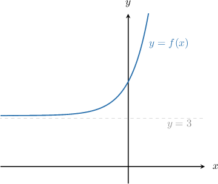
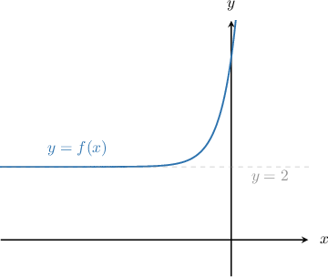

# Properties of Transformed Exponential Functions

Source: https://www.mathacademy.com/topics/1609?courseId=51
Topic ID: 1609

## Prerequisites

- [The Roots of a Function](../algebra-i/2022-the-roots-of-a-function.md)
- [Further Solving Linear Inequalities](../grade-7/4034-further-solving-linear-inequalities.md)
- [Combining Graph Transformations of Exponential Functions](./6351-combining-graph-transformations-of-exponential-functions.md)

## Lesson

### Introduction

Consider the exponential function $f(x)=2^x.$ Its domain is given by

$$

x \in (-\infty, \infty).

$$

Because the domain consists of all real numbers, if we were to apply graph transformations to $y = f(x),$ the domain would remain unchanged.

However, applying graph transformations could affect other properties of $f(x),$ such as its range, intercepts, end-behavior, and roots. In this lesson, we will learn how to calculate the properties of transformed exponential functions.

### Example: Finding the Y-Intercept of a Transformed Exponential Function

#### Question

What is the $y$-intercept of $y = -2e^{-2x}+3?$

#### Explanation

To find the $y$-intercept, we substitute $x = 0$ into the equation:

$$

\begin{aligned}𝑦 & =−2𝑒^{−2(0)}+3 \\ & =−2𝑒^{0}+3 \\ & =−2(1)+3 \\ & =1\end{aligned}

$$

Therefore, the $y$-intercept is $1.$

### Example: Finding the Range of a Transformed Exponential Function

#### Question

What is the range of $y = 2(4)^x+3?$

#### Explanation

The range of $4^x$ is

$$

4^x \gt 0.

$$

Multiplying the above inequality by $2$ and then adding $3,$ we get the following:

$$

\begin{aligned}4^{𝑥} & >0 \\ 2(4)^{𝑥} & >0 \\ 2(4)^{𝑥}+3 & >0+3 \\ 𝑦 & >3\end{aligned}

$$

Therefore, the range is $y \in (3,\infty).$

We can also see that this is true from the graph of the function. The graph of $f(x) = 2(4)^x+3$ is shown below.

### Example: Calculating the Root of a Transformed Exponential Function

#### Question

Find the root of $f(x) = 3(2)^{x} - 48.$

#### Explanation

To find the root of $f(x),$ we must solve $f(x)=0\mathbin{:}$

$$

3(2)^{x} - 48 = 0

$$

First, we isolate the term with the variable exponent by adding $48$ to both sides:

$$

\begin{aligned}3(2)^{𝑥}−48 & =0 \\ 3(2)^{𝑥}−48+48 & =0+48 \\ 3(2)^{𝑥} & =48\end{aligned}

$$

Dividing both sides by $3,$ we get

$$

\begin{aligned}3(2)^{𝑥} & =48 \\ 2^{𝑥} & =16.\end{aligned}

$$

Now, we rewrite $16$ as $2^4$ to get

$$

2^x = 2^4.

$$

Finally, since both sides of the equation share the same base $(2)$, we equate the exponents. This gives

$$

x = 4.

$$

Therefore, the root of $f(x)$ is $x=4.$

### Example: Finding the End-Behavior of a Transformed Exponential Function

#### Question

Suppose that $f(x) = 3(e^{5x}) + 2.$ Given that $f(x) \to a$ as $x \to -\infty,$ then what is the value of $a?$

#### Explanation

Let's sketch the graph of $y=f(x)\mathbin{:}$

Since the function approaches the line $y=2$ as $x\to -\infty,$ we conclude that

$$

f(x)\to 2 \quad \textrm{as}\quad x\to -\infty.

$$

Therefore, $a=2.$

Finally, we note that the horizontal asymptote of $y=f(x)$ is $y=2.$
