# Horizontal Translations of Trigonometric Functions

Source: https://www.mathacademy.com/topics/1659?courseId=51
Topic ID: 1659

## Prerequisites

- [Graphing Sine and Cosine](./1491-graphing-sine-and-cosine.md)
- [Graphing Tangent and Cotangent](./1493-graphing-tangent-and-cotangent.md)
- [Horizontal Translations of Functions](./1584-horizontal-translations-of-functions.md)

## Lesson

### Introduction

Let's consider the graph of $y=\sin x,$ graphed below.

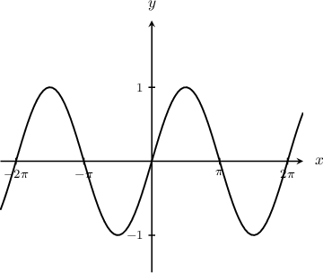

We can move the graph right (or left) by subtracting (or adding) a number from $x$ inside the sine function. These are **horizontal translations**.

To demonstrate, let's plot the graph of $y=\sin \left(x-\dfrac{\pi}{2}\right).$ To do this, we shift the sine function $\dfrac{\pi}{2}$ units to the *right*.

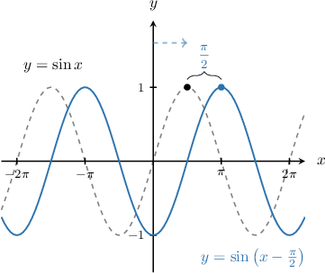

This might seem counterintuitive: *subtracting* a number from $x$ inside the sine function shifts the graph to the *right*, in the *positive* direction of the $x$-axis. But this is in fact true.

To demonstrate, consider the point $x=\pi.$ By substituting it into our function, we get

$$

\begin{aligned}𝑦 & =sin⁡(𝑥−\frac{𝜋}{2}) \\ & =sin⁡(𝜋−\frac{𝜋}{2}) \\ & =sin⁡(\frac{𝜋}{2}) \\ & =1.\end{aligned}

$$

So, the point $\left(\dfrac{\pi}{2},1\right)$ on the graph is now $\left(\pi,1\right)$ and we obtain a shift to the right.

Similarly, we plot the graph of $y=\sin\left(x+\dfrac{\pi}{3}\right)$ by shifting the sine function $\dfrac{\pi}{3}$ units to the *left*.

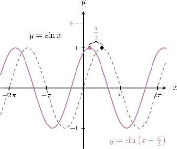

When a sine wave is shifted horizontally from its usual position, we say that the function has undergone a **phase shift.**

### Example: Identifying the Equation of a Sine Function With a Phase Shift

#### Question

What is the equation of the transformed sine curve shown below?

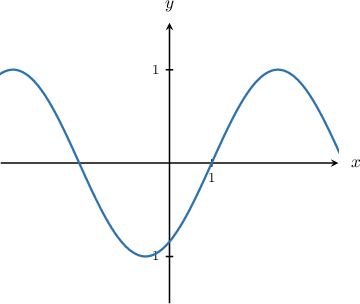

#### Explanation

Let's add the graph of $y=\sin x$ to the plot.

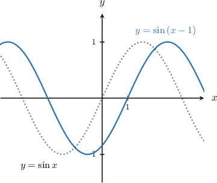

To plot the given curve, we follow these steps:

- Start with the graph of $y=\sin x.$

- Then, shift it by $1$ unit ****

Therefore, the given graph is $y = \sin\left(x-1\right).$

### Horizontally Translating the Cosine Function

Let's see how to horizontally shift the cosine function $y=\cos x,$ shown below.

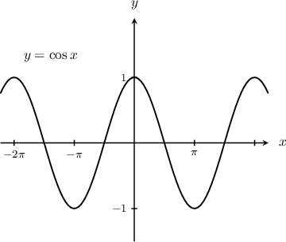

We obtain the graph of $y=\cos\left(x-\dfrac{\pi}{2}\right)$ by shifting the cosine function $\dfrac{\pi}{2}$ units to the *right*.

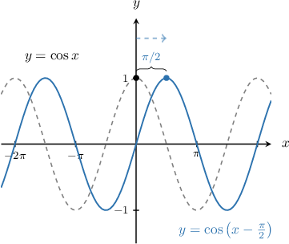

And we obtain the graph of $y=\cos\left(x+\dfrac{\pi}{3}\right)$ by shifting the cosine function $\dfrac{\pi}{3}$ units to the *left*.

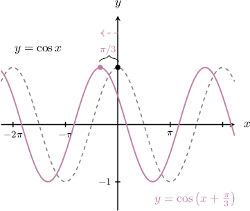

Again, when a cosine curve has been shifted horizontally, we say that it has undergone a phase shift.

### Example: Identifying the Equation of a Cosine Function With a Phase Shift

#### Question

Which of the following could be the equation of the graph shown below?

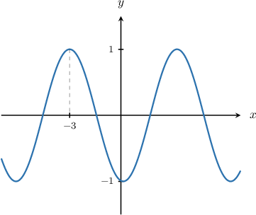

#### Explanation

Let's add the graph of $y=\cos x$ to the plot.

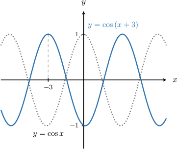

To plot the given curve, we follow these steps:

- Start with the graph of $y=\cos x.$

- Then, shift it by $3$ unit ****

Therefore, the given graph is $y = \cos\left(x+3\right).$

### Horizontally Translating the Tangent Function

Finally, let's consider the tangent function $y=\tan x,$ shown below.

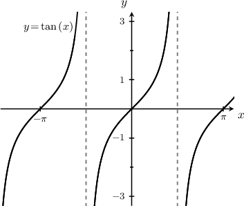

To obtain the graph of $y=\tan \left(x - \dfrac{\pi}{4}\right),$ we translate the tangent function by $\dfrac{\pi}{4}$ units to the right, as follows:

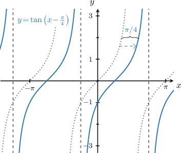

Note that the asymptotes of $y=\tan\left(x-\dfrac{\pi}{4} \right)$ are also shifted to the right by $\dfrac{\pi}{4}.$ For example, the first asymptote to the right of the $y$-axis is now

$$

x=\dfrac{\pi}{2}+ \dfrac{\pi}{4} = \dfrac{3\pi}{4}.

$$

Similarly, to obtain the graph of $y=\tan \left(x+1\right),$ we translate the tangent function by $1$ unit to the left, as follows:

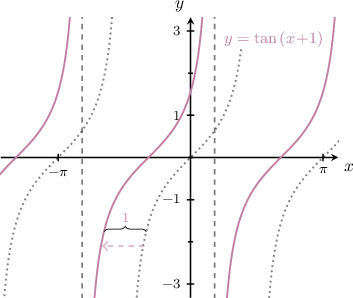

Note that the asymptotes of $y=\tan\left(x+1 \right)$ are also shifted to the left by $1.$ For example, the first asymptote to the right of the $y$-axis is now

$$

x=\dfrac{\pi}{2}-1.

$$

### Example: Identifying the Equation of a Tangent Function With a Horizontal Translation

#### Question

The graph below shows the function $y=\tan\left(x+C\right)$ for $-\dfrac{\pi}{2} < C < \dfrac{\pi}{2}.$ What is the value of $C?$

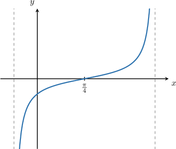

#### Explanation

Let's add the graph of $y=\tan x$ to the plot.

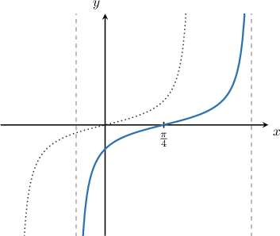

To plot the given curve, we follow these steps:

- Start with the graph of $y=\tan x.$

- Then, shift it by $\dfrac{\pi}{4}$ units ****.

Therefore, the given graph is $y = \tan\left(x-\dfrac{\pi}{4}\right)$ and hence the value of $C=-\dfrac{\pi}{4}$.

### Example: Finding a Vertical Asymptote for a Horizontally Translated Tangent Function

#### Question

The graph below shows one branch of the curve $y=\tan(x+C)$ for some number $C,$ where $-\dfrac\pi 2 < C < \dfrac \pi 2,$ and a vertical asymptote of the curve. What is the equation of the vertical asymptote?

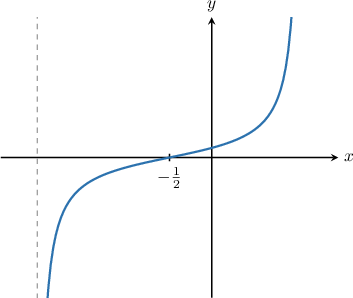

#### Explanation

Let's add the graph of $y=\tan x$ to the plot.

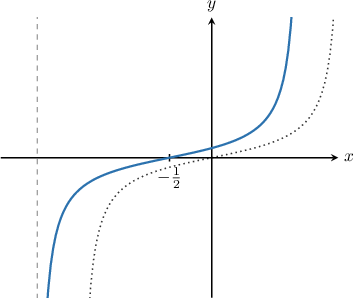

To plot the given curve, we follow these steps:

- Start with the graph of $y=\tan x.$

- Then, shift it by $\dfrac 12$ units ****.

Therefore, the given graph is $y = \tan\left(x+\dfrac 1 2\right),$ which means $C=\dfrac 1 2.$

Since the graph is shifted by $\dfrac 12$ units left, the asymptote is also shifted by $\dfrac 12$ units left.

The corresponding asymptote on the graph of $y=\tan x$ is $x=-\dfrac{\pi}{2}.$ Therefore, the equation of the asymptote shown is

$$

x = -\dfrac{\pi}{2} - \dfrac 12 = -\dfrac{\pi+1}{2}.

$$
