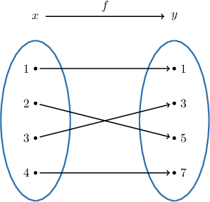
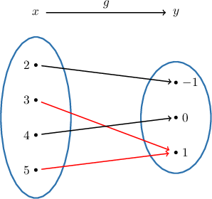
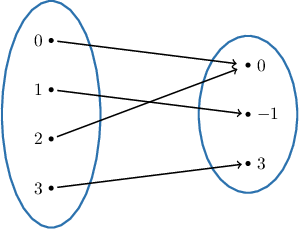
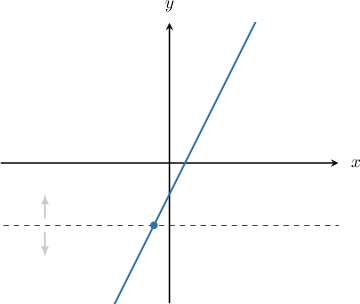
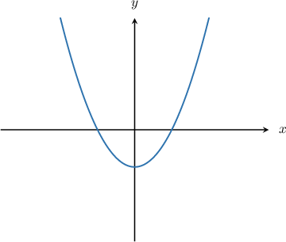
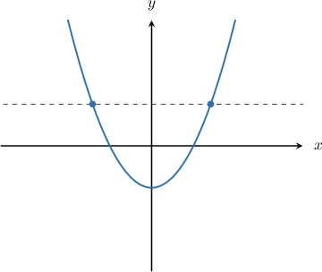
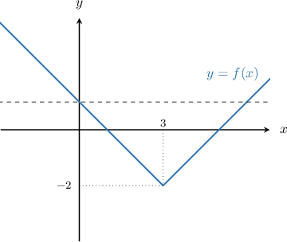

# One-To-One Functions

Source: https://www.mathacademy.com/topics/1886?courseId=51
Topic ID: 1886

## Prerequisites

- [Vertical Reflections of Quadratic Functions](../algebra-i/117-vertical-reflections-of-quadratic-functions.md)
- [The Range of a Function](../algebra-i/754-the-range-of-a-function.md)
- [Absolute Value Graphs](../algebra-i/790-absolute-value-graphs.md)

## Lesson

### Introduction

Let's consider the function $f(x)$ whose mapping diagram is given below.

Notice that each element $y$ in the range is paired with one (*and only one*) element $x$ in the domain. Such functions are called **one-to-one** functions.

On the other hand, for the function $g(x)$ shown below, we no longer have that property.

In the mapping diagram of $g(x),$ there are two arrows (originating from $3$ and $5$ in the domain) that are landing at the element $1$ in the range. So this element in the range is paired with *multiple* elements in the domain. Such functions are called **many-to-one** functions.

### Example: Determining Whether a Function is One-To-One From a Mapping Diagram

#### Question

Which of the following statements are true regarding the function represented by the mapping diagram above?

1. It is one-to-one

2. It is many-to-one

3. It is not a function

#### Explanation

Remember that

- a mapping diagram represents a ** if every element in the domain maps to exactly one element in the range,

- a function is ** if every element in the range is paired with one (and only one) element in the domain, and

- a function is ** if some element in the range is paired with multiple elements in the domain.

In the given mapping diagram, every element in the domain maps to exactly one element in the range, so it represents a function.

The element $0$ in the range is paired with multiple elements ($0$ and $2$) in the domain, so the function is many-to-one but not one-to-one.

Therefore, the correct answer is "II only".

### Example: Determining Whether a Function is One-To-One From a Table

#### Question

Which of the following statements are true regarding the function $g(x)?$

1. It is one-to-one

2. It is many-to-one

3. It is not a function

#### Explanation

Remember that

- a mapping diagram represents a ** if every element in the domain maps to exactly one element in the range,

- a function is ** if every element in the range is paired with one (and only one) element in the domain, and

- a function is ** if some element in the range is paired with multiple elements in the domain.

In the given table, every element in the domain maps to exactly one element in the range, so it represents a function.

The element $g(x)=27$ in the range is paired with multiple elements ($x=-9$ and $x=9$) in the domain, so the function is many-to-one but not one-to-one.

Therefore, the correct answer is "II only".

### The Horizontal Line Test

When a function is presented as a graph, there is a useful graphical method to determine whether a function is one-to-one or not. This method is called the **horizontal line test.** Here is how it works:

**Step 1.** Plot the graph of the function.

**Step 2.** Draw a horizontal line on the plot.

**Step 3.** Imagine moving the horizontal line up and down across the entire range.

- If the horizontal line hits the graph only once no matter where we draw it, then the function is one-to-one.

- If the horizontal line *ever* hits the graph more than once, then the function is many-to-one.

To demonstrate, let's use the horizontal line test to determine whether the following is a one-to-one function.

If we draw any horizontal line on the plot of the function above, it will hit the graph only once, no matter where we place the line.

Therefore, this is a one-to-one function.

### Example: Determining Whether a Function is One-To-One From a Graph

#### Question

Which of the following statements are true regarding the function whose graph is shown above?

1. It is one-to-one

2. It is many-to-one

3. It is **** a function

#### Explanation

First, the given graph is a function because each input $x$ gives a unique output $y.$

Carrying out the horizontal line test, notice that we can draw a horizontal line that hits the function more than once. This means the function is many-to-one (and not one-to-one).

Therefore, the correct answer is "II only".

### Example: Determining Whether a Function Is One-To-One From Its Definition

#### Question

Which of the following statements are true regarding $f(x)=|x-3|-2?$

1. It is one-to-one

2. It is many-to-one

3. It is a function

#### Explanation

The given $f(x)$ is a function because each input $x$ gives a unique output $y.$

To address the other statements, let's first make a graph of the function $f(x)=|x-3|-2$ as follows:

- Take the curve $y=|x|.$

- Translate it by $3$ units right to get $y=|x-3|.$

- Shift it by $2$ units down to get $y=|x-3|-2.$

If we apply the horizontal line test, we see that a horizontal line intersects the curve more than once for some horizontal lines. Therefore, it is many-to-one, not one-to-one.

So, the correct answer is "II and III only".
