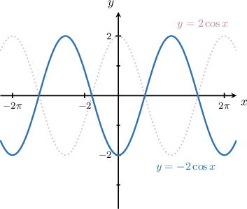
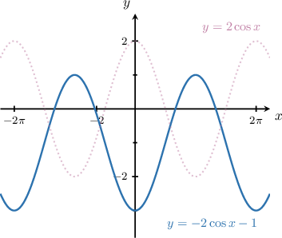
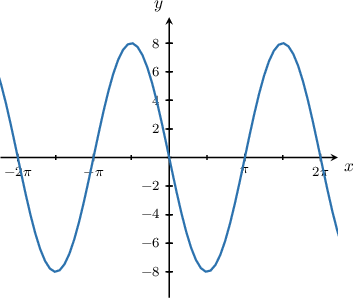
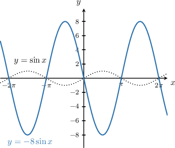
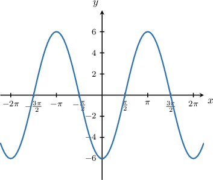
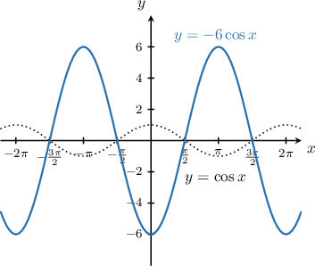
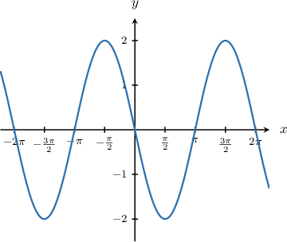
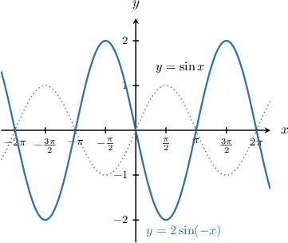
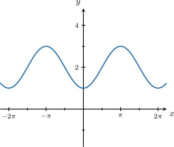
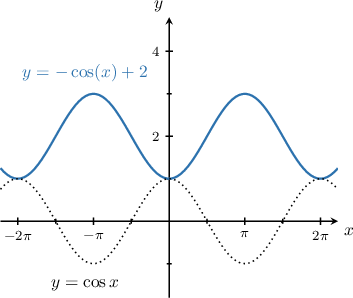

# Graphing Reflections of Trigonometric Functions

Source: https://www.mathacademy.com/topics/259?courseId=51
Topic ID: 259

## Prerequisites

- [Combining Graph Transformations of Sine and Cosine](./275-combining-graph-transformations-of-sine-and-cosine.md)
- [Combining Reflections With Other Graph Transformations](./2841-combining-reflections-with-other-graph-transformations.md)
- [Describing Properties of the Sine Function](./3540-describing-properties-of-the-sine-function.md)
- [Describing Properties of the Cosine Function](./3557-describing-properties-of-the-cosine-function.md)

## Lesson

### Introduction

We can combine vertical reflections, stretches, and shifts to get new transformed trigonometric curves. For example, let's draw the graph of the curve

To plot the given curve, we follow these steps:

- Start with the graph of

- Then, stretch it parallel to the -axis by a stretch factor of to give

- Next, reflect it over the -axis to give

- Finally, shift it **down** by unit to give

### Example: Identifying the Reflection of a Sine Curve Over the Horizontal Axis

#### Question

The graph above represents a transformed sine curve. What is the equation of the graph?

#### Explanation

To plot the given curve, we follow these steps:

- Start with the graph of $y=\sin x.$

- Then, reflect it in the $x$-axis to give $y=-\sin x.$

- Finally, stretch it parallel to the $y$-axis by a stretch factor of $8$ to give $y=-8\sin x.$

Therefore, the given curve is the graph of $y=-8\sin x.$

### Example: Identifying the Reflection of a Cosine Curve Over the Horizontal Axis

#### Question

The graph above represents a transformed cosine curve. What is the equation of the graph?

#### Explanation

To plot the given curve, we follow these steps:

- Start with the graph of $y=\cos x.$

- Then, reflect it in the $x$-axis to give $y=-\cos x.$

- Finally, stretch it parallel to the $y$-axis by a stretch factor of $6$ to give $y=-6\cos x.$

Therefore, the given curve is the graph of $y=-6\cos x.$

### Example: Identifying the Reflection of a Sine or Cosine Curve Over the Vertical Axis

#### Question

The graph above shows the function $y=2\sin(kx).$ What is the value of $k?$

#### Explanation

To plot the given curve, we follow these steps:

- Start with the graph of $y=\sin x.$

- Then, reflect it across the $y$-axis.

- Finally, stretch it parallel to the $y$-axis by a stretch factor of $2.$

Therefore, the given curve is the graph of $y=2\sin(-x).$ Hence, $k=-1.$

Notice that, because the sine function is odd, the $y$-axis reflection has the same effect as the $x$-axis reflection, i.e.,

$$

2\sin(-x) = -2\sin x .

$$

So the graph could also be viewed as $y=-2\sin x.$

### Example: Identifying the Reflection and Shifting of a Sine or Cosine Curve

#### Question

The graph above represents a transformed cosine curve. What is the equation of the graph?

#### Explanation

To plot the given curve, we follow these steps:

- Start with the graph of $y=\cos x.$

- Then, reflect it in the $x$-axis to give $y=-\cos x.$

- Finally, translate it by $2$ units **** to give $y=-\cos x+2.$

Therefore, the given curve is the graph of $y=-\cos x+2.$
