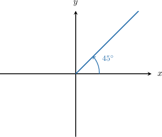
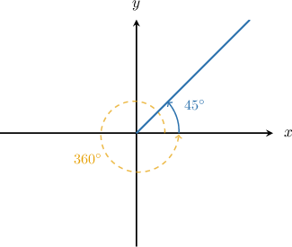
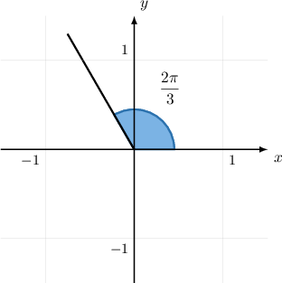
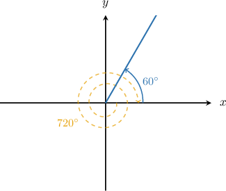
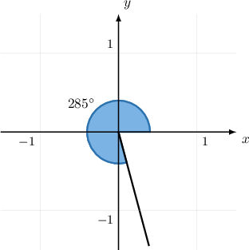
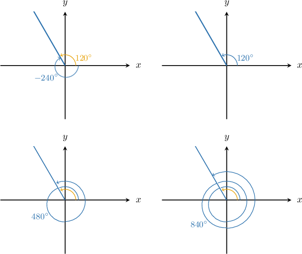

# Coterminal Angles

Source: https://www.mathacademy.com/topics/261?courseId=51
Topic ID: 261

## Prerequisites

- [Negative Angles in the Coordinate Plane](./167-negative-angles-in-the-coordinate-plane.md)

## Lesson

### Introduction

All the angles we have constructed so far have been inside the range However, we can also construct angles outside this range.

The way we do this involves **coterminal angles**. Coterminal angles are different angles that appear as the same angle in the coordinate plane. For example, the angles and are coterminal because a rotation of is the same as the rotation of In general, whenever we add or subtract a multiple of we get a coterminal angle.

The standard way in which we draw a **positive** angle in the coordinate plane is as follows:

- Subtract integer multiples of until we get a coterminal angle that lies in the range

- Draw the resulting angle in the coordinate plane.

For example, to represent the angle in the coordinate plane, we first subtract

The result, is a coterminal angle that lies in the range So, to draw the angle we draw the coterminal angle in the coordinate plane.

**Note:** For every multiple of we subtract, we make one complete rotation counter-clockwise around the origin. A rotation of is the same as the rotation of so it doesn't contribute to our final angle.

Here, we subtracted a single time, so we make a single rotation.

### Example: Finding the Correct Quadrant for Angles that Contain More Than One Full Rotation

#### Question

The angle $\theta = \dfrac {8\pi}3$ is represented in the coordinate plane in the usual way. In which quadrant does it lie?

#### Explanation

First, we find an angle that's coterminal with $\dfrac {8\pi}3$ by ** integer multiples of $2\pi$ until we get a coterminal angle that lies in the range $[0, 2\pi).$

$$

\begin{aligned}\frac{8𝜋}{3}−2𝜋=\frac{2𝜋}{3}\,✓\end{aligned}

$$

So the angle $\dfrac {2\pi}3$ is coterminal with $\dfrac {8\pi}3.$ Let's draw this coterminal angle in the coordinate plane.

We see that $\dfrac{2\pi}{3}$ lies in quadrant II. Therefore, $\dfrac{8\pi}{3}$ also lies in this quadrant.

### Constructing Negative Angles that Contain More Than One Full Rotation

The method for constructing a *negative* angle outside the range is similar to the method for positive angles, but with one main difference: we *add* multiples of instead of subtracting. So the steps are:

- Add integer multiples of until we get a coterminal angle that lies in the range

- Draw the resulting angle in the coordinate plane.

For example, we can represent the angle as follows:

Now, we draw the angle in the coordinate plane.

Again, for every multiple of that we add, we make one complete rotation around the origin clockwise. A rotation of is the same as the rotation of so it doesn't contribute to our final angle.

### Example: Finding the Correct Quadrant for Negative Angles that Contain More Than One Full Rotation

#### Question

The angle $\theta = -435^\circ$ is represented in the coordinate plane in the usual way. In which quadrant does it lie?

#### Explanation

First, we find an angle that's coterminal with $-435^\circ$ by ** integer multiples of $360^\circ$ until we get a coterminal angle that lies in the range $[0^\circ, 360^\circ).$

$$

\begin{aligned}−435^{∘}+360^{∘} & =−75^{∘} \\ −75^{∘}+360^{∘} & =285^{∘}\,✓\end{aligned}

$$

So the angle $285^\circ$ is coterminal with $-435^\circ.$ Let's draw this coterminal angle in the coordinate plane.

We see that $285^\circ$ lies in quadrant IV. Therefore, $-435^\circ$ also lies in this quadrant.

### Finding Multiple Coterminal Angles

To find a coterminal angle of a given angle we rotate clockwise or counter-clockwise from We could do this again and again, each time looping by to find an infinite number of coterminal angles:

For instance, the angles and are all coterminal.

### Example: Finding Coterminal Angles in Degrees

#### Question

Which angles are coterminal with $240^\circ?$

$$

600^\circ, \quad 300^\circ, \quad -480^\circ.

$$

#### Explanation

To find the coterminal angles of a given angle $\theta,$ we add and subtract integer multiples of $360^\circ\mathbin{.}$

Let's start by adding multiples of $360^\circ$ to $240^\circ\mathbin{:}$

$$

\begin{aligned}240^{∘}+360^{∘}=600^{∘}\,✓\end{aligned}

$$

There are no answer choices larger than $600^\circ,$ so we can stop here.

Now, let's subtract multiples of $360^\circ$ from $240^\circ\mathbin{:}$

$$

\begin{aligned}240^{∘}−360^{∘} & =−120^{∘} \\ 240^{∘}−2⋅(360^{∘}) & =−480^{∘}\,✓\end{aligned}

$$

There are no answer choices smaller than $-480^\circ,$ so we can stop here.

So, of the given angles, the coterminal angles are $600^\circ$ and $-480^\circ.$

### Example: Finding Coterminal Angles in Radians

#### Question

Which angle is coterminal with $\dfrac {3 \pi} {5}?$

$$

\dfrac{4\pi}{5}, \quad -\dfrac{7\pi}{5}, \quad -\dfrac{11\pi}{5}.

$$

#### Explanation

To find the coterminal angles of a given angle $\theta$ (in radians), we add and subtract integer multiples of $2\pi.$

Let's start by adding multiples of $2\pi$ to $\dfrac {3 \pi} {5}\mathbin{:}$

$$

\begin{aligned}\frac{3𝜋}{5}+2𝜋=\frac{13𝜋}{5}\end{aligned}

$$

There are no answer choices larger than $\dfrac {13 \pi} {5},$ so we can stop here.

Now, let's subtract multiples of $2\pi$ from $\dfrac {3 \pi} {5}\mathbin{:}$

$$

\begin{aligned}\frac{3𝜋}{5}−2𝜋 & =−\frac{7𝜋}{5}\,✓ \\ \frac{3𝜋}{5}−2⋅(2𝜋) & =−\frac{17𝜋}{5}\end{aligned}

$$

There are no answer choices smaller than $-\dfrac {17 \pi} {5},$ so we can stop here.

So, of the given angles, the only coterminal angle is $-\dfrac{7\pi}{5}.$
