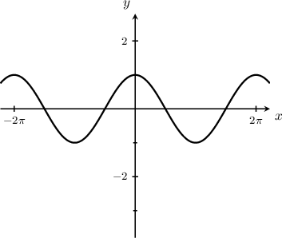
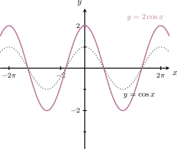
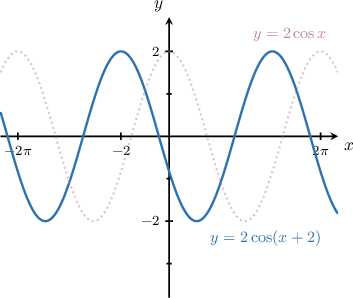
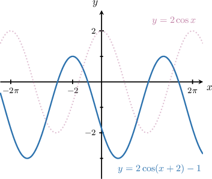
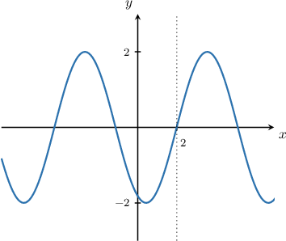
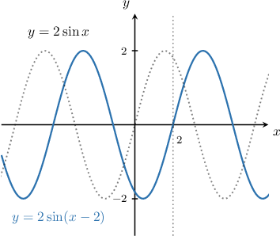
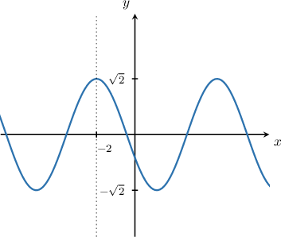
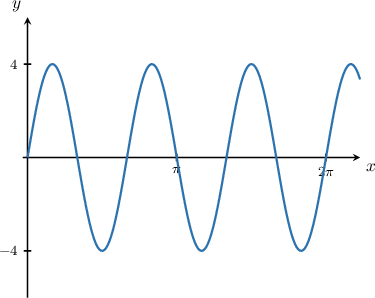
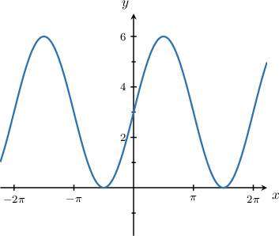
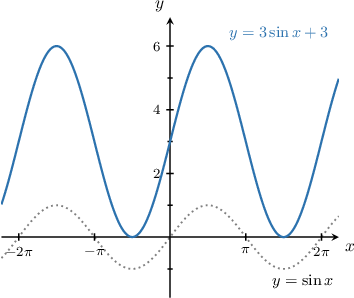

# Combining Graph Transformations of Sine and Cosine

Source: https://www.mathacademy.com/topics/275?courseId=51
Topic ID: 275

## Prerequisites

- [Vertical Translations of Trigonometric Functions](./206-vertical-translations-of-trigonometric-functions.md)
- [Horizontal Stretches of Trigonometric Functions](./784-horizontal-stretches-of-trigonometric-functions.md)
- [Combining Graph Transformations: Two Operations](./1254-combining-graph-transformations-two-operations.md)
- [Horizontal Translations of Trigonometric Functions](./1659-horizontal-translations-of-trigonometric-functions.md)
- [Vertical Stretches of Trigonometric Functions](./1661-vertical-stretches-of-trigonometric-functions.md)

## Lesson

### Introduction

We can combine vertical and horizontal shifts and stretches to get new transformed sine and cosine curves. For example, let's draw the graph of the curve

To plot the given curve, we follow these steps:

- Start with the graph of

- Then, stretch it parallel to the -axis by a stretch factor of to give

- Next, shift to the **left** by units to give

- Finally, shift it **down** by unit to give

### Example: Identifying Shifts of a Transformed Sine or Cosine Curve

#### Question

The graph above shows the function $y=2\sin{(x+C)},$ where $C$ is a constant. Given that $-\pi < C < \pi,$ what is the value of $C?$

#### Explanation

The constant $C$ is the phase shift of the function.

To plot the given function, we follow these steps:

- Take the graph of $y=\sin x.$

- Vertically stretch it by a scale factor of $2$ to give $y = 2 \sin x.$

- Then, shift it by $2$ units **** to give $y=2\sin \left(x-2\right).$

Therefore, $C=-2.$

### Example: Identifying the Vertical Stretch of a Transformed Sine or Cosine Curve

#### Question

The graph above shows the function $y=A\cos\left(x+2\right),$ where $A$ is a constant. What is $A?$

#### Explanation

The constant $A$ is the amplitude of the function.

From the graph, we see that the maximum value is $y_\max=\sqrt{2}$ and the minimum value is $y_\min=-\sqrt{2}.$ Therefore, the amplitude is

$$

A = \dfrac{y_\max-y_\min}{2} = \dfrac{\sqrt{2}-(-\sqrt{2})}{2}=\sqrt{2}.

$$

### Example: Identifying the Horizontal Stretch of a Transformed Sine or Cosine Curve

#### Question

The graph above shows the function $y=4\sin{(Bx)},$ where $B$ is a positive constant. What is $B?$

#### Explanation

The constant $B$ is the horizontal stretch of the function.

We can see that the function repeats itself $3$ times in the interval $x\in[0,2\pi].$ Therefore, the period $T$ of the function is

$$

T = \dfrac{2\pi}{3}.

$$

The formula for the period $T$ of the function $y=A\sin(Bx + C) + D$ is given by

$$

T = \dfrac{2\pi}{B}.

$$

Applying the formula for the period, we get

$$

\dfrac{2\pi}{3} = \dfrac{2\pi}{B}\quad\Longrightarrow\quad B = \dfrac{2\pi}{\left(\dfrac{2\pi}{3}\right)} = 3.

$$

Therefore, $B=3.$

### Example: Identifying the Equation of a Transformed Sine Curve

#### Question

The graph above represents a transformed sine curve. What is the equation of the graph?

#### Explanation

To plot the given curve, we follow these steps:

- Start with the graph of $y=\sin x.$

- Then, stretch it parallel to the $y$-axis by a stretch factor of $3$ to give $y=3\sin x.$

- Finally, shift it **** by $3$ units to give $y=3\sin x + 3.$

Therefore, the given curve is the graph of $y=3\sin x + 3.$
