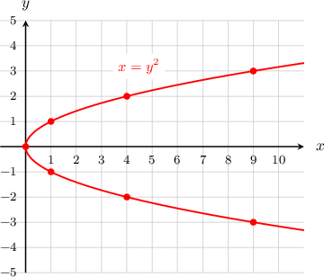
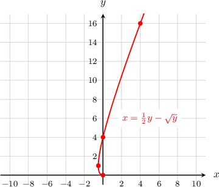
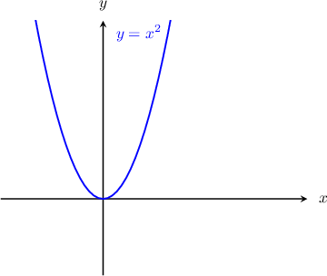
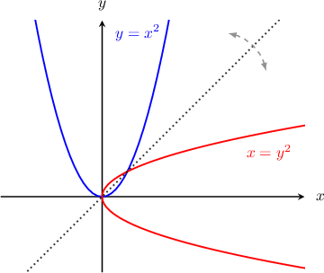
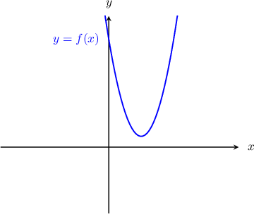
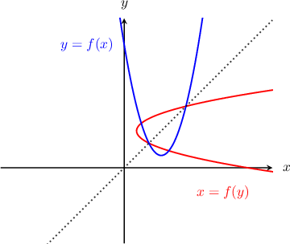
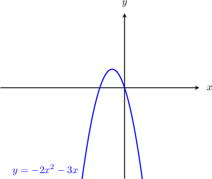
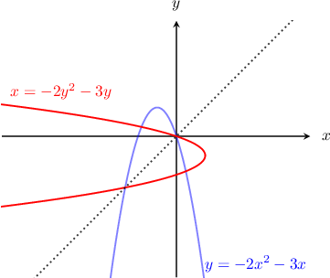

# Plotting X as a Function of Y

Source: https://www.mathacademy.com/topics/2978?courseId=51
Topic ID: 2978

## Prerequisites

- [Roots of Quadratic Functions](../algebra-i/661-roots-of-quadratic-functions.md)
- [Graphs of Inverse Functions](./756-graphs-of-inverse-functions.md)

## Lesson

### Introduction

We're used to plotting curves where $y$ is a function of $x.$ However, we can also plot curves where $x$ is a function of $y.$

For example, consider the curve $x = y^2.$ To graph this curve, we can start by calculating the values of $x$ for some values of $y{:}$

$$

\begin{aligned}𝑦=−3 & \,⟶\,𝑥=(−3)^{2}=9 \\ 𝑦=−2 & \,⟶\,𝑥=(−2)^{2}=4 \\ 𝑦=−1 & \,⟶\,𝑥=(−1)^{2}=1 \\ 𝑦=0 & \,⟶\,𝑥=0^{2}=0 \\ 𝑦=1 & \,⟶\,𝑥=1^{2}=1 \\ 𝑦=2 & \,⟶\,𝑥=2^{2}=4 \\ 𝑦=3 & \,⟶\,𝑥=3^{2}=9\end{aligned}

$$

We can summarize these results in the following table:

So, we have the following points:

$$

(9,-3), \quad (4,-2), \quad (1,-1), \quad (0,0), \quad (1,1), \quad (4,2), \quad (9,3).

$$

If we plot these points and connect them with a smooth curve, we get the following graph:

We say that the equation of the curve is defined **implicitly**, because instead of the usual $y = f(x),$ we have $x = f(y).$

**Watch out!** Here, we are viewing $x=y^2$ not as a function but rather as an equation. A point belongs to the curve if and only if its coordinates satisfy the equation. The curve does not represent a function since it fails the vertical line test.

### Example: Plotting X as a Function of Y Using a Table of Values

#### Question

Plot the graph of $x= \dfrac{1}{2}y - \sqrt y\,$ by completing the following table:

#### Explanation

To graph this curve, we can start by calculating the value of $x$ for various values of $y,$ as follows:

$$

\begin{aligned}𝑦=0 & \,⟶\,𝑥=\frac{1}{2}⋅0−\sqrt{√0}=0 \\ 𝑦=1 & \,⟶\,𝑥=\frac{1}{2}⋅1−\sqrt{√1}=−\frac{1}{2} \\ 𝑦=4 & \,⟶\,𝑥=\frac{1}{2}⋅4−\sqrt{√4}=0 \\ 𝑦=16 & \,⟶\,𝑥=\frac{1}{2}⋅16−\sqrt{√16}=4\end{aligned}

$$

We can summarize these results in the following table:

So, we have the following points:

$$

(0,0), \quad \left(-\dfrac 12,1\right), \quad (0,4), \quad (4,16).

$$

If we plot these points and connect them with a smooth curve, we get the following graph:

### Plotting X as a Function of Y Using a Reflection

Another way to plot $x = f(y)$ is to first plot the corresponding function $y = f(x)$ and then reflect it over the line $y=x.$

To illustrate, let's use this technique to plot the curve $x=y^2.$ To get the corresponding function, we swap $x$ and $y$ and get $y=x^2.$ This curve is familiar and much easier to graph:

Now, to get the curve $x=y^2,$ we just have to reflect the curve $y=x^2$ over the line $y=x,$ as follows:

You may notice that this process is very similar to plotting the inverse of a function. In fact, if $y=f(x)$ is a one-to-one function, then the corresponding function $x = f(y)$ will always give the inverse function.

### Example: Plotting X as a Function of Y Given the Graph of the Corresponding Function

#### Question

The graph of $y=f(x)$ is shown below. Sketch the graph of $x=f(y).$

#### Explanation

To plot the graph of $x=f(y),$ we take the graph of $y=f(x)$ and reflect it over the line $y=x,$ as follows:

### Example: Plotting a Quadratic Function Where X Is a Function of Y

#### Question

Plot the graph of $x=-2y^2 - 3y.$

#### Explanation

To plot $x=-2y^2-3y,$ we will first plot the function $y=-2x^2-3x$ and then reflect it over the line $y=x.$

The curve $y=-2x^2-3x$ is a parabola. It has the following factored form:

$$

y = -x(2x+3)

$$

From the factored form above, we see that we have a negative parabola with roots at $x=0$ and $x=-\dfrac32.$ Therefore, we get the following graph:

Now, to get the curve $x=-2y^2-3y,$ we just have to reflect the curve $y=-2x^2-3x$ over the line $y=x,$ as follows:

