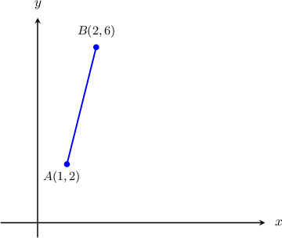
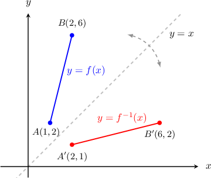
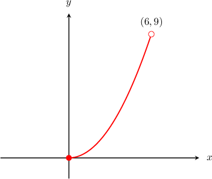
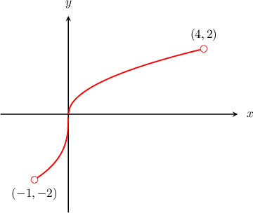

# Domain and Range of Inverse Functions

Source: https://www.mathacademy.com/topics/3734?courseId=51
Topic ID: 3734

## Prerequisites

- [Graphs of Inverse Functions](./756-graphs-of-inverse-functions.md)

## Lesson

### Introduction

Consider the function $y=f(x)$ whose graph is shown below.

Notice that

- the domain of $f(x)$ is $[1,2],$ and

- the range of $f(x)$ is $[2,6].$

Recall that each point $(a,b)$ on the graph of ${\color{blue}y=f(x)}$ has a corresponding point $(b,a)$ on the graph of the inverse function ${\color{red}y=f^{-1}(x)}.$ That is to say, the $x$ and $y$ coordinates swap.

Notice that

- the domain of $f^{-1}(x)$ is $[2,6],$ and

- the range of $f^{-1}(x)$ is $[1,2].$

In general:

- The domain of a function ${\color{blue}f(x)}$ is the range of its inverse function ${\color{red}f^{-1}(x)}.$

- The range of a function ${\color{blue}f(x)}$ is the domain of its inverse function ${\color{red}f^{-1}(x)}.$

### Example: Finding the Domain of an Inverse Function Using a Graph

#### Question

For the function $y = f(x)$ shown below, what is the domain of the inverse function $f^{-1}(x)?$

#### Explanation

First, we recall the following:

- The domain of a function $f(x)$ is the range of its inverse function $f^{-1}(x).$

- The range of a function $f(x)$ is the domain of its inverse function $f^{-1}(x).$

From the graph, we see that the range of $f(x)$ is

$$

0 \leq f(x) \lt 9.

$$

Therefore, the domain of $f^{-1}(x)$ is

$$

0 \leq x \lt 9.

$$

### Example: Finding the Range of an Inverse Function Using a Graph

#### Question

For the function $y = f(x)$ shown above, what is the range of the inverse function $f^{-1}(x)?$

#### Explanation

First, we recall the following:

- The domain of a function $f(x)$ is the range of its inverse function $f^{-1}(x).$

- The range of a function $f(x)$ is the domain of its inverse function $f^{-1}(x).$

From the graph, we see that the domain of $f(x)$ is

$$

-1 \lt x \lt 4.

$$

Therefore, the range of $f^{-1}(x)$ is

$$

-1 \lt f^{-1}(x) \lt 4.

$$

### Example: Finding the Domain and Range of an Inverse Function Using a Description

#### Question

The domain of the function $f(x)$ is $-3\lt x \leq 3$ and the range of $f$ is $-2\leq f(x) \lt 2.$ What is the range of the inverse function $f^{-1}(x)?$

#### Explanation

First, we recall the following:

- The domain of a function $f(x)$ is the range of its inverse function $f^{-1}(x).$

- The range of a function $f(x)$ is the domain of its inverse function $f^{-1}(x).$

The domain of $f(x)$ is

$$

-3\lt x \leq 3.

$$

Therefore, the range of $f^{-1}(x)$ is

$$

-3\lt f^{-1}(x) \leq 3.

$$
