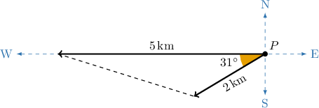
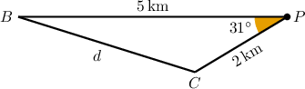
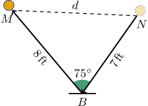
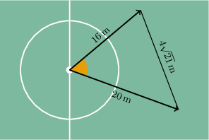

# Modeling Using the Law of Cosines

Source: https://www.mathacademy.com/topics/3736?courseId=51
Topic ID: 3736

## Prerequisites

- [The Law of Cosines](./169-the-law-of-cosines.md)
- [Modeling With Trigonometry](../geometry/641-modeling-with-trigonometry.md)

## Lesson

### Introduction

We sometimes face real-world problems where we can use the law of cosines to find missing information.

For example, consider two ships that are sailing from a port. The first ship is sailing due west and the second ship is sailing $31^\circ$ south of west. After ten minutes, the first ship has traveled $5\,\textrm{km}$ while the second ship has traveled only $2\,\textrm{km}.$ To one decimal place, what is the distance between the ships after ten minutes?

We begin by assigning some key points:

$\qquad$ $P$ - the position of the port,

$\qquad$ $B$ - the position of the first ship,

$\qquad$ $C$ - the position of the second ship,

$\qquad$ $d$ - the distance between the two ships.

We can summarize all this information in the diagram below.

By applying the law of cosines, we obtain

$$

\begin{aligned}𝑑^{2} & =𝑏^{2}+𝑐^{2}−2𝑏𝑐cos⁡𝑃 \\ & =2^{2}+5^{2}−2(2)(5)cos⁡31^{∘} \\ & =29−20cos⁡31^{∘} \\ & ≈11.857.\end{aligned}

$$

rounded to $3$ decimal places.

So, the distance between the ships after ten minutes is

$$

d = \sqrt{11.857} \approx 3.4 \,\textrm{km},

$$

rounded to $1$ decimal place.

### Example: Finding the Length of a Side of a Triangle Using the Law of Cosines: Word Problem

#### Question

Nicole and Megan are training passes for a basketball tournament. When Nicole throws the ball, it bounces on the ground once before reaching Megan. Assume the ball makes two straight paths, one from Nicole to the ground, whose length is $7\,\textrm{ft},$ and another from the ground to Megan, whose length is $8\,\textrm{ft}.$ If the angle formed between the paths is $75^\circ,$ how far away is Megan from Nicole?

#### Explanation

Let $N$ and $M$ be the positions of Nicole and Megan, respectively. Also, let $B$ be the point on the floor where the ball bounces and $d$ the distance between the girls. Then, we can build the following diagram.

According to the law of cosines, we get

$$

\begin{aligned}𝑑^{2} & =𝑚^{2}+𝑛^{2}−2𝑚𝑛cos⁡𝐵 \\ & =7^{2}+8^{2}−2(7)(8)cos⁡75^{∘} \\ & =113−112cos⁡75^{∘} \\ & ≈84.012.\end{aligned}

$$

So, the distance between the girls is

$$

d = \sqrt{84.012}\approx 9.17\,\textrm{ft}.

$$

### Example: Finding the Measure of an Angle Using the Law of Cosines: Word Problem

#### Question

Mark and Tom, two soccer players, were standing together in the middle of the field. Suddenly, they ran in a straight line in different directions as shown below. Mark ran $16\,\textrm{m}$ and Tom ran $20\,\textrm{m}.$ If the current distance between Mark and Tom is $4\sqrt{21}\,\textrm{m},$ what is the angle between the paths formed by the players?

#### Explanation

If we denote the center of the field by $C,$ Mark's position by $M,$ and Tom's position by $T$, then we have

$$

\begin{aligned}𝑐=4\sqrt{√21},\,𝑚=20,\,𝑡=16,\end{aligned}

$$

and we need to find $m\angle C.$ We can do it by applying the law of cosines as follows:

$$

\begin{aligned}𝑐^{2} & =𝑚^{2}+𝑡^{2}−2𝑚𝑡cos⁡𝐶 \\ (4\sqrt{√21})^{2} & =20^{2}+16^{2}−2(20)(16)cos⁡𝐶 \\ 336 & =400+256−640cos⁡𝐶 \\ 640cos⁡𝐶 & =320 \\ cos⁡𝐶 & =\frac{1}{2}.\end{aligned}

$$

Therefore,

$$

m\angle C = \arccos \left( \dfrac{1}{2} \right) = 60^\circ,

$$

and we conclude that the angle between the paths is $60^\circ.$
