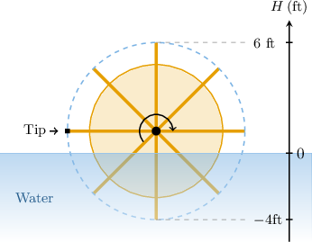
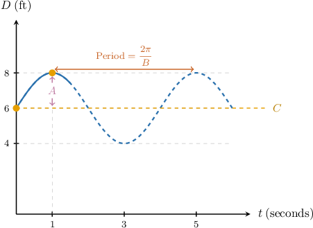
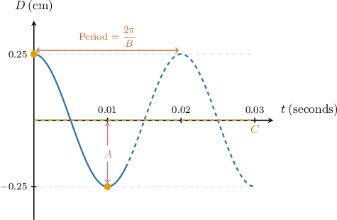
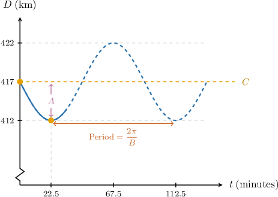

# Modeling With Trigonometric Functions

Source: https://www.mathacademy.com/topics/4934?courseId=51
Topic ID: 4934

## Prerequisites

- [Interpreting Trigonometric Models](./2566-interpreting-trigonometric-models.md)
- [Graphing Reflections of Trigonometric Functions: Three or More Transformations](./3553-graphing-reflections-of-trigonometric-functions-three-or-more-transformations.md)

## Lesson

### Introduction

Consider the tip of a waterwheel's paddle that rotates at a constant rate, as shown below.

The wheel begins its clockwise cycle from its leftmost position, as shown in the diagram. The maximum and minimum height of the tip is $6\,\textrm{ft}$ above the water and $4\,\textrm{ft}$ below the water, respectively, and the tip takes $30$ seconds to complete one full rotation.

Suppose we wish to model the height of the tip above the water using a function of the form

$$

H(t) = A \sin \left( B t \right) + C,

$$

where $H$ is measured in feet, $t$ is the time (in seconds) since the moment the wheel started to rotate, and $A,$ $B,$ and $C$ are constants. Can we use the given information to determine the values $A,$ $B,$ and $C$ in our model?

Let's recall the general terminology for sinusoidal curves:

We can obtain the values of $A,$ $B,$ and $C$ as follows:

- First, the midline (vertical shift) of the graph is given by the average value of the highest and lowest points: So, in our case, we have

- Second, the magnitude of the amplitude equals half the distance between the highest and lowest points: So, in our case, we have Therefore, $A = \pm 5\,\textrm{ft}.$

- If we assume $B > 0,$ we have which means that So, in our case, we have

Therefore, we have the following model for $H(t){:}$

$$

H(t) = \pm 5\sin\left(\dfrac{\pi t}{15}\right) + 1

$$

Finally, we must choose which sign (positive or negative) to use in our model. For now, we'll choose the *positive* value for $A.$ We'll explain this choice shortly.

Therefore, our complete model for the height of the waterwheel's tip is

$$

H(t) = 5\sin\left(\dfrac{\pi t}{15}\right) + 1.

$$

### Choosing a Model

A **sinusoidal** is a model that takes one of the following forms:

$$

F(t) = A \sin (B t) + C, \qquad G(t) = A \cos (B t) + C

$$

where it's assumed that $B > 0.$

These functions are used to model many natural phenomena whose variation is periodic.

Let's now think about the following questions:

1. When is it best to use sine, and do we use cosine?

2. In the last example, we selected $A > 0.$ Why did we do this, and when would we choose $A < 0?$

The answer to the first question relates to how we want our model to behave when $t=0{:}$

- If we want our model to start from the *midline,* then we choose a *sine* model. This is because the function $y=\sin B t$ lies on its midline when $t=0.$

- If we want our model to start from a *local extremum,* we choose a *cosine* model. This is because the function $y=\cos B t$ is at a local extremum when $t=0.$

The answer to the second question depends on the model we choose and how we want our model to behave for $t > 0.$

- If we're using a sine model and we want it to reach its maximum value *before* its minimum, we select $A > 0.$ Otherwise, we choose $A < 0.$

- If we're using a cosine model and we want it to start at its *maximum* value, we select $A > 0.$ Otherwise, if we want our model to start at its *minimum* value, we choose $A < 0.$

### Back to the Waterwheel

Let's go back to our waterwheel. Again, we assume the waterwheel rotates at a constant rate of $30$ seconds per rotation. However, this time, we will vary the starting position of the waterwheel's tip and observe how our model changes.

First, we'll consider the case where the tip is at the midline when $t=0.$ This means we should use a sine model. Furthermore, our starting position will be the leftmost position on the wheel.

- First, suppose that the wheel rotates clockwise. Earlier, we found that the height of the tip at time $t\geq 0$ can be modeled by the function Since we want the model to reach its *maximum* first, we selected $A = 5 > 0.$

- Now, suppose we reverse the direction of motion so that the wheel rotates *counterclockwise*. In this situation, we want our model to reach its *minimum* value first. Therefore, we select $A < 0,$ and the correct model is

Next, consider the cases where the tip is at a local extremum when $t=0.$ This means we should use a cosine model.

- Suppose the tip is at its *maximum* height when $t=0.$ Since the tip is at the *maximum* when $t=0,$ we choose $A > 0,$ and the correct model is

- Finally, suppose the tip is at its *minimum* height when $t=0.$ Since the tip is at the *minimum* height when $t=0,$ we choose $A < 0,$ and the correct model is

### Example: Models With Two Parameters

#### Question

A weight bounces vertically on the end of a spring. The distance between the weight and the ground, in feet, can be modeled by a function of the form $D(t) = 2\sin \left(B t \right)+C,$ where $B$ and $C$ are constants and $t$ is the time (in seconds). Assume that the positive direction is upward.

It is observed that when $t = 0,$ the distance from the weight to the ground is halfway between its minimum and maximum values. Then, after $1$ second, the weight reaches its maximum height of $8$ feet above its central position.

Using this information, determine the function $D(t).$

#### Explanation

Let's recall the general terminology for sinusoidal curves:

Now, we consider the given information:

- In the formula, the amplitude equals $|A| = 2.$ From this, we can find the minimum value:

- The weight's lowest position is at $4\, \textrm{ft}$ and its highest position is at $8 \, \textrm{ft}.$ This means that our graph must lie between the horizontal lines $D=4$ and $D=8.$ Using this information, we can compute the midline (vertical shift):

- At $t=0,$ the weight is $6$ feet above the ground. This means that the point $(0,6)$ lies on the graph.

- At $t= 1$ second, the weight is $8$ feet above the ground. This means that the point $(1,8)$ lies on the graph.

Therefore, we can make the following sketch of the graph:

Finally, let's find the constant $B.$ The period of our function is $1 \cdot 4 = 4$ seconds. So,

$$

B = \dfrac{2\pi}{\textrm{Period}} = \dfrac{2\pi}{4} = \dfrac{\pi}2.

$$

Therefore, we conclude that

$$

D(t) = 2\sin \left( \dfrac{\pi t}2 \right) + 6.

$$

### Example: Models With Three Parameters

#### Question

A guitar string is plucked and oscillates up and down. The displacement (in centimeters) of a point on the string with respect to its central position can be modeled by a function of the form $D(t) = A \cos \left(B t \right) + C,$ where $A,$ $B,$ $C$ are constants and $t$ is the time (in seconds). Assume that the positive direction is upward.

It is observed that when $t = 0,$ the string is at its maximum height of $0.25$ centimeters above its central position. Then, after $0.01$ seconds, the string reaches its minimum height of $0.25$ centimeters below its central position.

Find the function $D(t).$

#### Explanation

Let's recall the general terminology for sinusoidal curves:

Now, we consider the given information:

- The object's minimum distance from its central position is $-0.25 \, \textrm{cm}$ and its maximum distance is $0.25 \, \textrm{cm}.$ This means that our graph must lie between the horizontal lines $D=-0.25$ and $D=0.25.$ Using this information, we can compute the following: The midline (vertical shift) of the graph is The amplitude is

- At $t=0,$ the object is $0.25$ centimeters above its central position. This means that the point $(0,0.25)$ lies on the graph.

- At $t= 0.01$ seconds, the object is $0.25$ centimeters below its central position. This means that the point $(0.01,-0.25)$ lies on the graph.

Therefore, we can make the following sketch of the graph:

Finally, let's find the constant $B.$ The period of our function is $0.01 \cdot 2 = 0.02$ seconds. So,

$$

B = \dfrac{2\pi}{\textrm{Period}} = \dfrac{2\pi}{0.02} = 100\pi.

$$

So, since $|A|=0.25$, our function must be of the form

$$

D(t) = \pm 0.25\cos \left( 100{\pi t} \right).

$$

Finally, since we have a cosine model that begins at its maximum, we select the positive option. Therefore, we conclude that

$$

D(t) = 0.25\cos \left( 100{\pi t} \right).

$$

### Example: Models With Negative Multipliers

#### Question

The International Space Station (ISS) orbits the Earth. The distance from the ISS to the Earth, in kilometers, as it orbits can be modeled by a function of the form $D(t) = A \sin \left(B t \right) + C,$ where $A,$ $B,$ $C$ are constants, and $t$ is the time (in minutes).

It is observed that when $t = 0,$ the ISS is halfway between its perigee (the point in its orbit nearest to Earth) and apogee (the point in its orbit farthest from Earth). The ISS then reaches its perigee, $412\,\textrm{km}$ from Earth, after $22.5$ minutes. The apogee of the ISS is $422\,\textrm{km}$ from Earth.

Using this information, determine the function $D(t).$

#### Explanation

Let's recall the general terminology for sinusoidal curves:

Now, we consider the given information:

- The perigee is $412 \, \textrm{km}$ from Earth and the apogee is $422 \, \textrm{km}$ from Earth. This means that our graph must lie between the horizontal lines $D=412$ and $D=422.$ Using this information, we can compute the following: The midline (vertical shift) of the graph is The amplitude is

- When $t=0,$ the ISS is $417 \, \textrm{km}$ from Earth. This means that the point $(0,417)$ lies on the graph.

- When $t=22.5,$ the the ISS is $412 \, \textrm{km}$ from Earth. This means that the point $(22.5,412)$ lies on the graph.

Therefore, we can make the following sketch of the graph:

Finally, let's find the constant $B.$ The period of our function is $22.5 \cdot 4 = 90$ minutes. So,

$$

B = \dfrac{2\pi}{\textrm{Period}} = \dfrac{2\pi}{90} = \dfrac{\pi}{45}.

$$

So, since $|A|=5$, our function must be of the form

$$

H(t) = \pm5 \sin \left( \dfrac{\pi t}{45} \right) + 417.

$$

Finally, since we have a sine model that reaches its minimum before its maximum, we select the negative option. Therefore, we conclude that

$$

D(t) = -5 \sin \left( \dfrac{\pi t}{45} \right) + 417.

$$
