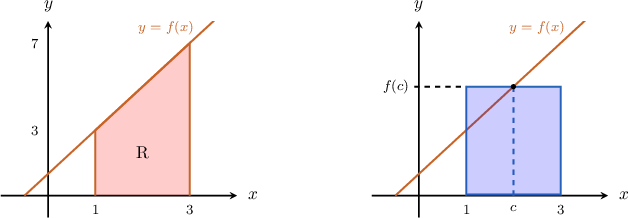
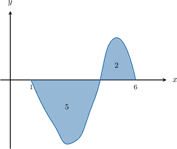

# The Average Value of a Function

Source: https://www.mathacademy.com/topics/1203?courseId=24
Topic ID: 1203

## Prerequisites

- [Integrating Trigonometric Functions Using Substitution](./478-integrating-trigonometric-functions-using-substitution.md)
- [Calculating the Definite Integral of a Function Given Its Graph](./1200-calculating-the-definite-integral-of-a-function-given-its-graph.md)

## Lesson

### Introduction

The region $\textrm{R},$ shown below, is the area under the graph of $f(x) = 2x+1$ over the interval $[1,3].$ What is the height of the rectangle defined over the same interval that has the same area as $\textrm{R}?$

Using the formula for the area of a trapezoid, we have that

$$

\begin{aligned} \textrm{Area}\,(\textrm{R}) = \dfrac{1}{2}(3+7)(3-1)= 10.\end{aligned}

$$

For the rectangle to have the same area, we must have

$$

\begin{aligned}10 & =𝑓(𝑐)(3−1) \\ 𝑓(𝑐) & =5 \\ 2𝑐+1 & =5 \\ 𝑐 & =2.\end{aligned}

$$

We can summarize what we've just done by saying that

$$

\int_1^3 (2x +1)\, \textrm d x= f(2) \cdot (3-1).

$$

This is an example of the **mean value theorem for integrals**, which states:

*If $f(x)$ is a continuous function on the closed interval $[a, b]$, then there exists a number $c$ in that interval such that*

$$

\int_a^b f(x)\, \textrm d x = f(c) \cdot (b-a).

$$

### Example: Finding Points That Satisfy the Mean Value Theorem for Integrals

#### Question

Find the values of $c$ that satisfy the mean value theorem for integrals for $f(x) = x^2-2x+2$ on the interval $[0,3].$

#### Explanation

Applying the mean value theorem for integrals, we have

$$

\begin{aligned} f(c) (b-a) & = \int_a^b f(x) \, \textrm dx \\\[5pt] f(c) & = \dfrac {1}{b-a} \int_a^b f(x) \, \textrm dx \\\[5pt] & = \dfrac {1}{3-0} \int_0^3 (x^2-2x+2) \, \textrm dx \\\[5pt] & = \left . \dfrac {1}{3} \cdot \left[\dfrac{x^3}{3} -x^2 +2x\right] \right|_0^3 \\\[5pt] & = \dfrac {1}{3} \cdot \left[ \left(\dfrac{3^3}{3} -3^2 +2\cdot3\right) - \left(\dfrac{0^3}{3} -0^2 +2\cdot0\right)\right] \\\[5pt] & = \dfrac {1}{3}\cdot6 \\\[5pt] & = 2. \end{aligned}

$$

Now, we use the expression for $f(x)$ to solve for the value of $c\mathbin{:}$

$$

\begin{aligned}𝑓(𝑐) & =2 \\ 𝑐^{2}−2𝑐+2 & =2 \\ 𝑐(𝑐−2) & =0 \\ 𝑐 & =0,2.\end{aligned}

$$

### The Average Value of a Function

The **average value** of a continuous function on a closed interval $[a,b]$ is given by

$$

f_\textrm{avg} = \dfrac{1}{b-a}\int_a^b f(x) \: \textrm{d}x.

$$

### Example: Finding the Average Value of a Function Over a Given Interval

#### Question

Find the average value of the function $f(x) = x - 2$ on the interval $[-2, 4].$

#### Explanation

Applying the average value formula, we find that the average value of the function is

$$

\begin{aligned}𝑓_{avg} & =\frac{1}{𝑏−𝑎}\,∫_{𝑏𝑎}^{}𝑓(𝑥)\,d𝑥 \\ & =\frac{1}{4−(−2)}∫_{4−2}^{}𝑥−2\,d𝑥 \\ & =\frac{1}{6}(\frac{𝑥^{2}}{2}−2𝑥)_{4−2}^{} \\ & =\frac{1}{6}[(\frac{4^{2}}{2}−2(4))−(\frac{(−2)^{2}}{2}−2(−2))] \\ & =\frac{1}{6}[(8−8)−(2+4)] \\ & =\frac{1}{6}(0−6) \\ & =−1.\end{aligned}

$$

### Example: Finding an Interval Given the Average Value of a Function

#### Question

Find $c$ such that the average value of $g(x) = 3 x$ on the interval $[0,c]$ is equal to $3.$

#### Explanation

To solve for $c,$ we apply the average value formula:

$$

\begin{aligned}𝑔_{avg} & =\frac{1}{𝑏−𝑎}\,∫_{𝑏𝑎}^{}𝑔(𝑥)\,d𝑥 \\ 3 & =\frac{1}{𝑐−0}\,∫_{𝑐0}^{}3𝑥\,d𝑥 \\ 3 & =\frac{1}{𝑐}(\frac{3𝑥^{2}}{2})_{𝑐0}^{} \\ 3 & =\frac{1}{𝑐}(\frac{3𝑐^{2}}{2}−0) \\ 3 & =\frac{3𝑐}{2} \\ 𝑐 & =2\end{aligned}

$$

### Example: Finding the Average Value of a Function Given a Graph

#### Question

The graph of the function $f(x),$ which is defined on $[1,6],$ is shown below. The areas of the regions between the graph and the $x$-axis are $5$ and $2,$ respectively (from left to right). Find the average value of $f(x)$ on $[1,6].$

#### Explanation

The average value of a function on a given interval is

$$

f_\textrm{avg} = \dfrac{1}{b-a}\int_a^b f(x) \: \textrm{d}x.

$$

Here, we see that

$$

\int_{1}^{6} f(x)\: \textrm{d}x = -5 + 2 = -3.

$$

So, applying the average value formula, we find that the average value is

$$

\begin{aligned}𝑓_{avg} & =\frac{1}{𝑏−𝑎}∫_{𝑏𝑎}^{}𝑓(𝑥)\,d𝑥 \\ & =\frac{1}{6−1}⋅(−3) \\ & =−\frac{3}{5}.\end{aligned}

$$
