# Volumes of Solids with Circular Cross Sections

Source: https://www.mathacademy.com/topics/1280?courseId=24
Topic ID: 1280

## Prerequisites

- [Volumes of Solids with Square Cross Sections](./1083-volumes-of-solids-with-square-cross-sections.md)
- [Circles in the Coordinate Plane](../geometry/1183-circles-in-the-coordinate-plane.md)
- [Areas of Circles](../geometry/1745-areas-of-circles.md)

## Lesson

### Introduction

Suppose that the base of a solid is the region enclosed by the line $y=-2x+2$ and the $x$-axis for $0 \leq x \leq 1,$ as shown below. If cross-sections perpendicular to the $x$-axis are semicircles, how do we calculate the volume of the solid?

A sketch with a few cross-sections is shown in the picture below.

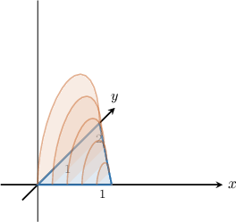

Consider a cross-section at some point $x$, where $x \in (0,1)$, and its projection onto the $xy$-plane:

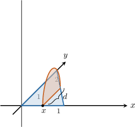

If we project the rectangular cross-section onto the $xy$-plane, we get the picture below:

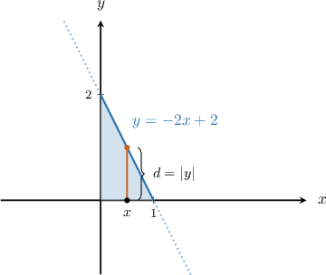

Then, the base of the cross-section is

$$

\begin{aligned}𝑑 & =|𝑦|=|−2𝑥+2|.\end{aligned}

$$

Given the diameter $d$ of a semicircle, we can find the corresponding area using the formula

$$

A = \overbrace{\dfrac{1}{2} \cdot \underbrace{\dfrac{1}{4}\pi d^2}_{\textrm{Full circle}}}^{\textrm{Semicircle}} = \dfrac{1}{8}\pi d^2.

$$

So, the expression for the area of the cross-section is

$$

\begin{aligned}𝐴(𝑥) & =\frac{1}{8}𝜋𝑑^{2} \\ & =\frac{𝜋}{8}|−2𝑥+2|^{2} \\ & =\frac{𝜋}{8}(4𝑥^{2}−8𝑥+4) \\ & =\frac{𝜋}{2}(1−2𝑥+𝑥^{2}).\end{aligned}

$$

We can now calculate the volume of the solid, as follows:

$$

\begin{aligned}𝑉 & =∫_{𝑏𝑎}^{}𝐴(𝑥)\,d𝑥 \\ & =∫_{10}^{}\frac{𝜋}{2}(1−2𝑥+𝑥^{2})d𝑥 \\ & =\frac{𝜋}{2}∫_{10}^{}(1−2𝑥+𝑥^{2})d𝑥 \\ & =\frac{𝜋}{2}(𝑥−𝑥^{2}+\frac{𝑥^{3}}{3})_{10}^{} \\ & =\frac{𝜋}{2}[(1−1+\frac{1}{3})−0] \\ & =\frac{𝜋}{2}⋅\frac{1}{3} \\ & =\frac{𝜋}{6}\end{aligned}

$$

### Example: Computing the Volume When the Base Is Bounded by a Curve and the X-Axis

#### Question

The base of a solid is the region enclosed by the curve $y=2-x^2$ and the $x$-axis for $-\sqrt{2} \leq x \leq \sqrt{2},$ as shown below. If cross-sections perpendicular to the $x$-axis are semicircles, find an integral that gives the volume of the solid.

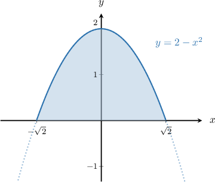

#### Explanation

Consider a cross-section at some point $x$, where $x \in \big(-\sqrt{2},\sqrt{2}\big)$, and its projection onto the $xy$-plane:

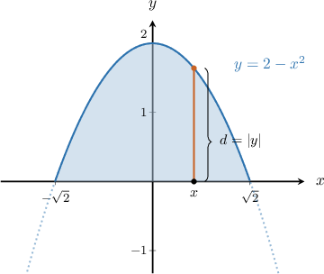

Then, the base of the cross-section is

$$

\begin{aligned}𝑑 & =|𝑦|=|2−𝑥^{2}|.\end{aligned}

$$

Given the diameter $d$ of a semicircle, the corresponding area can be found using the formula

$$

A = \dfrac{1}{2} \cdot \dfrac{1}{4}\pi d^2 = \dfrac{1}{8}\pi d^2.

$$

So, the expression for the area of the cross-section is

$$

\begin{aligned}𝐴(𝑥) & =\frac{1}{8}𝜋𝑑^{2} \\ & =\frac{𝜋}{8}2−𝑥^{2}^{2} \\ & =\frac{𝜋}{8}(4−4𝑥^{2}+𝑥^{4}).\end{aligned}

$$

We can now write the volume of the solid, as follows:

$$

\begin{aligned}𝑉 & =∫_{𝑏𝑎}^{}𝐴(𝑥)\,d𝑥 \\ & =\frac{𝜋}{8}∫_{\sqrt{√2}−\sqrt{√2}}^{}(4−4𝑥^{2}+𝑥^{4})d𝑥\end{aligned}

$$

### Example: Computing the Volume When the Base Is Bounded by Two Curves

#### Question

The base of a solid is the region enclosed by the curve $y=2-x^2$ and the line $y=x,$ as shown in the picture. If cross-sections perpendicular to the $x$-axis are semicircles, find an integral that gives the volume of the solid.

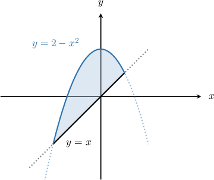

#### Explanation

Let $f(x)=2-x^2$ and $g(x)=x.$

First, we determine the limits of integration. To do that, we find the intersections of the two curves by setting the functions equal to one another and solving for $x\mathbin{:}$

$$

\begin{aligned}𝑓(𝑥) & =𝑔(𝑥) \\ 2−𝑥^{2} & =𝑥 \\ 𝑥^{2}+𝑥−2 & =0 \\ (𝑥−1)(𝑥+2) & =0\end{aligned}

$$

Hence, the solutions are $x=-2$ and $x=1.$

Now, consider a cross-section at some point $x$, where $x \in (-2,1)$, and its projection onto the $xy$-plane:

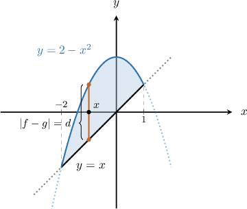

Then, the base of the cross-section is

$$

\begin{aligned}𝑑 & =|𝑓(𝑥)−𝑔(𝑥)| \\ & =(2−𝑥^{2})−(𝑥) \\ & =−𝑥^{2}−𝑥+2.\end{aligned}

$$

Given the diameter $d$ of a semicircle, the corresponding area can be found using the formula

$$

A = \dfrac{1}{2} \cdot \dfrac{1}{4}\pi d^2 = \dfrac{1}{8}\pi d^2 .

$$

So, the expression for the area of the cross-section is

$$

\begin{aligned}𝐴(𝑥) & =\frac{1}{8}𝜋𝑑^{2} \\ & =\frac{𝜋}{8}(−𝑥^{2}−𝑥+2)^{2}.\end{aligned}

$$

We can now write the volume of the solid, as follows:

$$

\begin{aligned}𝑉 & =∫_{𝑏𝑎}^{}𝐴(𝑥)\,d𝑥 \\ & =∫_{1−2}^{}\frac{𝜋}{8}(−𝑥^{2}−𝑥+2)^{2}\,d𝑥 \\ & =\frac{𝜋}{8}∫_{1−2}^{}(−𝑥^{2}−𝑥+2)^{2}\,d𝑥\end{aligned}

$$

### Cross-Sections Perpendicular to the Y-Axis

Now, let's suppose that the base of a solid is the region below enclosed by the line $x=y+2$ and the $y$-axis for $-2 \leq y \leq 0.$ Given that cross-sections perpendicular to the $y$-axis are semicircles, how do we calculate the volume of the solid?

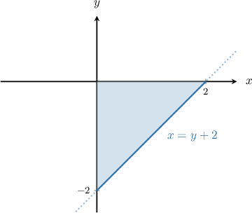

A sketch with a few cross-sections is shown in the picture below:

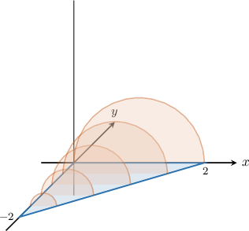

Now, consider the picture with only one cross-section that passes through some point $y \in (-2,0)\mathbin{:}$

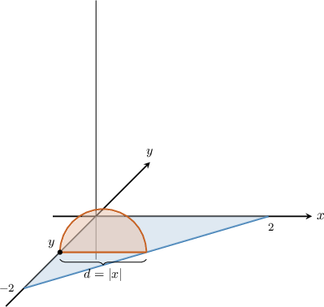

The projection of the previous picture on the $xy$-plane is given below:

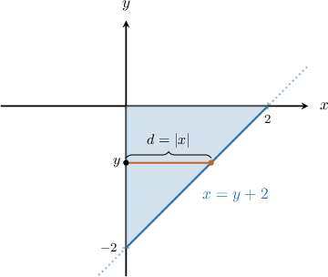

Then, the base of the cross-section is

$$

\begin{aligned}𝑑 & =|𝑦|=|𝑦+2|.\end{aligned}

$$

Given the diameter $d$ of a semicircle, we can find the corresponding area using the formula

$$

A = \dfrac{1}{2} \cdot \dfrac{1}{4}\pi d^2 = \dfrac{1}{8}\pi d^2.

$$

So, the expression for the area of the cross-section is

$$

\begin{aligned}𝐴(𝑦) & =\frac{1}{8}𝜋𝑑^{2} \\ & =\frac{𝜋}{8}|𝑦+2|^{2} \\ & =\frac{𝜋}{8}(𝑦^{2}+4𝑦+4).\end{aligned}

$$

We can now calculate the volume of the solid, as follows:

$$

\begin{aligned}𝑉 & =∫_{𝑑𝑐}^{}𝐴(𝑦)\,d𝑦 \\ & =∫_{0−2}^{}\frac{𝜋}{8}(𝑦^{2}+4𝑦+4)d𝑦 \\ & =\frac{𝜋}{8}∫_{0−2}^{}(𝑦^{2}+4𝑦+4)d𝑦 \\ & =\frac{𝜋}{8}(\frac{𝑦^{3}}{3}+2𝑦^{2}+4𝑦)_{0−2}^{} \\ & =\frac{𝜋}{8}[0−(−\frac{8}{3}+8−8)] \\ & =\frac{𝜋}{3}\end{aligned}

$$

### Example: Computing the Volume When the Cross Sections Are Perpendicular to the y-Axis

#### Question

The base of a solid is the region enclosed by the line $x=-3y$ and the $y$-axis for $0 \leq y \leq 1,$ as shown in the picture. Given that cross-sections perpendicular to the $y$-axis are semicircles, calculate the volume of the solid.

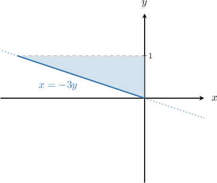

#### Explanation

Consider a cross-section at some point $y$, where $y \in (0,1)$, and its projection on the $xy$-plane:

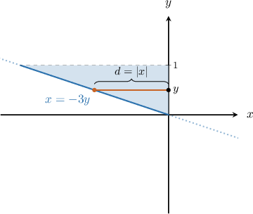

Then the base of the cross-section is

$$

\begin{aligned}𝑑 & =|𝑥| \\ & =|−3𝑦| \\ & =3𝑦.\end{aligned}

$$

Given the diameter $d$ of a semicircle, the corresponding area can be found using the formula

$$

A = \dfrac{1}{2} \cdot \dfrac{1}{4}\pi d^2 = \dfrac{1}{8}\pi d^2.

$$

So, the expression for the area of the cross-section is

$$

\begin{aligned}𝐴(𝑦) & =\frac{𝜋}{8}𝑑^{2} \\ & =\frac{𝜋}{8}(3𝑦)^{2} \\ & =\frac{9𝜋}{8}𝑦^{2}.\end{aligned}

$$

We can now calculate the volume of the solid, as follows:

$$

\begin{aligned}𝑉 & =∫_{𝑑𝑐}^{}𝐴(𝑦)\,d𝑦 \\ & =\frac{9𝜋}{8}∫_{10}^{}𝑦^{2}d𝑦 \\ & =\frac{3𝜋}{8}⋅(𝑦^{3})_{10}^{} \\ & =\frac{3𝜋}{8}(1−0) \\ & =\frac{3𝜋}{8}\end{aligned}

$$

### Example: Computing the Volume When the Base Is Bounded by Two Curves

#### Question

The base of a solid is the region enclosed by the curves $x=-y^2$ and $x=y^2-2,$ as shown in the picture. Given that cross-sections perpendicular to the $y$-axis are quarter-circles, calculate the volume of the solid.

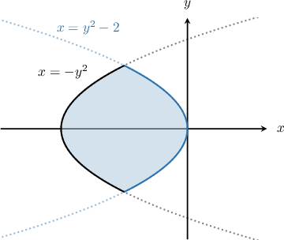

#### Explanation

Let $f(y)=-y^2$ and $g(y)=y^2-2.$

First, we determine the limits of integration. To do that, we find the intersections of the two curves by setting the functions equal and solving for $y\mathbin{:}$

$$

\begin{aligned}𝑓(𝑦) & =𝑔(𝑦) \\ −𝑦^{2} & =𝑦^{2}−2 \\ 2𝑦^{2} & =2 \\ 𝑦 & =±1\end{aligned}

$$

Hence, the solutions are $y= \pm 1.$

Now, consider a cross-section at some point $y$, where $y \in (-1,1)$, and its projection on the $xy$-plane:

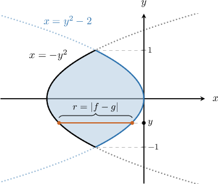

Then, the base of the cross-section is

$$

\begin{aligned}𝑟 & =|𝑓−𝑔| \\ & =(−𝑦^{2})−(𝑦^{2}−2) \\ & =−2𝑦^{2}+2.\end{aligned}

$$

Given the radius $r$ of a quarter-circle, we can find the corresponding area using the formula

$$

A = \dfrac{1}{4}\pi r^2.

$$

So, the expression for the area of the cross-section is

$$

\begin{aligned}𝐴(𝑦) & =\frac{1}{4}𝜋𝑟^{2} \\ & =\frac{𝜋}{4}⋅(−2𝑦^{2}+2)^{2} \\ & =\frac{𝜋}{4}(4𝑦^{4}−8𝑦^{2}+4) \\ & =𝜋(𝑦^{4}−2𝑦^{2}+1).\end{aligned}

$$

We can now calculate the volume of the solid, as follows:

$$

\begin{aligned}𝑉 & =∫_{𝑑𝑐}^{}𝐴(𝑦)\,d𝑦 \\ & =∫_{1−1}^{}𝜋(𝑦^{4}−2𝑦^{2}+1)d𝑦 \\ & =𝜋∫_{1−1}^{}(𝑦^{4}−2𝑦^{2}+1)d𝑦 \\ & =2𝜋∫_{10}^{}(𝑦^{4}−2𝑦^{2}+1)d𝑦 \\ & =2𝜋(\frac{𝑦^{5}}{5}−\frac{2}{3}𝑦^{3}+𝑦)_{10}^{} \\ & =2𝜋[(\frac{1}{5}−\frac{2}{3}+1)−0] \\ & =2𝜋⋅\frac{8}{15} \\ & =\frac{16𝜋}{15}\end{aligned}

$$
