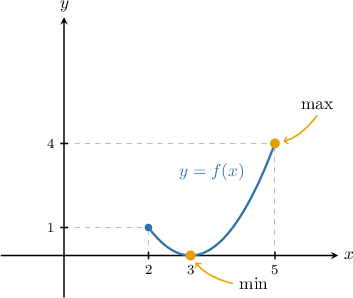
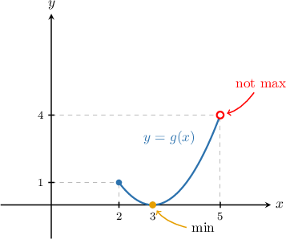
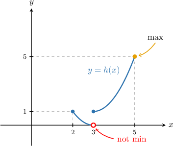
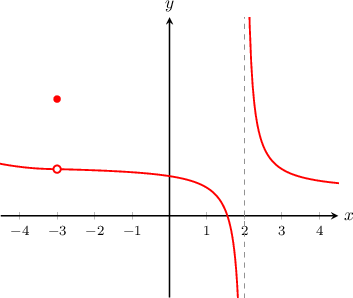

# The Extreme Value Theorem

Source: https://www.mathacademy.com/topics/3571?courseId=24
Topic ID: 3571

## Prerequisites

- [Continuity of Functions](./2006-continuity-of-functions.md)

## Lesson

### Introduction

Under what conditions can we be sure that the global extrema of a function exist?

The **extreme value theorem** answers this question and states the following:

*If $f(x)$ is a continuous function defined on the closed interval $[a,b],$ then $f(x)$ always has at least one global maximum and one global minimum on $[a,b]$*.

For example, consider the function $f(x),$ given by

$$

f(x) = (x-3)^2, \qquad x\in [2,5].

$$

Notice that this function satisfies the conditions for the extreme value theorem:

- the function $f(x)$ is *continuous* on the interval $x\in [2,5]$, and

- the interval $[2,5]$ is *closed*.

Since *both* conditions are satisfied, the extreme value theorem guarantees that $f(x)$ must have at least one global maximum and one global minimum.

To see that this is indeed true, let's sketch the graph of $f(x).$

From the diagram, we see that the function $f(x)$ has

- a global maximum at $x=5,$ and

- a global minimum at $x=3.$

### Conditions for Applying the Extreme Value Theorem

We can only apply the extreme value theorem to *continuous* functions defined on *closed* intervals. Both conditions are crucial.

To see why this is the case, consider the function $g(x),$ given by

$$

g(x)=(x-3)^2, \qquad x\in [2,5).

$$

Notice that $g(x)$ is defined on a semi-open interval (the right endpoint is open). As a result, we cannot guarantee that $g(x)$ has a global maximum and a global minimum.

Similarly, consider the function $h(x),$ given by

$$

\begin{aligned}(𝑥−3)^{2}, & \,2≤𝑥<3, \\ (𝑥−3)^{2}+1, & \,3≤𝑥≤5.\end{aligned}

$$

Notice that $h(x)$ is defined on the closed interval $[2,5].$ However, since $h(x)$ is not continuous on $[2,5],$ we cannot guarantee that $h(x)$ has both a global maximum and minimum on $[2,5].$

### Example: Determining Whether the Extreme Value Theorem Is Applicable to a Function Given Its Graph

#### Question

Consider the function $y = f(x)$ whose graph is the following:

On which of the following intervals is the extreme value theorem applicable to $f(x)?$

1. $[-2,1]$

2. $(-2,1)$

3. $[-4,4]$

#### Explanation

Remember that the extreme value theorem is only applicable to closed intervals on which the function is continuous.

With that in mind, let's take a look at each interval.

- The interval $[-2,1]$ is closed, and the function is continuous on $[-2,1].$ Therefore, the extreme value theorem is applicable.

- The interval $(-2,1)$ is not closed, so the extreme value theorem is not applicable.

- The interval $[-4,4]$ is closed, but the function is not continuous on $[-4,4]$ because there are discontinuities at $x=-3$ and $x=2,$ both of which lie within $[-4,4].$ Therefore, the extreme value theorem is not applicable.

In conclusion, the correct answer is $[-2,1]$ only.

### Example: Identifying Intervals on Which a Given Function Satisfies the Extreme Value Theorem

#### Question

On which of the following intervals can the extreme value theorem be applied to the function $y=\ln\left(\sqrt{x}+2\right)?$

1. $[0,2]$

2. $(0,2)$

3. $[-2,0]$

#### Explanation

Remember that the extreme value theorem is only applicable to closed intervals on which the function is continuous.

With that in mind, let's take a look at each interval.

- The interval $[0,2]$ is closed, and the function is continuous on $[0,2].$ Therefore, the extreme value theorem is applicable.

- The interval $(0,2)$ is not closed, so the extreme value theorem is not applicable.

- The interval $[-2,0]$ is closed, but the function is not continuous on $[-2,0]$ because this interval contains points where $\ln\left(\sqrt{x}+2\right)$ is not defined. In particular, $\sqrt{x}$ is not defined for negative values of $x.$ Therefore, the extreme value theorem is not applicable.

In conclusion, the correct answer is $[0,2]$ only.

### Example: Applying the Extreme Value Theorem to Piecewise Functions

#### Question

Suppose that $f(x)$ is defined as

$$

\begin{aligned}\frac{1}{𝑥−1}, & 𝑥≠1 \\ \,\,1, & 𝑥=1.\end{aligned}

$$

Is the extreme value theorem applicable to $f(x)$ on the intervals $[-1,2]$ and $[-1,0]?$

#### Explanation

Remember that the extreme value theorem is only applicable to closed intervals on which the function is continuous.

So, let's check whether the function is continuous on each of the intervals.

- First, consider $[-1,2].$ We have so $f(x)$ has a discontinuity at $x=1.$ Therefore, $f(x)$ is ** continuous on the interval $[-1,2],$ and the extreme value theorem is not applicable on this interval.

- Now, consider $[-1,0].$ The only discontinuity of the function $f(x)=\dfrac{1}{x-1}$ is at $x=1,$ which is not in the interval $[-1,0].$ Therefore, $f(x)$ is continuous on the interval $[-1,0],$ and the extreme value theorem is applicable on this interval.

In conclusion, of the two intervals, the extreme value theorem is only applicable on $[-1,0].$
