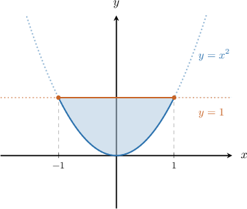
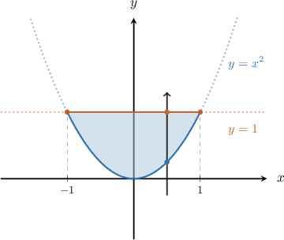
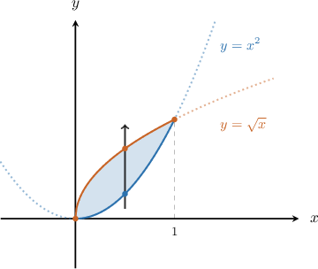
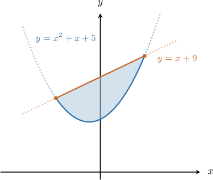
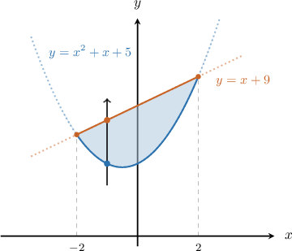
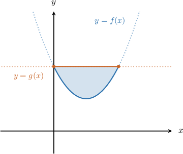
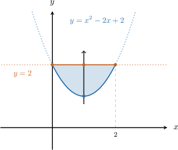
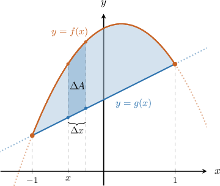

# The Area Between Curves Expressed as Functions of X

Source: https://www.mathacademy.com/topics/395?courseId=24
Topic ID: 395

## Prerequisites

- [Finding the Area Between a Curve and the X-Axis When They Intersect](./1432-finding-the-area-between-a-curve-and-the-x-axis-when-they-intersect.md)

## Lesson

### Introduction

Suppose that we want to find the finite area bounded between the curves $y=x^2$ and $y=1.$

The area $A$ of the region is given by

$$

A = \int_{-1}^{1} \left[\, \left(\color{brown}{\textrm{upper function}}\right) - \left(\color{blue}{\textrm{lower function}}\right) \,\right] \,\textrm{d}x.

$$

So in our case, the area is expressed as

$$

A = \int_{-1}^{1} \big[ ({\color{brown}{1}}) - ({\color{blue}{x^2}}) \big]\,\textrm{d}x = \int_{-1}^{1} (1-x^2)\,\textrm{d}x.

$$

Now that the integral has been written down correctly, we can evaluate it using the usual techniques:

$$

\begin{aligned}𝐴 & =∫_{1−1}^{}(1−𝑥^{2})\,d𝑥 \\ & =[𝑥−\frac{𝑥^{3}}{3}]_{1−1}^{} \\ & =[1−\frac{1}{3}]−[−1−\frac{(−1)^{3}}{3}] \\ & =\frac{2}{3}−[−\frac{2}{3}] \\ & =\frac{4}{3}\end{aligned}

$$

So the area of the region is $\dfrac{4}{3}.$

Lastly, let's recap a few things:

- The limits of integration correspond to the $x$-values at the points of intersection of the two functions.

- If you're not sure which is the lower function and which is the upper, one way to find out is to draw a vertical line that *points upward* through the region, like so:

The vertical line always

- *enters* the region through the lower function $y=x^2,$ and

- *leaves* through the upper function $y=1.$

### Example: Expressing the Area Between Two Curves as an Integral Given the Limits of Integration

#### Question

Write down an integral that gives the area of the finite region bounded by the curves $y=x^2$ and $y=\sqrt x,$ as shown below.

#### Explanation

The diagram shows that the intersection points between the two graphs occur when $x=0$ and $x=1.$ So these will be our limits of integration.

To determine which is the lower function and which is the upper, let's draw our vertical arrow.

The vertical line

- ** the region through the lower function $y=x^2,$ and

- ** through the upper function $y=\sqrt x.$

Therefore, the integral that gives our area is

$$

\begin{aligned}𝐴 & =∫_{10}^{}[\,(upper function)−(lower function)\,]\,d𝑥 \\ & =∫_{10}^{}[\,(\sqrt{√𝑥})−(𝑥^{2})\,]\,d𝑥 \\ & =∫_{10}^{}(\sqrt{√𝑥}−𝑥^{2})\,d𝑥.\end{aligned}

$$

### Example: Expressing the Area Between Two Curves as an Integral by First Solving For the Limits of Integration

#### Question

What is the integral that gives the area of the finite region bounded by $y=x^2+x+5$ and $y=x+9?$

#### Explanation

First, let's draw a sketch of the two functions.

**

Now, we want to determine the limits of integration. To do this, we equate the two functions and solve for $x\mathbin{:}$

$$

\begin{aligned}𝑥^{2}+𝑥+5 & =𝑥+9 \\ 𝑥^{2}−4 & =0 \\ (𝑥−2)(𝑥+2) & =0\end{aligned}

$$

Hence, we need to integrate from $x=-2$ to $x=2.$

To determine which is the lower function and which is the upper, let's draw our vertical arrow.

The vertical line

- ** the region through the lower function $y=x^2+x+5,$ and

- ** through the upper function $y=x+9.$

Therefore, the integral that gives our area is

$$

\begin{aligned}𝐴 & =∫_{2−2}^{}[\,(upper function)−(lower function)\,]\,d𝑥 \\ & =∫_{2−2}^{}[\,(𝑥+9)−(𝑥^{2}+𝑥+5)\,]\,d𝑥 \\ & =∫_{2−2}^{}(4−𝑥^{2})\,d𝑥.\end{aligned}

$$

### Example: Calculating the Area Between Two Curves Expressed as Functions of X

#### Question

Find the area of the finite region enclosed between $f(x) =x^2-2x+2$ and $g(x) = 2,$ shown below.

#### Explanation

First, we want to determine the limits of integration. To do this, we equate the two functions and solve for $x\mathbin{:}$

$$

\begin{aligned}𝑥^{2}−2𝑥+2 & =2 \\ 𝑥^{2}−2𝑥 & =0 \\ 𝑥(𝑥−2) & =0\end{aligned}

$$

Hence, we need to integrate from $x=0$ to $x=2.$

To determine which is the lower function and which is the upper, we draw our vertical arrow.

The vertical line

- ** the region through the lower function $y=x^2-2x+2,$ and

- ** through the upper function $y=2.$

Therefore, we can find the area as follows:

$$

\begin{aligned}𝐴 & =∫_{20}^{}[\,(upper function)−(lower function)\,]\,d𝑥 \\ & =∫_{20}^{}[\,(2)−(𝑥^{2}−2𝑥+2)\,]\,d𝑥 \\ & =∫_{20}^{}(−𝑥^{2}+2𝑥)\,d𝑥 \\ & =∫_{20}^{}(2𝑥−𝑥^{2})\,d𝑥 \\ & =(𝑥^{2}−\frac{1}{3}𝑥^{3})_{20}^{} \\ & =(2^{2}−\frac{1}{3}⋅2^{3})−(0−0) \\ & =(4−\frac{8}{3})−0 \\ & =\frac{4}{3}\end{aligned}

$$

### Justifying the Rule

Lastly, let's discuss why the area formula works.

$$

A = \int_{a}^{b}\left(\color{brown}{\textrm{upper function}}\right) - \left(\color{blue}{\textrm{lower function}}\right)\,\textrm{d}x

$$

Consider the area bounded by the two functions $y = f(x)$ and $y = g(x).$ We'll assume that the two curves intersect at $x=\pm 1,$ and for $x\in(-1,1)$ we have $f(x) > g(x),$ so $f(x)$ is the upper function.

We can approximate the area using rectangles in the following way. First, we will divide the interval $[-1,1]$ into small subintervals of equal length $\Delta{x}.$ One such subinterval is shown in the picture below.

The area $\Delta{A}$ bounded between the curves $f(x)$ and $g(x)$ can be approximated by the area of the rectangle shown below, with the sides $\Delta{x}$ (horizontal) and $f(x)-g(x)$ (vertical),

$$

\Delta{A} \approx \left(f(x)-g(x)\right)\Delta{x}

$$

The sum over all the rectangles will approximate the total area $A$ that we want. This approximation becomes more accurate as the rectangles get narrower, i.e., $\Delta{x} \to 0.$ And the limit of the sum, as $\Delta x \to 0,$ is the required integral!

$$

\begin{aligned}𝐴=∫_{𝑏𝑎}^{}(𝑓(𝑥)−𝑔(𝑥))\,d𝑥\end{aligned}

$$
