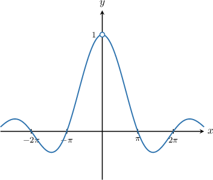
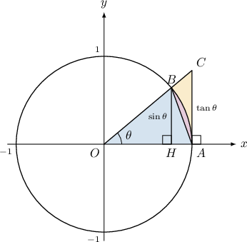

# Special Limits Involving Sine

Source: https://www.mathacademy.com/topics/606?courseId=24
Topic ID: 606

## Prerequisites

- [Simplifying Expressions Using Basic Trigonometric Identities](../precalculus/203-simplifying-expressions-using-basic-trigonometric-identities.md)
- [Limits of Reciprocal Trigonometric Functions](./1958-limits-of-reciprocal-trigonometric-functions.md)

## Lesson

### Introduction

Consider the limit

$$

\lim_\limits{x \to 0} \dfrac{\sin x}{x}.

$$

Direct substitution leads to the indeterminate form:

$$

\begin{aligned}\underset{𝑥→0}{lim}\frac{sin⁡𝑥}{𝑥}=\frac{sin⁡(0)}{0}=\frac{0}{0}\end{aligned}

$$

However, if we plot the graphs of $y=\dfrac{\sin x}{x},$ we get the following picture.

While $y = \dfrac{\sin{x}}{x}$ is undefined at $x=0,$ it does appear from the graph that

$$

\lim_\limits{x \to 0} \dfrac{\sin x}{x}=1.

$$

It's possible to prove this result more rigorously, and we'll do this at the end of the lesson. For now, we will assume that it is true and use it to calculate other limits.

### Example: Evaluating a Limit of a Function Involving the Special Limit With Sine

#### Question

Evaluate $\displaystyle \lim_{x\to 0}\: \dfrac{2\sin{x}}{3x}.$

#### Explanation

Notice that as $x \to 0,$ both the numerator and denominator approach $0.$

So, if we attempt to evaluate the limit directly, we get

$$

\displaystyle \lim_{x\to 0}\: \dfrac{2\sin{x}}{3x} = \dfrac{0}{0},

$$

which is an indeterminate form.

Instead, let's recall the following special limit:

$$

\displaystyle \lim_{x\to 0}\: \dfrac{\sin{x}}{x} = 1

$$

Rewriting the given limit using the algebra of limits and applying our special limit, we get the following:

$$

\begin{aligned}\underset{𝑥→0}{lim}\,\frac{2sin⁡𝑥}{3𝑥} & =\underset{𝑥→0}{lim}(\frac{2}{3}⋅\frac{sin⁡𝑥}{𝑥}) \\ & =\frac{2}{3}⋅\underset{𝑥→0}{lim}\,\frac{sin⁡𝑥}{𝑥} \\ & =\frac{2}{3}⋅1 \\ & =\frac{2}{3}\end{aligned}

$$

### Example: Evaluating a Limit of a Function Involving the Special Limit With Sine: Advanced Cases

#### Question

Evaluate $\lim_\limits{\theta \to 0}\: \dfrac{\theta \cot \theta}{4 \cos^2 \theta}.$

#### Explanation

First, we can simplify the limit using trigonometric identities, as follows:

$$

\begin{aligned}\underset{𝜃→0}{lim}\,\frac{𝜃cot⁡𝜃}{4cos^{2}⁡𝜃} & =\underset{𝜃→0}{lim}(\frac{𝜃}{4cos^{2}⁡𝜃}⋅cot⁡𝜃) \\ & =\underset{𝜃→0}{lim}(\frac{𝜃}{4cos^{2}⁡𝜃}⋅\frac{cos⁡𝜃}{sin⁡𝜃}) \\ & =\underset{𝜃→0}{lim}(\frac{𝜃}{sin⁡𝜃}⋅\frac{1}{4cos⁡𝜃}) \\ & =\underset{𝜃→0}{lim}\,\frac{𝜃}{sin⁡𝜃}⋅\underset{𝜃→0}{lim}\,\frac{1}{4cos⁡𝜃}\end{aligned}

$$

Let's now evaluate the limits separately:

- Consider the first limit. Notice that as $\theta \to 0,$ both numerator and denominator approach $0.$ So, if we attempt to evaluate the limit directly, we get which is an indeterminate form. Rewriting the given limit using the algebra of limits and applying our special limit, we get the following:

- Consider the second limit. Evaluating it directly, we get Therefore, we have

### Proof of the Result

Now, we will prove the limit

$$

\lim_{\theta \to 0} \dfrac{\sin \theta}{\theta}=1.

$$

First, we prove the right-sided limit

$$

\lim_{\theta \to 0^+} \dfrac{\sin \theta}{\theta}=1.

$$

On the unit circle, we choose the two points, $A$ and $B.$ The point $A$ lies on the $x$-axis and the point $B$ is such that the angle $\theta=\angle AOB$ is acute:

$$

0 < \theta < \dfrac{\pi}{2}

$$

Let $C$ be the point of intersection of the tangent to this circle at the point $A$ and the line $\overset{\longleftrightarrow}{OB}.$ The point $H$ is the projection of the point $B$ onto the $x$-axis. See the illustration below.

Then, $OA = OB =1,$ $BH = \sin \theta,$ and $AC = \tan \theta.$

The area of a triangle $\triangle OAB$ is less than the area of a sector $OAB$, which is less than the area of a triangle $\triangle OAC\mathbin{:}$

$$

{\color{SteelBlue}\mathcal{A}_{\triangle OAB} }\leq {\color{PaleVioletRed}\mathcal{A}_{sec OAB}} \leq { \color{SandyBrown}\mathcal{A}_{\triangle OAC}}.

$$

Using the formulas for the areas of the triangles and the sector, and noting that $\theta$ is measured in radians, we get:

$$

\begin{aligned}A_{△𝑂𝐴𝐵} & =\frac{1}{2}𝑂𝐴⋅𝐵𝐻 \\ & =\frac{1}{2}⋅1⋅sin⁡𝜃 \\ & =\frac{sin⁡𝜃}{2} \\ A_{sec.𝑂𝐴𝐵} & =𝜋𝑟^{2}⋅\frac{𝜃}{2𝜋} \\ & =𝜋⋅1^{2}⋅\frac{𝜃}{2𝜋} \\ & =\frac{𝜃}{2} \\ A_{△𝑂𝐴𝐶} & =\frac{1}{2}𝑂𝐴⋅𝐴𝐶 \\ & =\frac{1}{2}⋅1⋅tan⁡𝜃 \\ & =\frac{tan⁡𝜃}{2}\end{aligned}

$$

Therefore, we have

$$

\dfrac{\sin \theta}{2} \leq \dfrac{\theta}{2} \leq \dfrac{\tan \theta}{2}.

$$

Multiplying each part of the final inequality by $\dfrac{2}{\sin \theta},$ we obtain

$$

1 \leq \dfrac{\theta}{\sin \theta} \leq \dfrac{1}{\cos{\theta}}.

$$

Taking reciprocals and reversing the inequalities yields

$$

\cos{\theta} \leq \dfrac{\sin \theta}{\theta} \leq 1.

$$

Since $\lim\limits_{\theta \to 0^+}\cos{\theta} = 1$ and $\lim\limits_{\theta \to 0^+}1 = 1,$ we get

$$

\begin{aligned}\underset{𝜃→0^{+}}{lim}cos⁡𝜃 & ≤\underset{𝜃→0^{+}}{lim}\frac{sin⁡𝜃}{𝜃}≤\underset{𝜃→0^{+}}{lim}1 \\ 1 & ≤\underset{𝜃→0^{+}}{lim}\frac{sin⁡𝜃}{𝜃}≤1,\end{aligned}

$$

and consequently, the squeeze theorem implies that

$$

\lim\limits_{\theta \to 0^+} \dfrac{\sin \theta}{\theta} = 1.

$$

Now, we'll use this result to calculate $\lim\limits_{\theta \to 0^-} \dfrac{\sin \theta}{\theta}.$

Let $u=-\theta.$ Then, the limit $\theta \to 0^-$ is equivalent to $u \to 0^+.$ Therefore,

$$

\begin{aligned}\underset{𝜃→0^{−}}{lim}\frac{sin⁡𝜃}{𝜃} & =\underset{𝑢→0^{+}}{lim}\frac{sin⁡(−𝑢)}{(−𝑢)} \\ & =\underset{𝑢→0^{+}}{lim}\frac{−sin⁡𝑢}{−𝑢} \\ & =\underset{𝑢→0^{+}}{lim}\frac{sin⁡𝑢}{𝑢} \\ & =1.\end{aligned}

$$

Finally, since

$$

\lim_{\theta \to 0^+} \dfrac{\sin \theta}{\theta} = \lim_{\theta \to 0^-} \dfrac{\sin \theta}{\theta}=1,

$$

we conclude that

$$

\lim_{\theta \to 0} \dfrac{\sin \theta}{\theta} = 1.

$$
