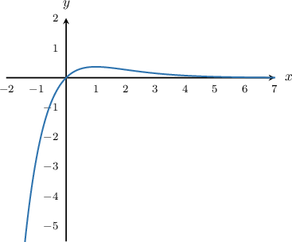
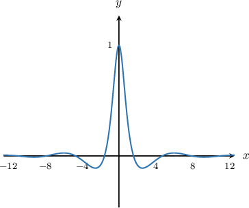

# Evaluating Limits at Infinity by Comparing Relative Magnitudes of Functions

Source: https://www.mathacademy.com/topics/607?courseId=24
Topic ID: 607

## Prerequisites

- [Limits at Infinity of Polynomials](./1263-limits-at-infinity-of-polynomials.md)
- [Limits of Logarithmic Functions](./1377-limits-of-logarithmic-functions.md)
- [Limits of Exponential Functions](./1717-limits-of-exponential-functions.md)
- [Limits of Trigonometric Functions](./1719-limits-of-trigonometric-functions.md)

## Lesson

### Introduction

Suppose that we want to calculate the following limit:

$$

\lim_{x\to \infty}\dfrac{x}{e^x}

$$

Notice that as $x \to \infty,$ both the numerator and denominator approach $\infty.$ Consequently, attempting direct substitution gives $\dfrac \infty\infty$, which is called an **indeterminate form** because we are unable to determine what it means.

However, there is a trick. The trick is to realize that the numerator approaches infinity slowly, whereas the denominator approaches infinity rapidly. So for large values of $x,$ we have

$$

\dfrac{x}{e^x} = \dfrac{\text{a big number}}{\text{a really really big number}}.

$$

To put this in perspective: if $x=20,$ then

$$

\dfrac{x}{e^x} = \dfrac{20}{e^{20}} \approx \dfrac{20}{485165195} \approx 0.00000004.

$$

So, we conclude that

$$

\lim_{x\to \infty}\dfrac{x}{e^x} = 0.

$$

This result is consistent with the graph of $y=\dfrac{x}{e^x}.$

In general, for large values of $x,$

$$

e^{x} \gg x^n \gg \ln(x),

$$

where $\gg$ means **much greater than**, and $n$ is *any* positive integer. We can use this to solve a variety of problems involving limits at infinity.

### Example: Comparing an Exponential Function and a Polynomial Function

#### Question

Evaluate $\displaystyle \lim_{x\to \infty}\dfrac{x^{100}}{e^x}.$

#### Explanation

Both the numerator and denominator approach $\infty$ as $x\to\infty.$ However, since $e^x \gg x^{100}$ for large values of $x,$ the denominator is growing much faster than the numerator. Consequently, we conclude that

$$

\lim_{x\to \infty}\dfrac{x^{100}}{e^x} = 0.

$$

### Example: Comparing a Polynomial Function and a Logarithmic Function

#### Question

Evaluate $\displaystyle \lim_{x\to \infty}\dfrac{x}{\ln{x}}.$

#### Explanation

Both the numerator and denominator approach $\infty$ as $x\to\infty.$ However, since $x \gg \ln{x}$ for large values of $x,$ the numerator is growing much faster than the denominator. Consequently, we conclude that

$$

\lim_{x\to \infty}\dfrac{x}{\ln{x}} = \infty.

$$

### Example: Comparing an Exponential Function and a Logarithmic Function

#### Question

Evaluate $\displaystyle \lim_{x\to \infty}\dfrac{e^{2x}}{\ln{x}}.$

#### Explanation

Both the numerator and denominator approach $\infty$ as $x\to\infty.$ However, since $e^{2x} \gg \ln{x}$ for large values of $x,$ the numerator is growing much faster than the denominator. Consequently, we conclude that

$$

\lim_{x\to \infty}\dfrac{e^{2x}}{\ln{x}} = \infty.

$$

### Example: Comparing the Relative Magnitude of a Trigonometric Function

#### Question

Evaluate $\displaystyle \lim_{x\to \infty}\dfrac{\cos x}{x^2+1}.$

#### Explanation

The numerator here is a bounded, oscillating function with

$$

|\cos x| \leq 1.

$$

However, the denominator $x^2+1$ grows without bound as $x\to\infty.$ So the denominator is growing much faster than the numerator, and we conclude that

$$

\lim_{x\to \infty}\dfrac{\cos x}{x^2+1} = 0.

$$

We can see this from the graph of $y=\dfrac{\cos x}{x^2+1},$ shown below:

