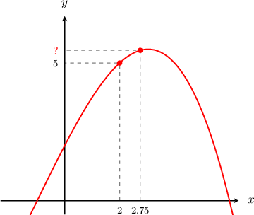
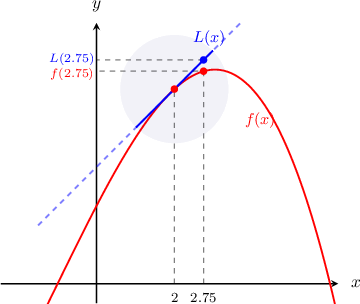
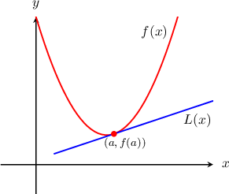
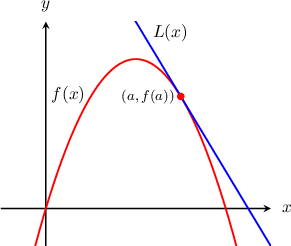

# Approximating Functions Using Local Linearity and Linearization

Source: https://www.mathacademy.com/topics/621?courseId=24
Topic ID: 621

## Prerequisites

- [Intervals of Concavity](./363-intervals-of-concavity.md)

## Lesson

### Introduction

Consider the function $y=f(x)$ below. Suppose we know that $f(2)=5$ and $f'(2)=1.$ Based on this information, how can we approximate the value of $f(2.75)?$

First, recall that the tangent line to $y=f(x)$ at $x=a$ is given by

$$

y-f(a) = f'(a)(x-a).

$$

Solving for $y$ in the above, we get

$$

y= f(a)+ f'(a)(x-a)

$$

Now, provided that $x$ is close to $a,$ we can assume that $y\approx f(x),$ which gives us the approximation

$$

f(x)\approx f(a)+ f'(a)(x-a).

$$

We often represent the tangent line approximation using the notation $L(x),$ as follows:

$$

L(x)= f(a)+ f'(a)(x-a)

$$

In this case, we want the tangent line approximation at $a=2.$ Substituting this value along with the given information, we find

$$

\begin{aligned}𝐿(𝑥) & =𝑓(𝑎)+𝑓^{′}(𝑎)(𝑥−𝑎) \\ & =𝑓(2)+𝑓^{′}(2)(𝑥−2) \\ & =(5)+(1)(𝑥−2) \\ & =𝑥+3.\end{aligned}

$$

Now, let's take a look at the graphs. Notice that in the neighborhood of $x=2$, the function and its tangent line approximation are very close. The line $L(x)$ is a good approximation of the function for points close to $x=2.$

As we can see, ${\color{blue}L(2.75)}$ and ${\color{red}f(2.75)}$ are quite close. So, we can approximate $f(2.75)$ using $L(2.75)\mathbin{:}$

$$

\begin{aligned}𝑓(2.75) & ≈𝐿(2.75) \\ & =(2.75)+3 \\ & =5.75.\end{aligned}

$$

The tangent line approximation

$$

L(x)= f(a)+ f'(a)(x-a)

$$

is sometimes also called the **linear approximation** of the function $f(x)$ at the point $x=a.$ The process of approximating the function by its tangent is called **linearization.**

### Example: Estimating the Value of a Function at a Point Using a Tangent Line Approximation

#### Question

Suppose that $f(-2) = 0$ and $f'(-2)=2.$ Estimate the value of $f(-1.8)$ using the tangent line approximation of $f(x)$ at $x=-2.$

#### Explanation

The tangent line approximation to $f(x)$ at the point $a=-2$ is

$$

\begin{aligned}𝐿(𝑥) & =𝑓(𝑎)+𝑓^{′}(𝑎)(𝑥−𝑎) \\ & =𝑓(−2)+𝑓^{′}(−2)(𝑥−(−2)) \\ & =0+2(𝑥+2) \\ & =2(𝑥+2).\end{aligned}

$$

We can approximate $f(-1.8)$ by evaluating the tangent line approximation at $x=-1.8.$ We get

$$

\begin{aligned}𝑓(−1.8) & ≈𝐿(−1.8) \\ & =2(−1.8+2) \\ & =2(0.2) \\ & =0.4.\end{aligned}

$$

### Example: Estimating the Value of a Function at a Point Given its Derivative

#### Question

Let $g$ be a function such that $g'(x) =\sqrt{x}$ and $g(4) = 3.$ Using the tangent line approximation of $g(x)$ at $x=4,$ estimate the value of $g(3.6).$

#### Explanation

The tangent line approximation to $g(x)$ at the point $a=4$ is

$$

\begin{aligned}𝐿(𝑥) & =𝑔(𝑎)+𝑔^{′}(𝑎)(𝑥−𝑎) \\ & =𝑔(4)+𝑔^{′}(4)(𝑥−4).\end{aligned}

$$

We're told that $g(4)=3,$ and since $g'(x)=\sqrt{x},$ then $g'(4)=\sqrt{4}=2.$ So, the tangent line approximation is given by

$$

\begin{aligned}𝐿(𝑥) & =3+2(𝑥−4).\end{aligned}

$$

Now, we can approximate $g(3.6)$ by evaluating the tangent line approximation at $x=3.6.$ We get

$$

\begin{aligned}𝑔(3.6) & ≈𝐿(3.6) \\ & =3+2(3.6−4) \\ & =3+2(−0.4) \\ & =3−0.8 \\ & =2.2.\end{aligned}

$$

### Underestimate and Overestimate Approximations

Let $L(x)$ be the tangent line approximation of $y = f(x)$ at $x=a,$ as shown in the pictures below.

We can make the following conclusions:

- When the function is *concave up*, the tangent line is *below* the graph (see the picture on the left). Then, near $x=a,$ and we say that $L(x)$ gives an *underestimate* of the function.

- When the function is *concave down*, the tangent line is *above* the graph (see the picture on the right). Then, near $x=a,$ and we say that $L(x)$ gives an *overestimate* of the function.

### Example: Computing a Tangent Line Approximation and Classifying it as an Underestimate or Overestimate

#### Question

The graph of the function $y=f(x)$ passes through $(-2,-5)$ and is concave down on the interval $(-\infty,0).$ If $f'(-2)=3$, estimate the value of $f(-2.3)$ using the tangent line approximation of $f(x)$ at $x=-2$ and determine whether the approximation is an underestimate or overestimate.

#### Explanation

The tangent line approximation to $f(x)$ at the point $a=-2$ is

$$

\begin{aligned}𝐿(𝑥) & =𝑓(𝑎)+𝑓^{′}(𝑎)(𝑥−𝑎) \\ & =𝑓(−2)+𝑓^{′}(−2)(𝑥−(−2)) \\ & =𝑓(−2)+𝑓^{′}(−2)(𝑥+2).\end{aligned}

$$

The function passes through the point $(-2,-5),$ so we have $f(-2)=-5.$ Also, we're told that $f'(-2)=3,$ so we get

$$

\begin{aligned}𝐿(𝑥) & =−5+3(𝑥+2).\end{aligned}

$$

We can approximate $f(-2.3)$ by evaluating the tangent line approximation at $x=-2.3.$ We get

$$

\begin{aligned}𝑓(−2.3) & ≈𝐿(−2.3) \\ & =−5+3(−2.3+2) \\ & =−5+3(−0.3) \\ & =−5−0.9 \\ & =−5.9.\end{aligned}

$$

Finally, since the function is concave down on the interval $(-\infty,0)$, the linear approximation $L(x)$ is above the graph near $x=-2,$ and therefore we have an overestimate.
