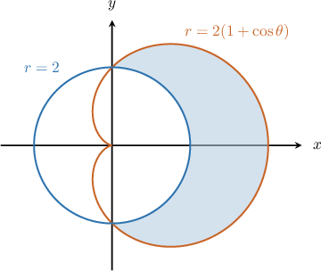
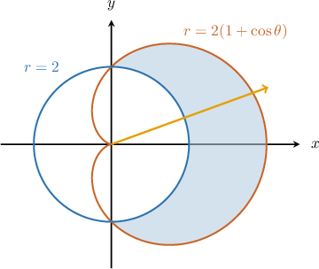
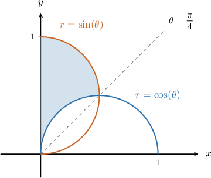
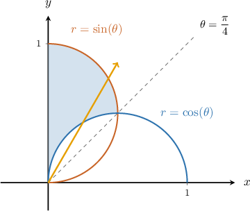
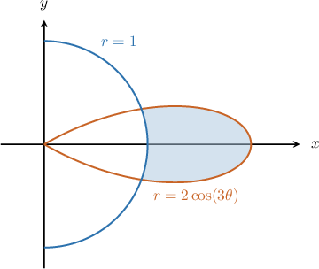
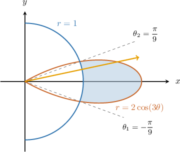
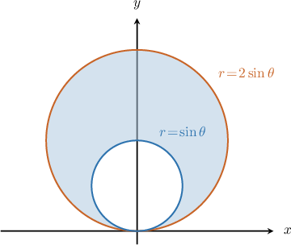
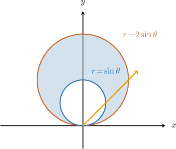
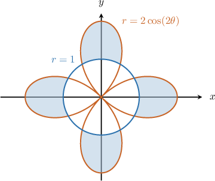
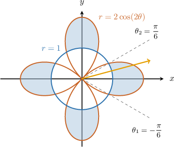

# The Area Bounded by Two Polar Curves

Source: https://www.mathacademy.com/topics/1001?courseId=21
Topic ID: 1001

## Prerequisites

- [Finding Intersections of Polar Curves](../precalculus/1274-finding-intersections-of-polar-curves.md)
- [The Total Area Bounded by a Single Polar Curve](./2833-the-total-area-bounded-by-a-single-polar-curve.md)

## Lesson

### Introduction

Consider the polar curves $r=2(1+\cos\theta)$ and $r=2.$ What is the area of the shaded region shown below?

First, we find the values of $\theta$ for which the two curves intersect:

$$

\begin{aligned}2(1+cos⁡𝜃) & =2 \\ 1+cos⁡𝜃 & =1 \\ cos⁡𝜃 & =0\end{aligned}

$$

This gives us two solutions for $\theta \in \left[-\dfrac{\pi}{2},\dfrac{\pi}{2}\right],$ namely

$$

\theta = -\dfrac{\pi}{2}, \dfrac{\pi}{2}

$$

To find the area, we use the formula

$$

A = \dfrac{1}{2} \int_{\theta_1}^{\theta_2} \Big( \big[ {\color{brown}\text{outer curve}} \big]^2 - \big[ {\color{blue}\text{inner curve}} \big]^2 \Big) \:\textrm{d}\theta,

$$

In our case, we have

$\qquad$ $\theta_1=-\dfrac{\pi}{2}, \quad$ and $\quad \theta_2=\dfrac{\pi}{2}.$

To determine the inner function and the outer, let's draw an arrow from the origin that passes through the shaded region.

The arrow

- *enters* the region through the inner function $r=2,$ and

- *leaves* through the outer function $r=2(1+\cos\theta).$

Therefore, we obtain

$$

\begin{aligned}𝐴 & =\frac{1}{2}∫_{𝜋/2−𝜋/2}^{}((2(1+cos⁡𝜃))^{2}−2^{2})\,d𝜃 \\ & =\frac{1}{2}∫_{𝜋/2−𝜋/2}^{}(4(1+2cos⁡𝜃+cos^{2}⁡𝜃)−4)d𝜃 \\ & =2∫_{𝜋/2−𝜋/2}^{}(2cos⁡𝜃+cos^{2}⁡𝜃)d𝜃.\end{aligned}

$$

### Example: Writing an Integral Expression For the Area Bounded by Two Polar Curves When the Intersections Are Given

#### Question

Find an integral expression that gives the area of the shaded region that lies between the polar curves $r=\cos\theta$ and $r=\sin\theta,$ as shown below.

**

#### Explanation

We are given that our curves intersect when $\theta_1= \dfrac{\pi}{4}$ and $\theta_2=\dfrac{\pi}{2}.$

To determine the inner function and the outer, let's draw an arrow from the origin that passes through the shaded region.

The arrow

- ** the region through the inner function $r=\cos\theta,$ and

- ** through the outer function $r=\sin\theta.$

To find the area, we use the formula

$$

A = \dfrac{1}{2} \int_{\theta_1}^{\theta_2} \Big( \big[ {\color{brown}\text{outer}} \big]^2 - \big[ {\color{blue}\text{inner}} \big]^2 \Big) \:\textrm{d}\theta,

$$

where

$\qquad$ $\theta_1= \dfrac{\pi}{4}, \quad$ and $\quad \theta_2=\dfrac{\pi}{2}.$

Therefore, we obtain

$$

\begin{aligned}𝐴 & =\frac{1}{2}∫_{𝜋/2𝜋/4}^{}(sin⁡𝜃)^{2}−(cos⁡𝜃)^{2}\,d𝜃 \\ & =\frac{1}{2}∫_{𝜋/2𝜋/4}^{}(sin^{2}⁡𝜃−cos^{2}⁡𝜃)\,d𝜃 \\ & =\frac{1}{2}∫_{𝜋/2𝜋/4}^{}−cos⁡2𝜃\,d𝜃 \\ & =−\frac{1}{2}∫_{𝜋/2𝜋/4}^{}cos⁡2𝜃\,d𝜃.\end{aligned}

$$

### Example: Writing an Integral Expression For the Area Bounded by Two Polar Curves

#### Question

Find an integral expression that gives the shaded area between the polar curves $r=2\cos(3\theta)$ and $r=1,$ as shown below.

#### Explanation

Consider the rightmost petal, oriented along the $x$-axis. First, we find the values of $\theta$ for which the two curves intersect:

$$

\begin{aligned}2cos⁡(3𝜃) & =1 \\ cos⁡(3𝜃) & =\frac{1}{2}\end{aligned}

$$

This gives us two solutions for $3\theta \in \left[-\pi,\pi\right]\mathbin{:}$

$$

3\theta = -\dfrac{\pi}{3}, \dfrac{\pi}{3} \qquad \Longrightarrow \qquad \theta= -\dfrac{\pi}{9}, \dfrac{\pi}{9}

$$

To determine the inner function and the outer, let's draw an arrow from the origin that passes through the shaded region.

The arrow

- ** the region through the inner function $r=1,$ and

- ** through the outer function $r=2\cos(3\theta).$

To find the area, we use the formula

$$

A = \dfrac{1}{2} \int_{\theta_1}^{\theta_2} \Big( \big[ {\color{brown}\text{outer}} \big]^2 - \big[ {\color{blue}\text{inner}} \big]^2 \Big) \:\textrm{d}\theta,

$$

where

$\qquad$ $\theta_1=-\dfrac{\pi}{9}, \quad$ and $\quad \theta_2=\dfrac{\pi}{9}.$

Therefore, we obtain

$$

\begin{aligned}𝐴 & =\frac{1}{2}∫_{𝜋/9−𝜋/9}^{}[(2cos⁡(3𝜃))^{2}−1^{2}]d𝜃 \\ & =\frac{1}{2}∫_{𝜋/9−𝜋/9}^{}(4cos^{2}⁡(3𝜃)−1)d𝜃\,.\end{aligned}

$$

### Example: Finding the Area of the Region Bounded by Two Polar Curves

#### Question

Find the shaded area that lies between the polar curves $r=\sin\theta$ and $r=2\sin\theta,$ as shown below.

#### Explanation

First, we find the values of $\theta$ for which the two curves intersect:

$$

\begin{aligned}2sin⁡𝜃 & =sin⁡𝜃 \\ sin⁡𝜃 & =0\end{aligned}

$$

This gives us two solutions for $\theta \in \left[0,\pi\right]\mathbin{:}$

$$

\theta = 0, \pi

$$

To determine the inner function and the outer, let's draw an arrow from the origin that passes through the shaded region.

The arrow

- ** the region through the inner function $r=\sin\theta,$ and

- ** through the outer function $r=2\sin\theta.$

To find the area, we use the formula

$$

A = \dfrac{1}{2} \int_{\theta_1}^{\theta_2} \Big( \big[ {\color{brown}\text{outer}} \big]^2 - \big[ {\color{blue}\text{inner}} \big]^2 \Big) \:\textrm{d}\theta,

$$

where

$\qquad$ $\theta_1=0, \quad$ and $\quad \theta_2=\pi.$

Therefore, we obtain

$$

\begin{aligned}𝐴 & =\frac{1}{2}∫_{𝜋0}^{}((2sin⁡𝜃)^{2}−(sin⁡𝜃)^{2})\,d𝜃 \\ & =\frac{1}{2}∫_{𝜋0}^{}3sin^{2}⁡𝜃\,d𝜃 \\ & =\frac{3}{4}∫_{𝜋0}^{}(1−cos⁡2𝜃)\,d𝜃 \\ & =\frac{3}{4}(𝜃−\frac{sin⁡2𝜃}{2})_{𝜋0}^{} \\ & =\frac{3}{4}[(𝜋−\frac{sin⁡(2𝜋)}{2})−(0−\frac{sin⁡0}{2})] \\ & =\frac{3𝜋}{4}\,.\end{aligned}

$$

### Example: Finding the Area of the Region Bounded by Two Polar Curves With Multiple Intersections

#### Question

Find the **** area of the shaded region that lies between the polar curves $r=2\cos(2\theta)$ and $r=1,$ as shown below.

#### Explanation

Consider the rightmost pair of petals. First, we find the values of $\theta$ for which the two curves intersect:

$$

\begin{aligned}2cos⁡(2𝜃) & =1 \\ cos⁡(2𝜃) & =\frac{1}{2}\end{aligned}

$$

This gives us two solutions for $2\theta \in [-\pi,\pi]$:

$$

2\theta = -\dfrac{\pi}{3}, \dfrac{\pi}{3} \qquad \Longrightarrow \qquad \theta= -\dfrac{\pi}{6}, \dfrac{\pi}{6}

$$

To determine which is the inner function and which is the outer, let's draw an arrow from the origin that passes through the shaded region.

The arrow

- ** the region through the inner function $r=1,$ and

- ** through the outer function $r=2\cos(2\theta).$

To find the area, we use the formula

$$

A = \dfrac{1}{2} \int_{\theta_1}^{\theta_2} \Big( \big[ {\color{brown}\text{outer}} \big]^2 - \big[ {\color{blue}\text{inner}} \big]^2 \Big) \:\textrm{d}\theta,

$$

where

$\qquad$ $\theta_1=-\dfrac{\pi}{6}, \quad$ and $\quad \theta_2=\dfrac{\pi}{6}.$

Therefore, we obtain

$$

\begin{aligned}𝐴_{1} & =\frac{1}{2}∫_{𝜋/6−𝜋/6}^{}((2cos⁡(2𝜃))^{2}−1^{2})\,d𝜃 \\ & =\frac{1}{2}∫_{𝜋/6−𝜋/6}^{}(4cos^{2}⁡(2𝜃)−1)\,d𝜃 \\ & =\frac{1}{2}∫_{𝜋/6−𝜋/6}^{}(2(1+cos⁡(4𝜃))−1)\,d𝜃 \\ & =\frac{1}{2}∫_{𝜋/6−𝜋/6}^{}(1+2cos⁡(4𝜃))\,d𝜃 \\ & =\frac{1}{2}𝜃_{𝜋/6−𝜋/6}^{}+\frac{1}{4}sin⁡(4𝜃)_{𝜋/6−𝜋/6}^{} \\ & =\frac{1}{2}(\frac{𝜋}{6}−(−\frac{𝜋}{6}))+\frac{1}{4}(sin⁡\frac{2𝜋}{3}−sin⁡(−\frac{2𝜋}{3})) \\ & =\frac{𝜋}{6}+\frac{1}{4}(\frac{\sqrt{√3}}{2}−(−\frac{\sqrt{√3}}{2})) \\ & =\frac{𝜋}{6}+\frac{\sqrt{√3}}{4}.\end{aligned}

$$

Therefore, the total area is

$$

\begin{aligned}𝐴 & =4𝐴_{1}=4(\frac{𝜋}{6}+\frac{\sqrt{√3}}{4})=\frac{2𝜋}{3}+\sqrt{√3}.\end{aligned}

$$
