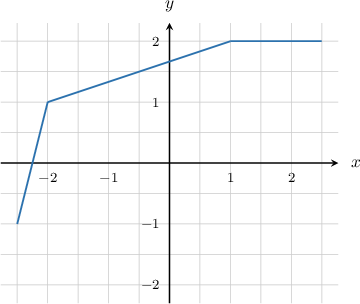
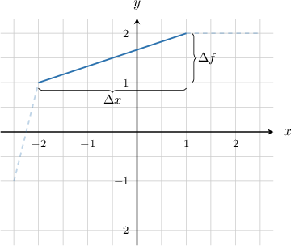
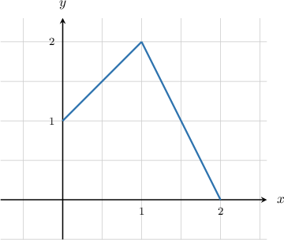
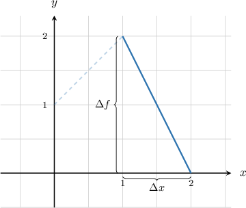
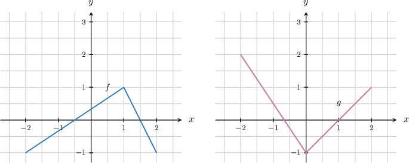
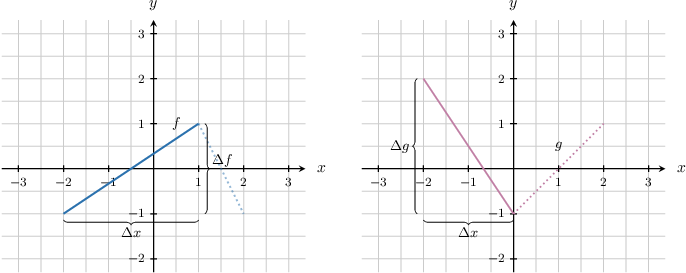
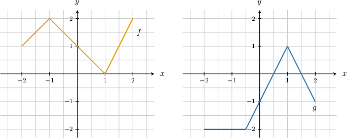
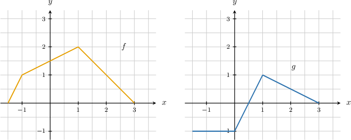

# Calculating Derivatives From Graphs

Source: https://www.mathacademy.com/topics/1117?courseId=21
Topic ID: 1117

## Prerequisites

- [Calculating Derivatives From Data and Tables](../ap-calculus-ab/1249-calculating-derivatives-from-data-and-tables.md)

## Lesson

### Introduction

Consider the graph of the function $y = f(x)$ shown below.

Let's use our knowledge of derivatives to find $f'(0),$ the derivative of $f$ at $x=0.$

Note the following:

- $f'(0)$ represents the slope of the tangent to $y=f(x)$ at the point $x=0.$

- The function $y = f(x)$ is made up of line segments.

- So, to find $f'(0),$ we simply need to find the slope of $y = f(x)$ over an interval that contains $x=0,$ and where $f$ is represented by a single line segment.

With that in mind, we consider the graph of $y=f(x)$ over $x\in [-2,1].$

This interval contains $x=0,$ and $f$ is represented by a single line segment over this interval.

The slope of $y=f(x)$ over this interval is equal to

$$

\begin{aligned}\frac{Δ𝑓}{Δ𝑥} & =\frac{2−1}{1−(−2)}=\frac{1}{3}.\end{aligned}

$$

Therefore, $f'(0)=\dfrac{1}{3}.$

### Example: Calculating the Derivative of a Function From Its Graph

#### Question

The graph of the function $y = f(x)$ is given above. Find $f'\left(\dfrac32\right)$.

#### Explanation

To compute $f'\left(\dfrac32\right),$ we need to find the slope of the tangent to $f(x)$ at $x=\dfrac32.$

Let's consider the graph of $y=f(x)$ on $x\in [1,2].$ Notice that $x=\dfrac32$ lies in this interval.

The slope of $y=f(x)$ on $x\in(1,2)$ is constant and equals

$$

\begin{aligned}\frac{Δ𝑓}{Δ𝑥} & =\frac{0−2}{2−1}=\frac{−2}{1}=−2.\end{aligned}

$$

Therefore, $f'\left(\dfrac32\right)=-2.$

### Example: Computing the Derivative of a Linear Sum of Functions

#### Question

The graphs of the functions $y = f(x)$ and $y=g(x)$ are given above. Find $h'(-1)$ where $h(x)=f(x)+g(x).$

#### Explanation

The addition rule for derivatives gives

$$

h'(x) = f'(x) + g'(x).

$$

As a result, we have that

$$

h'(-1) =f'(-1) + g'(-1).

$$

Also, notice that $x=-1$ corresponds to

- the interval $x\in(-2,1)$ for the function $f,$ and

- the interval $x\in(-2,0)$ for the function $g,$

as shown below.

- The slope of $y=f(x)$ is constant on $x\in(-2,1)$ and equals Therefore, $f'(-1)=\dfrac{2}{3}.$

- The slope of $y=g(x)$ is constant on $x\in(-2,0)$ and equals Therefore, $g'(-1)=-\dfrac{3}{2}.$

Finally, we have

$$

\begin{aligned}ℎ^{′}(−1) & =𝑓^{′}(−1)+𝑔^{′}(−1) \\ & =\frac{2}{3}−\frac{3}{2} \\ & =−\frac{5}{6}.\end{aligned}

$$

### Example: Computing the Derivative of a Product of Functions

#### Question

The graphs of the functions $y=f(x)$ and $y=g(x)$ are given above. Find $h'(0)$ where $h(x)=f(x)g(x).$

#### Explanation

The product rule for derivatives gives

$$

h'(x) = f'(x)\cdot g(x)+f(x)\cdot g'(x).

$$

As a result, we have that

$$

h'(0)=f'(0)\cdot g(0)+f(0)\cdot g'(0).

$$

From the graphs above, we obtain that $f(0)=1$ and $g(0)=-1.$

Additionally,

- The slope of $y=f(x)$ on $x\in(-1,1)$ equals $-1.$ So, $f'(0)=-1.$

- The slope of $y=g(x)$ on $x\in(-0.5,1)$ equals $2.$ So, $g'(0)=2.$

Therefore,

$$

\begin{aligned}ℎ^{′}(0) & =𝑓^{′}(0)⋅𝑔(0)+𝑓(0)⋅𝑔^{′}(0) \\ & =(−1)⋅(−1)+1⋅2 \\ & =3.\end{aligned}

$$

### Example: Computing the Derivative of a Quotient of Functions

#### Question

Given the plots of $y=f(x)$ and $y=g(x)$ above, find $h'(2)$ where $h(x)=\dfrac{f(x)}{g(x)}.$

#### Explanation

The quotient rule for derivatives gives

$$

h'(x) = \dfrac{f'(x)\cdot g(x)-f(x)\cdot g'(x)}{(g(x))^2}.

$$

As a result, we have that

$$

h'(2) = \dfrac{f'(2)\cdot g(2)-f(2)\cdot g'(2)}{(g(2))^2}.

$$

From the graph above, we obtain that $f(2)=1$ and $g(2)=0.5.$

Additionally:

- The slope of $y=f(x)$ on $x\in(1,3)$ equals $-1.$ So, $f'(2)=-1.$

- The slope of $y=g(x)$ on $x\in(1,3)$ equals $-0.5.$ So, $g'(2)=-0.5.$

Finally, we have

$$

\begin{aligned}ℎ^{′}(2) & =\frac{𝑓^{′}(2)⋅𝑔(2)−𝑓(2)⋅𝑔^{′}(2)}{(𝑔(2))^{2}} \\ & =\frac{(−1)⋅(0.5)−(1)⋅(−0.5)}{(0.5)^{2}} \\ & =0.\end{aligned}

$$
