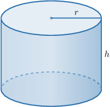
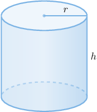
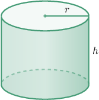
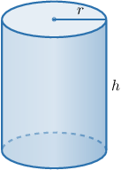

# Optimization Problems Involving Cylinders

Source: https://www.mathacademy.com/topics/1214?courseId=21
Topic ID: 1214

## Prerequisites

- [Volumes of Cylinders](../geometry/1144-volumes-of-cylinders.md)
- [Solving Optimization Problems Using Derivatives](../ap-calculus-ab/1211-solving-optimization-problems-using-derivatives.md)
- [Surface Areas of Cylinders](../geometry/1762-surface-areas-of-cylinders.md)

## Lesson

### Introduction

Suppose we want to construct a cylindrical container with a fixed volume, yet we wish to use as little material as possible to minimize our production costs.

This is yet another type of optimization problem. Let's remind ourselves of the general strategy for optimization problems.

1. Draw a diagram of the situation, introducing variables where necessary.

2. Write down the equation of the quantity that you're trying to maximize or minimize. This is the objective function, and it might include more than one variable.

3. Write down the constraint equation.

4. Use the constraint equation to write the objective function in terms of a single variable only.

5. Differentiate the objective function, set it equal to zero, and solve for the stationary points.

6. Test each stationary point using the second derivative test. Or you can use the first derivative test if it's easier.

In the following examples, we'll need to use the formulas for a cylindrical can's volume $V$ and surface area $S.$ For a cylinder with radius $r$ and height $h,$ its volume is given by the formula

$$

V = \pi r^2 h.

$$

If the cylinder is closed at both ends, its surface area $S$ is given by

$$

\begin{aligned}𝑆=2𝜋𝑟ℎ+2𝜋𝑟^{2}.\end{aligned}

$$

If the cylinder is closed at only one end, its surface area $S$ is

$$

\begin{aligned}𝑆=2𝜋𝑟ℎ+𝜋𝑟^{2}.\end{aligned}

$$

### Example: Minimizing the Surface Area of a Cylinder With a Fixed Volume

#### Question

We wish to construct a cylindrical can with a base but no lid. Our cylinder must have an exact volume of $27\pi\, \textrm{in}^3.$ What is the radius of the cylinder that gives the smallest surface area?

#### Explanation

First, let's draw a picture of a cylinder. Let $r$ be the radius, and $h$ the height.

We wish to minimize the surface area

$$

S= 2\pi r h + \pi r^2.

$$

We know that the volume is fixed at $27\pi \, \textrm{in}^3,$ so we also have the constraint condition

$$

27\pi = \pi r^2 h.

$$

Now, by making $h$ the subject of the constraint equation, we have that

$$

h = \dfrac{27}{ r^2}.

$$

Plugging the above into our expression for $S,$ we obtain

$$

\begin{aligned} S(r)& = 2\pi r \left(\dfrac{27}{ r^2}\right) + \pi r^2\\& = \dfrac{54\pi}{r} + \pi r^2.\end{aligned}

$$

We want to minimize $S,$ so we need to differentiate $S$ and set the derivative equal to zero. The derivative is

$$

S'(r) = -\dfrac{54\pi}{r^2} + 2\pi r.

$$

Setting the derivative equal to zero and solving for $r$ gives a stationary point, as follows:

$$

\begin{aligned}𝑆^{′}(𝑟) & =0 \\ −\frac{54𝜋}{𝑟^{2}}+2𝜋𝑟 & =0 \\ 2𝜋𝑟 & =\frac{54𝜋}{𝑟^{2}} \\ 2𝜋𝑟^{3} & =54𝜋 \\ 𝑟^{3} & =27 \\ 𝑟 & =\sqrt[√27]{3} \\ 𝑟 & =3\,in\end{aligned}

$$

Using a calculator, we can verify that if $r < 3$ then $S'(r) < 0,$ and if $r > 3$ then $S'(r) > 0,$ which means that the stationary point $r=3$ is indeed a minimum of $S(r).$

Therefore, the cylinder with the smallest surface area has radius $r =3\,\textrm{in}.$

### Example: Maximizing the Volume of a Cylinder With a Fixed Surface Area

#### Question

We need to create a cylindrical tin with no lid using $25\pi\,\mathrm{cm^2}$ of sheet metal. What is the radius $r$ of the cylinder that has the largest volume?

#### Explanation

First, let $r$ be the radius and $h$ be the height of the cylinder.

We wish to maximize the volume

$$

V = \pi r^2 h.

$$

We know that the surface area is fixed at $25\pi\,\mathrm{cm^2},$ so we also have the constraint equation

$$

2\pi r h + \pi r^2 = 25\pi.

$$

Now, by making $h$ the subject of the constraint equation, we have that

$$

\begin{aligned}2𝜋𝑟ℎ & =25𝜋−𝜋𝑟^{2} \\ ℎ & =\frac{25𝜋−𝜋𝑟^{2}}{2𝜋𝑟} \\ ℎ & =\frac{25−𝑟^{2}}{2𝑟}.\end{aligned}

$$

Plugging the above into our expression for $V,$ we obtain

$$

\begin{aligned}𝑉(𝑟) & =𝜋𝑟^{2}×\frac{25−𝑟^{2}}{2𝑟} \\ 𝑉(𝑟) & =\frac{(25𝑟−𝑟^{3})𝜋}{2}.\end{aligned}

$$

We want to maximize $V,$ so we need to differentiate $V$ and set the derivative equal to zero. The derivative is

$$

V'(r) = \frac{(25 - 3 r^2)\pi}{2}.

$$

Setting the derivative equal to zero and solving for $r$ gives a stationary point, as follows:

$$

\begin{aligned}𝑉^{′}(𝑟) & =0 \\ \frac{(25−3𝑟^{2})𝜋}{2} & =0 \\ 25 & =3𝑟^{2} \\ 𝑟^{2} & =\frac{25}{3} \\ 𝑟 & =\frac{5\sqrt{√3}}{3}\,cm\end{aligned}

$$

Note that we only considered the positive root in the last step because the radius $r$ must be positive.

Finally, we confirm that $r = \dfrac{5\sqrt{3}}{3}$ is a maximum using the second derivative test. The second derivative is

$$

V''(r) = -3\pi r,

$$

and we can see that $V''\left(\dfrac{5\sqrt{3}}{3} \right) < 0.$ So, the stationary point $r=\dfrac{5\sqrt{3}}{3}$ is indeed a maximum of $V(r).$

Therefore, the cylinder with the largest volume has a radius of $r=\dfrac{5\sqrt{3}}{3} \, \textrm{cm}.$

### Example: Optimizing the Cost of Building a Cylinder

#### Question

A manufacturer wishes to build a cylindrical tank with a base and a lid. The tank must have an exact volume of $18\pi\,\mathrm{m}^3.$ To make the tank, the manufacturer uses two materials:

- a metal sheet that costs $1.50$ per $\mathrm{m}^2$ for the lateral surface,

- a metal sheet that costs $0.50$ per $\mathrm{m}^2$ for the base and lid.

What is the radius of the tank that gives the smallest possible manufacturing cost?

#### Explanation

First, let's draw a picture of a cylinder. Let $r$ be the radius, and $h$ the height.

We wish to minimize the manufacturing cost. We can express the manufacturing cost $C$ in terms of $r$ and $h,$ as follows:

$$

\begin{aligned}𝐶 & =2𝜋𝑟ℎ⋅1.5+2𝜋𝑟^{2}⋅0.5 \\ & =3𝜋𝑟ℎ+𝜋𝑟^{2}.\end{aligned}

$$

We know that the volume is fixed at $18\pi\,\textrm{m}^3,$ so we also have the constraint condition

$$

18\pi = \pi r^2 h.

$$

Now, by making $h$ the subject of the constant equation, we have that

$$

h = \dfrac{18}{r^2}.

$$

Plugging the above into our expression for $C,$ we obtain

$$

\begin{aligned}𝐶(𝑟) & =3𝜋𝑟(\frac{18}{𝑟^{2}})+𝜋𝑟^{2} \\ & =\frac{54𝜋}{𝑟}+𝜋𝑟^{2}.\end{aligned}

$$

We want to minimize $C,$ so we need to differentiate $C$ and set the derivative equal to zero. The derivative is

$$

C'(r) = -\dfrac{54\pi}{r^2} + 2\pi r.

$$

Setting the derivative equal to zero and solving for $r$ gives a stationary point, as follows:

$$

\begin{aligned}𝐶^{′}(𝑟) & =0 \\ −\frac{54𝜋}{𝑟^{2}}+2𝜋𝑟 & =0 \\ 2𝜋𝑟 & =\frac{54𝜋}{𝑟^{2}} \\ 2𝜋𝑟^{3} & =54𝜋 \\ 𝑟^{3} & =27 \\ 𝑟 & =\sqrt[√27]{3} \\ 𝑟 & =3\,m\end{aligned}

$$

Using a calculator, we can verify that if $r < 3$ then $C'(r) < 0,$ and if $r > 3$ then $C'(r) > 0,$ which means that the stationary point $r = 3$ is indeed a minimum of $C(r).$

Therefore, the tank with the smallest manufacturing cost has radius $r = 3\,\textrm{m}.$
