# Volumes of Solids with Triangular Cross Sections

Source: https://www.mathacademy.com/topics/1276?courseId=21
Topic ID: 1276

## Prerequisites

- [Volumes of Solids with Square Cross Sections](../ap-calculus-ab/1083-volumes-of-solids-with-square-cross-sections.md)
- [The Area of an Isosceles Right Triangle](../geometry/2885-the-area-of-an-isosceles-right-triangle.md)
- [The Area of an Equilateral Triangle](../geometry/2886-the-area-of-an-equilateral-triangle.md)

## Lesson

### Introduction

Suppose that the base of a solid is the region enclosed between the curve $y=\sqrt{9-x^2}$ and the $x$-axis from $x=0$ to $x=3,$ as shown in the picture. Given that cross-sections perpendicular to the $x$-axis are equilateral triangles, how can we find the volume of the solid?

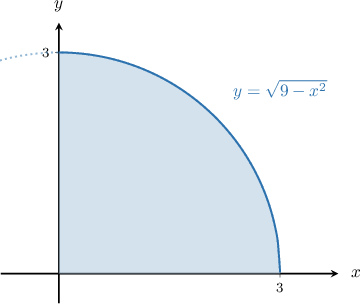

A sketch with a few cross-sections is shown in the picture below.

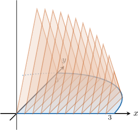

Consider the picture with only one cross-section that passes through $x \in (0,3)\mathbin{:}$

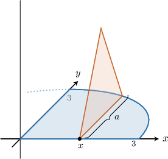

If we project the triangular cross-section onto the $xy$-plane, we get the picture below:

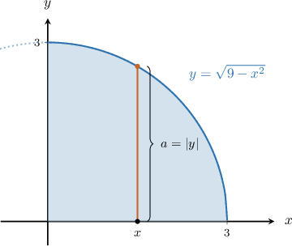

Then, the base of the cross-section is

$$

\begin{aligned}𝑎 & =|𝑦|=\sqrt{√9−𝑥^{2}}.\end{aligned}

$$

Given a side $a$ of an equilateral triangle, we can show that the corresponding area is given by

$$

A = \dfrac{\sqrt{3}}{4} a^2.

$$

So, the expression for the area of the cross-section is

$$

\begin{aligned}𝐴(𝑥) & =\frac{\sqrt{√3}}{4}𝑎^{2} \\ & =\frac{\sqrt{√3}}{4}(\sqrt{√9−𝑥^{2}})^{2} \\ & =\frac{\sqrt{√3}}{4}(9−𝑥^{2}).\end{aligned}

$$

We can now write the volume of the solid, as follows:

$$

\begin{aligned}𝑉 & =∫_{𝑏𝑎}^{}𝐴(𝑥)\,d𝑥 \\ & =\frac{\sqrt{√3}}{4}∫_{30}^{}(9−𝑥^{2})d𝑥\end{aligned}

$$

Evaluating the integral above gives the required volume.

### A Summary of Useful Triangle Formulas

Recall that the area $A$ of a triangle is given by

$$

A = \dfrac12 \cdot \textrm{base} \cdot \textrm{height}.

$$

We can use this formula to derive some further formulas for the areas of special triangles. We will make use of these formulas in this lesson.

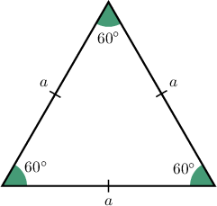

- For an equilateral triangle with side length $a$ (shown above), the area is given by the formula

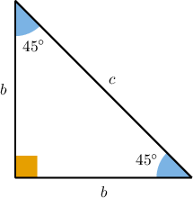

- For an isosceles right triangle with leg $b$ and hypotenuse $c,$ the areas can be found using the following formulas:

$$

\begin{aligned}𝐴 & =\frac{1}{2}𝑏^{2} \\ 𝐴 & =\frac{1}{4}𝑐^{2}\end{aligned}

$$

We will give derivations of these formulas at the end of the lesson.

### Example: Computing the Volume When the Base Is Bounded by a Curve and the X-Axis

#### Question

The base of a solid is the region enclosed between the curve $y=-\sqrt{-x}$ and the $x$-axis from $x=-3$ to $x=-1,$ as shown in the picture. Given that cross-sections perpendicular to the $x$-axis are isosceles right triangles with the hypotenuse lying on the $xy$-plane, calculate the volume of the solid.

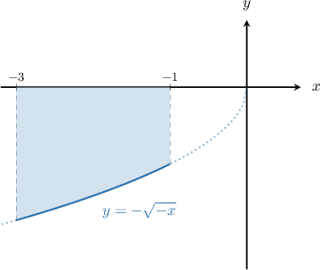

#### Explanation

Consider a cross-section at some point $x$, where $x \in (-3,-1),$ and its projection on the $xy$-plane:

Then the base of the cross-section is

$$

c = |y| = \left|-\sqrt{-x}\right| = \sqrt{-x}.

$$

Given the hypotenuse of an isosceles right triangle, the corresponding area can be found using the formula

$$

A =\dfrac{c^2}{4}.

$$

So, the expression for the area of the cross-section is

$$

\begin{aligned}𝐴(𝑥) & =\frac{1}{4}𝑐^{2} \\ & =\frac{1}{4}(\sqrt{√−𝑥})^{2} \\ & =−\frac{1}{4}𝑥.\end{aligned}

$$

We can now calculate the volume of the solid, as follows:

$$

\begin{aligned}𝑉 & =∫_{𝑏𝑎}^{}𝐴(𝑥)\,d𝑥 \\ & =∫_{−1−3}^{}(−\frac{1}{4}𝑥)d𝑥 \\ & =−\frac{1}{4}∫_{−1−3}^{}𝑥\,d𝑥 \\ & =−\frac{1}{4}⋅\frac{𝑥^{2}}{2}_{−1−3}^{} \\ & =−\frac{1}{4}(\frac{(−1)^{2}}{2}−\frac{(−3)^{2}}{2}) \\ & =1\end{aligned}

$$

### Example: Computing the Volume When the Base Is Bounded by Two Curves

#### Question

The base of a solid is the region enclosed between the curves $y=x^2-1$ and $y=-x^2+1,$ as shown in the picture. If cross-sections perpendicular to the $x$-axis are equilateral triangles, which of the following gives the volume of the solid?

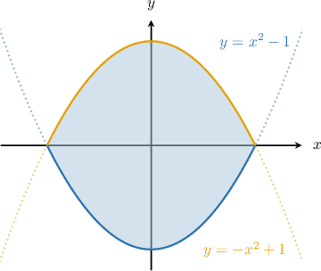

#### Explanation

Let $f(x)=-x^2+1$ and $g(x)=x^2-1.$

First, we determine the limits of integration. To do that, we find the intersections of the two curves by setting the functions equal to one another and solving for $x\mathbin{:}$

$$

\begin{aligned}𝑓(𝑥) & =𝑔(𝑥) \\ −𝑥^{2}+1 & =𝑥^{2}−1 \\ 𝑥^{2} & =1\end{aligned}

$$

So, the solutions are $x= \pm 1.$

Now, consider a cross-section at some point $x$, where $x \in (-1,1)$, and its projection on the $xy$-plane:

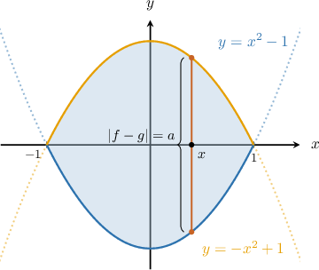

Then, the base of the cross-section is

$$

\begin{aligned}𝑎 & =|𝑓(𝑥)−𝑔(𝑥)| \\ & =|(−𝑥^{2}+1)−(𝑥^{2}−1)| \\ & =2|1−𝑥^{2}|.\end{aligned}

$$

Given a side $a$ of an equilateral triangle, the corresponding area can be found using the formula

$$

A = \dfrac{\sqrt{3}}{4}a^2.

$$

So, the expression for the area of the cross-section is

$$

\begin{aligned}𝐴(𝑥) & =\frac{\sqrt{√3}}{4}𝑎^{2} \\ & =\frac{\sqrt{√3}}{4}(2|1−𝑥^{2}|)^{2} \\ & =\sqrt{√3}(1−2𝑥^{2}+𝑥^{4}).\end{aligned}

$$

We can now write the volume of the solid, as follows:

$$

\begin{aligned}𝑉 & =∫_{𝑏𝑎}^{}𝐴(𝑥)\,d𝑥 \\ & =\sqrt{√3}∫_{1−1}^{}(1−2𝑥^{2}+𝑥^{4})d𝑥\end{aligned}

$$

### Cross-Sections Perpendicular to the y-Axis

Now, suppose that the base of a solid is the region enclosed between the curve $x=\sqrt{2-y^2}$ and the $y$-axis for $0 \leq y \leq \sqrt{2},$ as shown in the picture. If cross-sections perpendicular to the $y$-axis are isosceles right triangles with a leg lying on the $xy$-plane, can we find an integral that gives the volume of the solid?

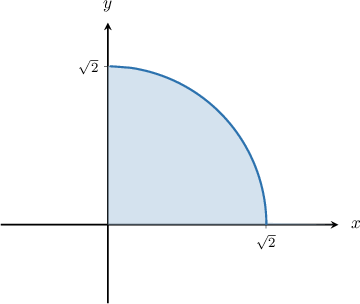

A sketch with a few cross-sections is shown in the picture below.

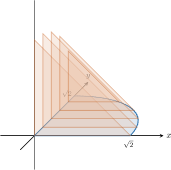

Consider the picture with only one cross-section that passes through $y \in (0,\sqrt{2})\mathbin{:}$

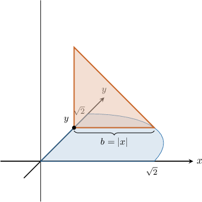

If we project the triangular cross-section onto the $xy$-plane, we get the picture below:

Then, the base of the cross-section is

$$

\begin{aligned}𝑏 & =|𝑥|=\sqrt{√2−𝑦^{2}}.\end{aligned}

$$

Given a leg $b$ of an isosceles right triangle, we can find the corresponding area using the formula

$$

A = \dfrac{b^2}{2}.

$$

So, the expression for the area of the cross-section is

$$

\begin{aligned}𝐴(𝑦) & =\frac{1}{2}𝑏^{2} \\ & =\frac{1}{2}(\sqrt{√2−𝑦^{2}})^{2} \\ & =\frac{1}{2}(2−𝑦^{2}).\end{aligned}

$$

We can now write the volume of the solid as an integral, as follows:

$$

\begin{aligned}𝑉 & =∫_{𝑑𝑐}^{}𝐴(𝑦)\,d𝑦 \\ & =\frac{1}{2}∫_{\sqrt{√2}0}^{}(2−𝑦^{2})\,d𝑦\end{aligned}

$$

Evaluating the integral above gives the required volume.

### Example: Computing the Volume When the Cross Sections Are Perpendicular to the Y-Axis

#### Question

The base of a solid is the region enclosed by the curve $x=\sqrt{4-2y^2}$ and the $y$-axis for $0 \leq y \leq \sqrt{2},$ as shown in the picture. If cross-sections perpendicular to the $y$-axis are isosceles right triangles with the hypotenuse lying on the $xy$-plane, which of the following gives the volume of the solid?

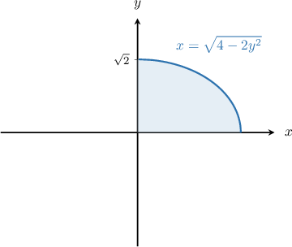

#### Explanation

Consider a cross-section at some point $y$, where $y \in (0,\sqrt 2)$, and its projection on the $xy$-plane:

Then the base of the cross-section is

$$

\begin{aligned}𝑐 & =|𝑥|=\sqrt{√4−2𝑦^{2}}=\sqrt{√4−2𝑦^{2}}.\end{aligned}

$$

Given the hypotenuse of an isosceles right triangle, we can find the corresponding area using the formula

$$

A =\dfrac{c^2}{4}.

$$

So, the expression for the area of the cross-section is

$$

\begin{aligned}𝐴(𝑦) & =\frac{1}{4}𝑐^{2} \\ & =\frac{1}{4}(\sqrt{√4−2𝑦^{2}})^{2} \\ & =\frac{1}{4}(4−2𝑦^{2}) \\ & =1−\frac{𝑦^{2}}{2}.\end{aligned}

$$

We can now write the volume of the solid, as follows:

$$

\begin{aligned}𝑉 & =∫_{𝑑𝑐}^{}𝐴(𝑦)\,d𝑦 \\ & =∫_{\sqrt{√2}0}^{}(1−\frac{𝑦^{2}}{2})d𝑦\end{aligned}

$$

### Example: Computing the Volume When the Base Is Bounded by Two Curves

#### Question

The base of a solid is the region enclosed between the curve $x=\sqrt{y}$ and the line $x=y,$ as shown in the picture. Given that cross-sections perpendicular to the $y$-axis are isosceles right triangles with a leg lying on the $xy$-plane, calculate the volume of the solid.

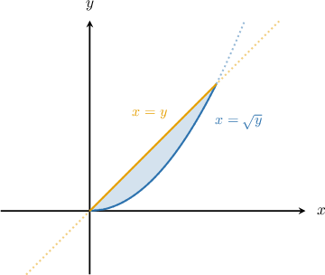

#### Explanation

Let $f(y)=\sqrt{y}$ and $g(y)=y.$

First, we determine the limits of integration. To do that, we find the intersections of the two curves by setting the functions equal to one another and solving for $y\mathbin{:}$

$$

\begin{aligned}𝑓(𝑦) & =𝑔(𝑦) \\ \sqrt{√𝑦} & =𝑦 \\ \sqrt{√𝑦}−𝑦 & =0 \\ \sqrt{√𝑦}(1−\sqrt{√𝑦}) & =0.\end{aligned}

$$

Hence, the intersections are $y=0$ and $y=1.$

Now, consider a cross-section at some point $y$, where $y \in (0,1)$, and its projection on the $xy$-plane:

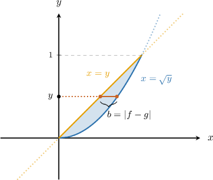

Then the base of the cross-section is

$$

\begin{aligned}𝑏 & =|𝑓(𝑦)−𝑔(𝑦)| \\ & =|\sqrt{√𝑦}−𝑦|.\end{aligned}

$$

Given a leg $b$ of an isosceles right triangle, we can find the corresponding area using the formula

$$

A =\dfrac{b^2}{2}.

$$

So, the expression for the area of the cross-section is

$$

\begin{aligned}𝐴(𝑦) & =\frac{1}{2}𝑏^{2} \\ & =\frac{1}{2}|\sqrt{√𝑦}−𝑦|^{2} \\ & =\frac{1}{2}(𝑦−2𝑦^{3/2}+𝑦^{2}).\end{aligned}

$$

We can now calculate the volume of the solid, as follows:

$$

\begin{aligned}𝑉 & =∫_{𝑑𝑐}^{}𝐴(𝑦)\,d𝑦 \\ & =\frac{1}{2}∫_{10}^{}(𝑦−2𝑦^{3/2}+𝑦^{2})\,d𝑦 \\ & =\frac{1}{2}[\frac{𝑦^{2}}{2}−\frac{4}{5}𝑦^{5/2}+\frac{𝑦^{3}}{3}]_{10}^{} \\ & =\frac{1}{2}(\frac{1}{2}−\frac{4}{5}+\frac{1}{3})−0 \\ & =\frac{1}{2}⋅\frac{1}{30} \\ & =\frac{1}{60}\end{aligned}

$$

### Derivations of the Triangle Formulas

Here, we derive the three useful triangle formulas that we have used throughout the lesson.

- For an equilateral triangle with side length $a,$ the area $A$ is given by the formula To see why this is true, consider the equilateral triangle below. For this triangle, we see that we have Substituting this into the formula for the area of a triangle, we get

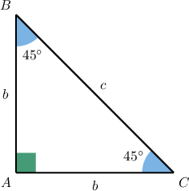

- For an isosceles right triangle with leg $b$ and hypotenuse $c,$ the area $A$ of the triangle is This is a straightforward application of the formula for the area of a triangle. Clearly, we have $\textrm{base} = \textrm{height} = b,$ and therefore, the formula follows immediately. We also have the formula To see why this is true, recall that, for an isosceles right triangle, the base $b$ and hypotenuse $c$ are related by the equation $c = \sqrt 2 b.$ Now, substituting for $b$ into the formula $A=\dfrac12 b^2,$ we get
