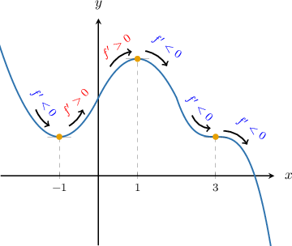

# Using the First Derivative Test to Classify Local Extrema

Source: https://www.mathacademy.com/topics/1360?courseId=21
Topic ID: 1360

## Prerequisites

- [Determining Intervals on Which a Function Is Increasing or Decreasing](../ap-calculus-ab/1359-determining-intervals-on-which-a-function-is-increasing-or-decreasing.md)

## Lesson

### Introduction

A stationary point of a function can be classified in one of three ways: as a local minimum, a local maximum, or neither a local minimum nor a local maximum.

To classify a stationary point without using a graph, we can use the **first derivative test**. The first derivative states that, when crossing a stationary point from left to right:

1. If the sign of the derivative switches from *negative to positive*, then the stationary point is a *local minimum* (because it lies at the bottom of a valley).

2. If the sign of the derivative switches from *positive to negative*, then the stationary point is a *local maximum* (because it lies at the top of a peak).

3. If the sign of the derivative *does not switch sign*, then the stationary point is *neither a local minimum nor a local maximum*.

For example, let's consider a function whose graph is depicted in the diagram below.

The function has stationary points at $x=-1,$ $x=1$ and $x=3.$ Summarizing the information about the signs of the derivative from the picture, we obtain the following table.

Finally, let's use the first derivative test to classify the local extrema:

- At $x=-1,$ the first derivative changes sign from negative to positive. Therefore, $x=-1$ is a local minimum.

- At $x=1,$ the first derivative changes sign from positive to negative. Therefore, $x=1$ is a local maximum.

- At $x=3,$ the first derivative does not change the sign. Therefore, $x=3$ is neither a local minimum nor a local maximum.

We conclude that $f(x)$ has

- one local minimum at $x = -1,$

- one local maximum at $x=1,$ and

- neither a local minimum nor a local maximum at $x=3.$

### Using the First Derivative Test Without a Graph

The really useful thing about the first derivative test is that we can use it even if we don't have the graph of the function.

For example, let's consider the function $f(x) = x^3 - 3x + 2.$ We can classify all the local extrema of this function without even graphing it.

First, we need to find the stationary points. Taking the derivative, we have $f'(x)= 3x^2-3,$ and the stationary points of the function are located at $x=\pm 1.$

Now, let's classify each stationary point.

- Let's start with $x=-1.$ We compute $f'(x)$ at two test points that are "close" to $x=-1,$ say $x=-2$ and $x=0,$ and we get We summarize this information in the table below:

So $f'(x)$ switches from positive to negative at $x=-1,$ and we conclude that $x=-1$ is a *local maximum*.

- Now, let's test $x=1.$ We already know that $f'(x)$ is negative to the left of this point, so we just need to choose one more test point that is to the right of this point, say at $x=2.$ We get and we include this information in our table:

So $f'(x)$ switches from negative to positive at $x=1,$ and we conclude that $x=1$ is a *local minimum*.

In conclusion, the stationary points are $x=-1,$ which is a local maximum, and $x=1,$ which is a local minimum.

### Example: Finding Local Minima and Local Maxima of Polynomials

#### Question

Determine the local maxima and minima for $f(x) = 6x-x^3-5,$ and classify each point.

#### Explanation

First, we find the stationary points. Differentiating $f(x)$ gives

$$

f'(x) = 6-3x^2.

$$

Solving $f'(x) = 0$ gives

$$

3(2-x^2)=0 \quad \Longrightarrow \quad x=\pm \sqrt{2}.

$$

So we have two stationary points, $x=\pm \sqrt 2.$ Next, to determine whether these points are local maxima or minima, we use the first derivative test.

Let's choose the test points $x = -2, 0, 2$ and evaluate the first derivative at these points.

$$

\begin{aligned}𝑓^{′}(−2) & =6−3(−2)^{2}=−6 \\ 𝑓^{′}(0) & =6−3(0)^{2}=6 \\ 𝑓^{′}(2) & =6−3(2)^{2}=−6\end{aligned}

$$

We summarize the information in a table, shown below.

Finally, let's use the table above to classify the critical points.

- At $x=-\sqrt{2},$ the first derivative changes sign from negative to positive. Therefore, $x=-\sqrt{2}$ is a local minimum.

- At $x=\sqrt{2},$ the first derivative changes sign from positive to negative. Therefore, $x=\sqrt{2}$ is a local maximum.

We conclude that $f(x)$ has one local minimum at $x = -\sqrt 2$ and one local maximum at $x = \sqrt 2.$

### Example: Finding Local Minima and Local Maxima of Other Types of Functions

#### Question

Find the relative maximum and minimum points of the function $f(x) = (2x+3)e^x.$

#### Explanation

First, we find the stationary points. Differentiating $f(x)$ gives

$$

\begin{aligned}𝑓^{′}(𝑥) & =(2𝑥+3)𝑒^{𝑥}+2𝑒^{𝑥}=(2𝑥+5)𝑒^{𝑥}.\end{aligned}

$$

Solving $f'(x)=0$ gives

$$

\begin{aligned}(2𝑥+5)𝑒^{𝑥} & =0 \\ 2𝑥+5 & =0 \\ 𝑥 & =−\frac{5}{2}.\end{aligned}

$$

So $x = -\dfrac{5}{2}$ is a stationary point. Next, to determine whether these points are local maxima or minima, we use the first derivative test.

Let's choose the test points $x = -5,0$ and evaluate the first derivative at these points.

$$

\begin{aligned}𝑓^{′}(−5) & =(2(−5)+5)𝑒^{−5}=−\frac{5}{𝑒^{5}}<0 \\ 𝑓^{′}(0) & =(2(0)+5)𝑒^{0}=5>0\end{aligned}

$$

We summarize the information in a table, shown below.

Finally, let's use the table above to classify the critical point.

At $x=-\dfrac{5}{2},$ the first derivative changes sign from negative to positive.

So, we conclude that $f(x)$ has a local minimum at $x = -\dfrac{5}{2}.$

### Example: Identifying Points That Are Neither Local Minima nor Local Maxima

#### Question

Find the stationary points of the function $f(x) =x^3$ and classify each point.

#### Explanation

First, we find the stationary points. Differentiating $f(x)$ gives

$$

f'(x) =3x^2,

$$

and solving $f'(x) = 0$ gives

$$

3x^2 = 0 \quad \Longrightarrow \quad x=0.

$$

So $x = 0$ is the only stationary point of $f(x).$ Next, to determine whether these points are local maxima or minima, we use the first derivative test.

Let's choose the test points $x = -1,1$ and evaluate the first derivative at these points.

$$

\begin{aligned}𝑓^{′}(−1) & =3(−1)^{2}=3>0 \\ 𝑓^{′}(1) & =3(1)^{2}=3>0\end{aligned}

$$

We summarize the information in a table, shown below.

The first derivative does not change sign at $x=0.$ Therefore, we conclude that $x=0$ is neither a minimum nor a maximum.

So, the first derivative test shows that the function has no local extrema.
