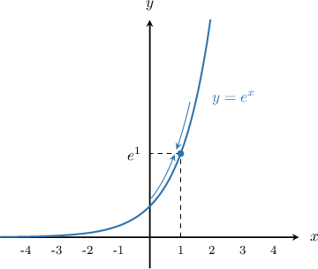
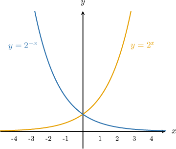
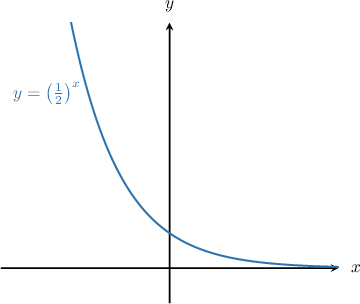

# Limits of Exponential Functions

Source: https://www.mathacademy.com/topics/1717?courseId=21
Topic ID: 1717

## Prerequisites

- [The Product and Quotient Rules for Limits](../ap-calculus-ab/1246-the-product-and-quotient-rules-for-limits.md)
- [Limits at Infinity from Graphs](../ap-calculus-ab/1873-limits-at-infinity-from-graphs.md)
- [Combining Graph Transformations of Exponential Functions](../algebra-ii/6351-combining-graph-transformations-of-exponential-functions.md)

## Lesson

### Introduction

Consider the graph of $y=e^x$ below. We will use this graph to compute $\lim\limits_{x \to \, 1} e^x \,.$

From the graph, we see that as $x$ approaches $1,$ the value of $y$ approaches $e^1.$ So

$$

\lim_{x\to 1} e^x = e^1 = e.

$$

The limit of the function at a point is equal to the value of the function at that point, and this is true for *any* point, not just $x=1.$ If $c$ is any real number, we have

$$

\lim_{x\to c} e^x = e^c.

$$

In fact, *all* exponential functions have this property. For $a \gt 0$ and any real number $c,$ we have

$$

\lim_{x\to c} a^x = a^c.

$$

### Example: Evaluating Using Direct Substitution

#### Question

Find $\lim_\limits{x \to 1} (3^{2x} + 2^{3x} + 1).$

#### Explanation

We can evaluate this limit using direct substitution, as follows:

$$

\begin{aligned}\underset{𝑥→1}{lim}(3^{2𝑥}+2^{3𝑥}+1) & =3^{2(1)}+2^{3(1)}+1 \\ & =9+8+1 \\ & =18\end{aligned}

$$

### Infinite Limits of Exponential Functions

Consider the graphs of $y = 2^x$ and $y = 2^{-x}$ shown below. We will use these graphs to compute the limits at infinity.

Considering $y = 2^x$ first, we note that as $x \to \infty,$ the function increases without bound, and as $x \to -\infty,$ the function approaches zero. So

$$

\lim_{x\to \infty} 2^x = \infty\qquad \textrm{and}\qquad \lim_{x\to -\infty} 2^x =0.

$$

The same properties hold true for any exponential function $y=a^x$ where $a \gt 1.$

Now consider the curve $y=2^{-x}.$ We have

$$

\lim_{x\to \infty} 2^{-x} = 0\qquad \textrm{and}\qquad \lim_{x\to -\infty} 2^{-x} =\infty.

$$

Again, the same properties are true for any exponential function $y=a^{-x}$ for $a \gt 1.$

### Example: Evaluating Infinite Limits of Exponential Functions

#### Question

Evaluate $\displaystyle\lim_{x\to-\infty} -3\left(\dfrac 1 2\right)^x.$

#### Explanation

First, we rewrite the limit using the algebra of limits, as follows:

$$

\begin{aligned}\underset{𝑥→−∞}{lim}−3(\frac{1}{2})^{𝑥}=−3⋅\underset{𝑥→−∞}{lim}(\frac{1}{2})^{𝑥}\end{aligned}

$$

Next, we recall the graph of $y = \left(\dfrac 1 2\right)^x.$

From the graph, we see that the function increases without bound as $x$ decreases. Therefore,

$$

\lim_{x\to-\infty} \left(\dfrac 1 2\right)^x = \infty.

$$

However, the negative factor $-3$ changes the sign of the limit. Therefore, we conclude that

$$

-3\cdot \lim_{x\to-\infty} \left(\dfrac 1 2\right)^x = -\infty.

$$

### Example: Evaluating Infinite Limits Using the Laws of Exponents and the Algebra of Limits

#### Question

Compute $\lim_\limits{x \to \infty} -5 \left(\dfrac{1}{3}\right)^{1+x}.$

#### Explanation

We can use the laws of exponents and the algebra of limits to rewrite the given limit as follows:

$$

\begin{aligned}\underset{𝑥→∞}{lim}−5(\frac{1}{3})^{1+𝑥} & =−5\underset{𝑥→∞}{lim}(\frac{1}{3})^{1+𝑥} \\ & =−5\underset{𝑥→∞}{lim}(\frac{1}{3})^{1}⋅(\frac{1}{3})^{𝑥} \\ & =−5\underset{𝑥→∞}{lim}\frac{1}{3}⋅(\frac{1}{3})^{𝑥} \\ & =−\frac{5}{3}⋅\underset{𝑥→∞}{lim}(\frac{1}{3})^{𝑥}\end{aligned}

$$

Next, we recall the graph of $y = \left(\dfrac 1 3\right)^x.$

From the graph, we see that the function decreases to zero as $x$ increases. So

$$

\lim_\limits{x \to \infty} \left(\dfrac{1}{3}\right)^{x} = 0,

$$

and finally, we have

$$

-\dfrac{5}{3}\cdot \lim_\limits{x \to \infty} \left(\dfrac{1}{3}\right)^{x} = -\dfrac 5 3\cdot 0 = 0.

$$
