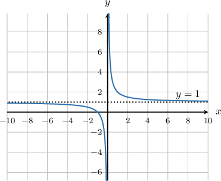
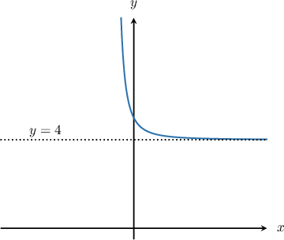
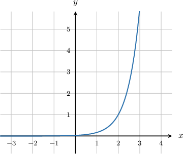
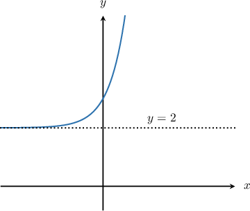

# Limits at Infinity from Graphs

Source: https://www.mathacademy.com/topics/1873?courseId=21
Topic ID: 1873

## Prerequisites

- [The Finite Limit of a Function](../ap-calculus-ab/461-the-finite-limit-of-a-function.md)
- [End Behavior of Functions](../algebra-i/2048-end-behavior-of-functions.md)

## Lesson

### Introduction

Until now, we have considered limits at individual points:

$\lim\limits_{x \to a} f(x)$ is the value that $f(x)$ approaches as $x$ approaches the point $a.$

However, the idea of a limit extends beyond individual points. For instance, it might also be the case that $f(x)$ approaches some value as $x$ gets bigger and bigger, growing without bound.

To illustrate, consider the function $f(x)=\dfrac{1}{x} + 1$ whose graph is shown below.

On the right side of the graph, we see that as $x$ gets bigger and bigger, $f(x)$ approaches the horizontal asymptote $y=1.$ In other words, as $x$ increases to infinity ($\infty$), the value of $f(x)$ approaches a limit of $1.$ We can write this symbolically as

$$

\lim_\limits{x\to \infty } f(x) = 1.

$$

Likewise, on the left side of the graph, as $x$ decreases to negative infinity ($-\infty$), the value of $f(x)$ approaches the same horizontal asymptote $y=1.$ Consequently, we also have that

$$

\lim_\limits{x\to -\infty } f(x) = 1.

$$

### Example: The Limit at Infinity for a Bounded Function

#### Question

The figure below shows the graph of $f(x).$ Find the limit $\lim_\limits{x \rightarrow \infty} f(x).$

#### Explanation

From the graph, we see that as $x$ increases to $\infty,$ the graph of the function moves closer to the horizontal asymptote $y=4.$

Therefore, as $x$ approaches $\infty,$ the function $f(x)$ approaches $4,$ and we have

$$

\lim_\limits{x\rightarrow \infty } f(x) = 4.

$$

### Infinite Limits

Not every function $f(x)$ levels off to approach an asymptote as $x$ approaches infinity.

Instead, a function $f(x)$ might get bigger and bigger, increasing without bound, as shown in the graph below.

In this case, we say that the limit of the function is infinity:

$$

\lim_\limits{x \rightarrow \infty} f(x) = \infty

$$

### Example: The Limit at Infinity for an Unbounded Function

#### Question

The figure below shows the graph of $f(x).$ Find $\lim_\limits{x \rightarrow \infty} f(x)$ and $\lim_\limits{x \rightarrow -\infty} f(x).$

#### Explanation

On the left side of the graph, we see that as the values of $x$ decrease and approach $-\infty$, the graph of the function moves closer and closer to the horizontal asymptote $y=2.$

Consequently, $f(x)$ approaches the value $2$ as $x$ approaches $-\infty,$ and we have

$$

\lim_\limits{x\rightarrow -\infty } f(x) = 2.

$$

On the right side of the graph, as the values of $x$ increase and approach $\infty,$ the graph of the function grows without bound to $\infty$ as well. Therefore,

$$

\lim_\limits{x\to \infty } f(x) = \infty.

$$
