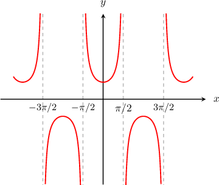
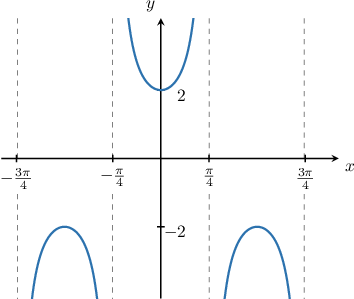
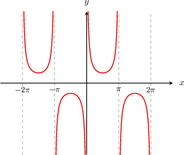
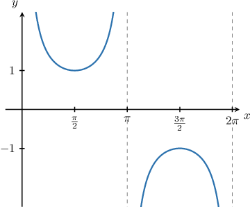
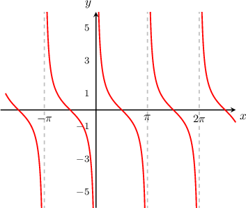
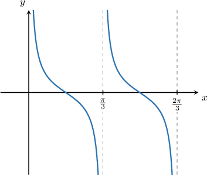

# Limits of Reciprocal Trigonometric Functions

Source: https://www.mathacademy.com/topics/1958?courseId=21
Topic ID: 1958

## Prerequisites

- [Combining Graph Transformations of Secant and Cosecant](../algebra-ii/776-combining-graph-transformations-of-secant-and-cosecant.md)
- [Limits of Trigonometric Functions](../ap-calculus-ab/1719-limits-of-trigonometric-functions.md)

## Lesson

### Introduction

Consider the graph of $y=\sec(x)$ as shown below. We will use this graph to work out limits involving $\sec(x).$

From the graph, we see that for any point that is not an asymptote, the limit of $\sec(x)$ is equal to the value of $\sec(x)$ at that point.

$$

\begin{aligned}\underset{𝑥→𝑎}{lim}sec⁡(𝑥)=sec⁡(𝑎),\,𝑎≠±\frac{𝜋}{2},±\frac{3𝜋}{2},…\end{aligned}

$$

At each asymptote, the one-sided infinite limits exist. For example:

$$

\lim_\limits{x\to (\pi/2)^{-}}\sec(x)=\infty,\qquad \lim_\limits{x\to (\pi/2)^{+}}\sec(x)=-\infty.

$$

However, because the left and right-sided limits are not equal, the overall limit at each asymptote does not exist.

$$

\lim_\limits {x \to a} \sec \left(x\right)=\text{DNE}, \qquad a= \pm\dfrac{\pi}{2}, \pm \dfrac{3\pi}{2},\ldots

$$

### Example: Computing the Limit of a Secant Function

#### Question

Calculate $\lim_\limits {x\to (\pi/4)} 2\sec \left(2x\right).$

#### Explanation

First, let's attempt to evaluate the limit by direct substitution:

$$

\begin{aligned}\underset{𝑥→(𝜋/4)}{lim}2sec⁡(2𝑥) & =2sec⁡(2⋅(\frac{𝜋}{4})) \\ & =2sec⁡(\frac{𝜋}{2}) \\ & =\frac{2}{cos⁡(\frac{𝜋}{2})} \\ & =\frac{2}{0},\end{aligned}

$$

which is undefined.

Therefore, to find the limit, let's sketch the graph of $y = 2\sec\left(2x\right).$

As $x$ approaches $\dfrac\pi {4}$ from the left, the values of $y=2\sec(2x)$ are positive and grow without bound. Therefore

$$

\lim_\limits {x \to (\pi/4)^-} 2\sec(2x) = \infty.

$$

Similarly, as $x$ approaches $\dfrac\pi {4}$ from the right, the values of $y=2\sec (2x)$ are negative and decrease without bound. Therefore

$$

\lim_\limits {x \to (\pi/4)^+} 2\sec (2x) = -\infty.

$$

Therefore, since the two limits are not equal, we conclude that

$$

\lim_\limits {x \to (\pi/4)} 2\sec (2x) = \text{DNE}.

$$

### Computing Limits of Cosecant

Now, consider the graph of $y=\csc{x}$ as shown below. We will use this graph to work out limits involving $\csc x.$

From the graph, we see that for any point that is not an asymptote, the limit of $\csc x$ is equal to the value of $\csc x$ at that point.

$$

\begin{aligned}\underset{𝑥→𝑎}{lim}csc⁡𝑥=csc⁡𝑎,\,𝑎≠0,±𝜋,±2𝜋,…\end{aligned}

$$

At each asymptote, the one-sided limits exist. For example:

$$

\lim_\limits{x\to 0^-}\csc(x)=-\infty, \quad \lim_\limits{x\to 0^+}\csc(x)=\infty.

$$

However, because the left and right-sided limits are not equal, the overall limit at each asymptote does not exist.

$$

\lim_\limits{x\to a}\csc(x)=\text{DNE}, \qquad a = 0, \pm \pi, \pm 2\pi\ldots

$$

### Example: Computing the Limit of a Cosecant Function

#### Question

Calculate $\lim_\limits {x \to \pi} \csc x$

#### Explanation

First, let's attempt to evaluate the limit by direct substitution:

$$

\begin{aligned}\underset{𝑥→𝜋}{lim}csc⁡𝑥 & =csc⁡𝜋 \\ & =\frac{1}{sin⁡𝜋} \\ & =\frac{1}{0},\end{aligned}

$$

which is undefined.

Therefore, to find the limit, let's sketch the graph of $y = \csc\left(x\right).$

As $x$ approaches $\pi$ from the left, the values of $y=\csc x$ are positive and grow without bound.

Therefore

$$

\lim_\limits {x \to \pi^-}\csc x = \infty

$$

However, as $x$ approaches $\pi$ from the right, the values of $y=\csc x$ are negative and decrease without bound.Therefore,

$$

\lim_\limits {x \to \pi^+}\csc x = -\infty

$$

Since the two limits are not equal, we conclude that

$$

\lim_\limits {x \to \pi}\csc x = \text{DNE}.

$$

### Limits of Cotangent

Finally, let's look at the graph $y= \cot (x).$ We will use this graph to work out limits involving $\cot(x).$

From the graph, we see that for any point that is not an asymptote, the limit of $\cot(x)$ is equal to the value of $\cot(x)$ at that point.

$$

\lim_\limits{x \to a} \cot (x)=\cot\left(a\right), \qquad a\neq 0, \pm \pi, \pm 2\pi,\ldots

$$

At each asymptote, the one-sided limits exist. For example:

$$

\lim_\limits{x \to 0^{+}} \cot (x) = \infty, \qquad \lim_\limits{x \to 0^{-}} \cot (x) = -\infty.

$$

However, because the left and right-sided limits are not equal, the overall limit at each asymptote does not exist.

$$

\lim_\limits{x \to a} \cot (x)=\text{DNE}, \qquad a= 0, \pm \pi, \pm 2\pi,\ldots

$$

### Example: Computing the Limit of Cotangent Function

#### Question

Calculate $\lim_\limits {x \to \pi/3} \cot \left(3x\right).$

#### Explanation

First, let's attempt to evaluate the limit by direct substitution:

$$

\begin{aligned}\underset{𝑥→𝜋/3}{lim}cot⁡(3𝑥) & =cot⁡(3⋅\frac{𝜋}{3}) \\ & =cot⁡(𝜋) \\ & =\frac{cos⁡(𝜋)}{sin⁡(𝜋)} \\ & =\frac{−1}{0},\end{aligned}

$$

which is undefined.

Therefore, to find the limit, let's sketch the graph of $y = \cot\left(3x\right).$

As $x$ approaches $\dfrac\pi 3$ from the left, the values of $y=\cot(3x)$ are negative and decrease without bound. Therefore

$$

\lim_\limits {x \to (\pi/3)^-} \cot(3x) = -\infty.

$$

As $x$ approaches $\dfrac\pi 3$ from the right, the values of $y=\cot(3x)$ are positive and increase without bound. Therefore

$$

\lim_\limits {x \to (\pi/3)^+} \cot(3x) = +\infty.

$$

Since the left and right-sided limits are not equal, we get

$$

\lim_\limits {x \to \pi/3} \cot \left(3x\right) = \textrm{DNE}.

$$
