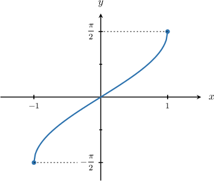

# Differentiating Inverse Trigonometric Functions

Source: https://www.mathacademy.com/topics/303?courseId=21
Topic ID: 303

## Prerequisites

- [Implicit Differentiation](../ap-calculus-ab/57-implicit-differentiation.md)
- [Graphing the Inverse Sine Function](../precalculus/1483-graphing-the-inverse-sine-function.md)
- [Graphing the Inverse Cosine Function](../precalculus/1486-graphing-the-inverse-cosine-function.md)
- [Graphing the Inverse Tangent Function](../precalculus/1487-graphing-the-inverse-tangent-function.md)
- [Differentiating Inverse Functions](../ap-calculus-ab/1785-differentiating-inverse-functions.md)

## Lesson

### Introduction

Let's learn how to differentiate the inverse trigonometric functions: $\arcsin x,$ $\arccos x,$ and $\arctan x.$

We begin with arcsine. From the definition, we know that writing $y=\arcsin{x}$ is equivalent to writing

$$

\sin y=x.

$$

Now, we differentiate both sides with respect to $x$ using implicit differentiation:

$$

\begin{aligned}\frac{d}{d𝑥}(sin⁡𝑦) & =\frac{d}{d𝑥}(𝑥) \\ \frac{d}{d𝑦}(sin⁡𝑦)⋅\frac{d𝑦}{d𝑥} & =\frac{d}{d𝑥}(𝑥) \\ cos⁡𝑦⋅\frac{d𝑦}{d𝑥} & =1 \\ \frac{d𝑦}{d𝑥} & =\frac{1}{cos⁡𝑦}\end{aligned}

$$

So we've found the derivative of $\arcsin x$ in terms of $y,$ but we want it to be expressed in terms of $x$ only.

To do that, we use the trigonometric identity $\sin^2 y+\cos^2y= 1$ and the fact that $\sin y =x.$ We write $\cos y$ as

$$

\cos y= \sqrt{1- \sin^2 y} = \sqrt{1 -x^2}.

$$

Recall that the derivative of a function at a point equals the slope of the function's graph at that point. Since the graph of $\arcsin{x}$ has a positive slope everywhere in its domain, we take the positive square root.

Now, if we plug the last expression into our derivative of $y,$ we get the derivative of $\arcsin x$ in terms of $x\mathbin{:}$

$$

\begin{aligned}\frac{d𝑦}{d𝑥}=\frac{1}{cos⁡𝑦}=\frac{1}{\sqrt{√1−𝑥^{2}}}.\end{aligned}

$$

We can use the same technique to find the derivatives of $\arccos x$ and $\arctan x.$ Try it for yourself! The results are given below.

$$

\begin{aligned}\frac{d}{d𝑥}(arcsin⁡𝑥) & =\frac{1}{\sqrt{√1−𝑥^{2}}} \\ \frac{d}{d𝑥}(arccos⁡𝑥) & =−\frac{1}{\sqrt{√1−𝑥^{2}}} \\ \frac{d}{d𝑥}(arctan⁡𝑥) & =\frac{1}{1+𝑥^{2}}\end{aligned}

$$

**Note:** To remember the derivative formulas above, it's helpful to notice the following:

- The derivative of $\arccos x$ is just like the derivative of $\arcsin x,$ except that it's negative. The negative sign makes sense because $\arccos x$ is a "co"-function, and the derivative of a "co"-function is negative (for example, the derivative of $\cos x$ is negative).

- The derivative of $\arctan x$ is similar to the others, except that there is no square root and there are no negative signs.

### Example: Differentiating an Inverse Sine Function

#### Question

Calculate $f'(x)$ for $f(x) = 5\arcsin(3x^2).$

#### Explanation

The formula for the derivative of arcsine is

$$

\frac{\textrm{d}}{\textrm{d}x}(\arcsin x) = \dfrac{1}{\sqrt{1-x^2}}.

$$

Using the chain rule and the formula above, we get

$$

\begin{aligned}𝑓^{′}(𝑥) & =\frac{d}{d𝑥}(5arcsin⁡(3𝑥^{2})) \\ & =5⋅\frac{1}{\sqrt{√1−(3𝑥^{2})^{2}}}⋅\frac{d}{d𝑥}(3𝑥^{2}) \\ & =\frac{5}{\sqrt{√1−9𝑥^{4}}}⋅(6𝑥) \\ & =\frac{30𝑥}{\sqrt{√1−9𝑥^{4}}}.\end{aligned}

$$

### Example: Differentiating an Inverse Cosine Function

#### Question

Calculate $\dfrac{\textrm{d}y}{\textrm{d}x},$ if $y = \arccos (5-8x).$

#### Explanation

The formula for the derivative of arccosine is

$$

\frac{\textrm{d}}{\textrm{d}x}(\arccos x) = -\dfrac{1}{\sqrt{1-x^2}}.

$$

Using the chain rule and the formula above, we get

$$

\begin{aligned}\frac{d𝑦}{d𝑥} & =\frac{d}{d𝑥}(arccos⁡(5−8𝑥)) \\ & =−\frac{1}{\sqrt{√1−(5−8𝑥)^{2}}}⋅\frac{d}{d𝑥}(5−8𝑥) \\ & =−\frac{1}{\sqrt{√1−(25−80𝑥+64𝑥^{2})}}⋅(−8) \\ & =\frac{8}{\sqrt{√80𝑥−24−64𝑥^{2}}} \\ & =\frac{8}{\sqrt{√4(20𝑥−6−16𝑥^{2})}} \\ & =\frac{8}{2\sqrt{√20𝑥−6−16𝑥^{2}}} \\ & =\frac{4}{\sqrt{√20𝑥−6−16𝑥^{2}}}.\end{aligned}

$$

### Example: Differentiating an Inverse Tangent Function

#### Question

Find the derivative of $y = \arctan (-7x).$

#### Explanation

The formula for the derivative of arctangent is

$$

\frac{\textrm{d}}{\textrm{d}x}(\arctan x) = \dfrac{1}{1+x^2}.

$$

Using the chain rule and the formula above, we get

$$

\begin{aligned}\frac{d𝑦}{d𝑥} & =\frac{d}{d𝑥}(arctan⁡(−7𝑥)) \\ & =\frac{1}{1+(−7𝑥)^{2}}⋅\frac{d}{d𝑥}(−7𝑥) \\ & =\frac{1}{1+49𝑥^{2}}⋅(−7) \\ & =−\frac{7}{1+49𝑥^{2}}.\end{aligned}

$$

### Example: Differentiating Inverse Trigonometric Functions Using the Product or Quotient Rule

#### Question

If $y= x \arccos x,$ calculate $\dfrac{\textrm{d}y}{\textrm{d}x}.$

#### Explanation

Applying the product rule and using the formula for the derivative of $\arccos x,$ we get

$$

\begin{aligned}\frac{d}{d𝑥}(𝑥arccos⁡𝑥) & =𝑥⋅\frac{d}{d𝑥}(arccos⁡𝑥)+arccos⁡𝑥\frac{d}{d𝑥}(𝑥) \\ & =𝑥⋅(−\frac{1}{\sqrt{√1−𝑥^{2}}})+arccos⁡𝑥⋅1 \\ & =−\frac{𝑥}{\sqrt{√1−𝑥^{2}}}+arccos⁡𝑥.\end{aligned}

$$
