# Finding Roots of Functions Using a Graphing Calculator

Source: https://www.mathacademy.com/topics/3116?courseId=21
Topic ID: 3116

## Prerequisites

- [Evaluating Expressions Using a Graphing Calculator](../ap-calculus-ab/1832-evaluating-expressions-using-a-graphing-calculator.md)
- [The Roots of a Function](../algebra-i/2022-the-roots-of-a-function.md)

## Lesson

### Introduction

In this lesson, we'll learn how to plot a function on a graphing calculator and then use our plot to find accurate approximations of the function's roots.

This lesson is designed to help prepare you for the parts of the AP Calculus exam where graphing calculators are needed.

**If you want to succeed on the AP Calculus exam, then you must acquire a physical graphing calculator and use it when completing this lesson.**

Do *not* use any other type of online tool, as you will not be allowed to use it during the exam. You need to practice with the specific calculator that you will use on the AP exam so that you can solve problems quickly without wasting any time troubleshooting your calculator.

A comprehensive list of calculators that are permitted in the AP Calculus exams can be found [here.](https://apcentral.collegeboard.org/exam-administration-ordering-scores/administering-exams/on-exam-day/calculator-policy#list)

Throughout this lesson, we will list buttons that feature on a TI-84 Plus CE-T graphing calculator.

Similar models will have the same or similar buttons, and even dissimilar models may have similar buttons.

If you have a different calculator model and cannot find the right buttons to press, the best way to resolve this is to either to

$\qquad$ (a) consult your calculator's manual, or

$\qquad$ (b) search online for a video that explains how to operate your calculator.

The best way to get familiar with your calculator is to consult its manual. Manuals can usually be found online. For example, a link to the manual for a TI-84 Plus CE-T can be found by entering the following query into a search engine.

$\qquad$ online manual TI-84 Plus CE-T

If you have a different model calculator, replace "TI-84 Plus CE-T" in the query above with your calculator's model.

Answers to common questions can be found by searching for online videos explaining how the calculator works. For example, to find a video that shows how to plot a function on a TI-84, you might type the following query into a search engine.

$\qquad$ video plot a function on a TI-84 graphing calculator

Again, replace "TI-84" in the query above with your calculator's model. Also, bear in mind that videos for similar models might also help.

### Plotting a Function

So, our goal is to plot some functions on a graphing calculator and then use these to approximate the function's roots.

Let's start by plotting the following function:

$$

f(x)=x^3-\sin x.

$$

**Watch Out!** Since $f(x)$ involves a trigonometric function, we *must* put our calculator into radians mode!

To plot the function, we first press the $\boxed{\color{gray}\,y=\,}$ button, and then enter the function definition in the first available space (usually labeled $Y_1=$) using the following sequence of buttons:

$$

\boxed{\color{gray}X,T,\theta,n}\qquad \boxed{\color{gray}\,\land\,} \qquad \boxed{\color{gray}\,3\,} \qquad \boxed{\color{gray}\,\blacktriangleright\,} \qquad \boxed{\color{gray}\,-\,} \qquad \boxed{\color{gray}\,\sin\,} \qquad \boxed{\color{gray}X,T,\theta,n}\qquad \boxed{\color{gray}\,)\,}

$$

We then press $\boxed{\color{gray}\,\text{graph}\,}$ to graph the function.

To get a better view of our function, we can adjust the window settings using the $\boxed{\color{gray}\,\text{window}\,}$ button. Press this button, and then enter the following settings:

$$

\begin{aligned}Xmin & =−2 \\ Xmax & =2 \\ Ymin & =−3 \\ Ymax & =3\end{aligned}

$$

Remember to use the negative $\boxed{\color{gray}\,(-)\,}$ button when entering the negative numbers.

Once you've entered these settings, press $\boxed{\color{gray}\,\text{graph}\,}$ once more. Your calculator should then draw the following graph:

Notice that the $x$ and $y$-axes have been restricted as follows:

- For the horizontal axis, we have $x \in [-2,2].$

- For the vertical axis, we have $y \in [-3,3].$

Make sure you can replicate this graph on your graphing calculator before continuing. This includes adjusting the window settings, which will become important later in the lesson.

### Finding the Root of a Function

So, we have the function $f(x),$ defined as

$$

f(x)=x^3-\sin x.

$$

Our plot of this function is shown again below.

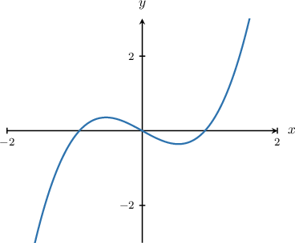

The graph shows that the positive root of this function lies inside the interval $x \in [0,2].$ Our goal now is to find an accurate approximation for this root using our graphing calculator's $\boxed{\color{gray}\,\text{zero}\,}$ command.

To access the $\boxed{\color{gray}\,\text{zero}\,}$ command, we first make sure that our function $f(x)$ is plotted, and the root we want to find is clearly in view. Then, we press the $\boxed{\color{gray}\,\text{2nd}\,}$ button followed by $\boxed{\color{gray}\,\text{calc}\,}.$ We then select $\boxed{\color{gray}\,\text{zero}\,}$ from the menu, followed by $\boxed{\color{gray}\,\text{enter}\,}.$

The calculator will now ask us to specify an interval containing the root and an initial guess. First, we select a "left bound," followed by a "right bound," followed by our "guess." To specify these values, we use the $\boxed{\color{gray}\,\blacktriangleleft\,}$ and $\boxed{\color{gray}\,\blacktriangleright\,}$ buttons to move the cursor along the curve, and press $\boxed{\color{gray}\,\textrm{enter}\,}$ to select.

In this particular case, we enter the following when prompted:

- The "left bound" should be a value close to the root on its left-hand side. Let's pick $0.$

- The "right bound" should be a value close to the root on its right-hand side. Let's pick $1.5.$

- The "guess" could be any number from the interval $x\in [0,1.5].$ Let's pick $0.5.$

Our interval and guess are highlighted below.

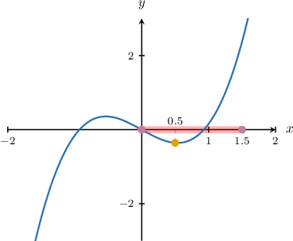

At the bottom of the display, the calculator will return the following value for the zero (i.e., the root):

$\qquad$ $x = 0.928\,626\,3$

And that's it! We've successfully used the calculator's root-finding functions to approximate the positive root of $f(x)$ to seven decimal places.

### Example: Approximating a Root of a Function

#### Question

Find, to five decimal places, an approximation for the positive root of the function

$$

f(x)=-x^3+x^2+1.

$$

#### Explanation

First, we plot $y=f(x)$ using a graphing calculator to find an interval that contains the root.

To plot the function, we press $\boxed{\color{gray}\,y=\,}$ and enter the function definition in the first available space. We then press $\boxed{\color{gray}\,\text{graph}\,}$ to graph the function.

To get a better view, we might need to either

- zoom in or out, or

- adjust the window ranges.

We can adjust the window settings using the $\boxed{\color{gray}\,\text{window}\,}$ button (or equivalent).

In our case, the appropriate window ranges could be the following:

- for the horizontal axis, $x \in [-1, 3]$

- for the vertical axis, $y \in [-2,2]$

This gives us the following graph:

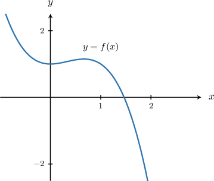

The graph shows that the root lies inside the interval $x \in [1,2].$

To get a good approximation for the root, we use the $\boxed{\color{gray}\,\text{zero}\,}$ command (or equivalent). This is usually accessed by pressing the $\boxed{\color{gray}\,\text{calc}\,}$ button (or equivalent). Note that we sometimes need to press the $\boxed{\color{gray}\,\text{2nd}\,}$ or $\boxed{\color{gray}\,\text{shift}\,}$ button first.

We enter the following when prompted:

- The "left bound" should be a value close to the root on its left-hand side. Let's pick $1.$

- The "right bound" should be a value close to the root on its right-hand side. Let's pick $2.$

- The "guess" could be any number from $[1,2].$ Let's pick $1.5.$

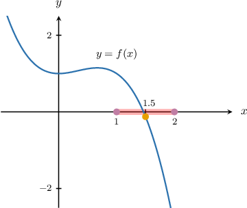

The calculator returns the zero

$\qquad$ $x \approx 1.465\,571.$

Rounding to $5$ decimal places, we obtain the following:

$\qquad$ $x \approx 1.465\,57$

### Example: Finding Solutions to Equations

#### Question

Find, to four decimal places, the smallest positive solution of the equation

$$

\ln{(x^e + x^2)} - x + 1 = 0.

$$

#### Explanation

The solutions of the equation correspond to the roots of the function $f(x) = \ln{(x^e + x^2)} - x+1.$

First, we plot $y=f(x)$ using a graphing calculator to find an interval that contains the root.

To plot the function, we press $\boxed{\color{gray}\,y=\,}$ and enter the function definition in the first available space. We then press $\boxed{\color{gray}\,\text{graph}\,}$ to graph the function.

To get a better view, we might need to either

- zoom out, or

- adjust the window ranges.

We can adjust the window settings using the $\boxed{\color{gray}\,\text{window}\,}$ button (or equivalent).

In our case, the appropriate window ranges could be the following:

- for the horizontal axis, $x \in [-1,7]$

- for the vertical axis, $y \in [-2,2]$

This gives us the following graph:

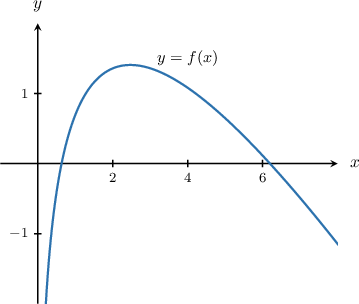

The graph shows that the smallest positive root lies inside the interval $x \in [0,2].$

To get a good approximation for the root, we use the $\boxed{\color{gray}\,\text{zero}\,}$ command (or equivalent). This is usually accessed by pressing the $\boxed{\color{gray}\,\text{calc}\,}$ button (or equivalent). Note that we sometimes need to press the $\boxed{\color{gray}\,\text{2nd}\,}$ or $\boxed{\color{gray}\,\text{shift}\,}$ button first.

We enter the following when prompted:

- The "left bound" should be a value close to the root on its left-hand side. Let's pick $0.$

- The "right bound" should be a value close to the root on its right-hand side. Let's pick $2.$

- The "guess" could be any number from $[0,2].$ Let's pick $1.$

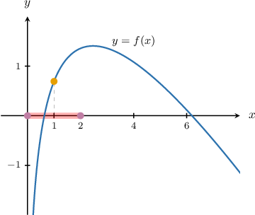

The calculator returns the zero

$\qquad$ $x \approx 0.634\,987.$

Rounding to $4$ decimal places, we obtain the following:

$\qquad$ $x \approx 0.635\,0$

### Plotting Functions With Roots Outside the Standard Range

The default view on most graphing calculators is $x\in [-10,10]$ and $y\in [-10,10].$ When a root lies outside this range, we must adjust the window to see the root.

Suppose we want to find the smallest positive root of the following function:

$$

f(x) = \dfrac{1}{x\sqrt x} + 24\cos\left(\dfrac{x+1}{48}\right)

$$

Plotting $y=f(x)$ using the default view gives the following:

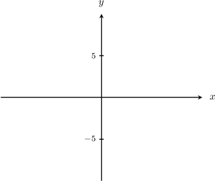

Not only is the root not in the standard view, but the function cannot be seen!

To get a better view, we might start by zooming out. For this, we press $\boxed{\color{gray}\textrm{zoom}}$ and select "zoom out." Then, we press $\boxed{\color{gray}\textrm{enter}}$ followed by $\boxed{\color{gray}\textrm{enter}}$ once more.

This gives the following plot.

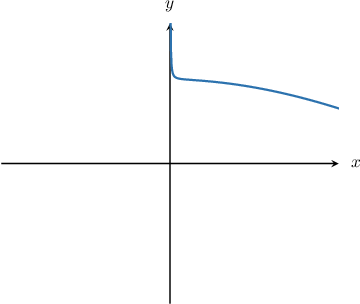

By pressing the $\boxed{\color{gray}\textrm{window}}$ button, we see that this view is $x\in [-40,40], y\in [-40,40].$

Looking at the shape of the curve, it appears that the root will show up to the right of $x=40.$ So, let's adjust our window settings by selecting the following options under the $\boxed{\color{gray}\textrm{window}}$ menu.

- For the horizontal axis, select $x\in [40,100]$

- For the vertical axis, select $y\in [-40,40]$

This gives the following picture:

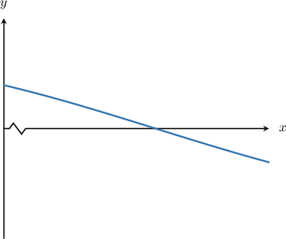

The root is now clearly visible, and we can apply our usual root-finding procedure to approximate the root.

### Problems With Using Zoom

Although using zoom is *sometimes* handy for identifying the approximate location of a root, it does have its drawbacks. In particular, we can run into problems when a function varies slowly, and the root lies far from the origin.

For example, suppose we want to locate the smallest positive root of the following function:

$$

f(x) = \sin\left(\dfrac{\sqrt x}{10}\right)

$$

This function varies slowly, and the smallest positive root $(x\approx 987)$ is well outside the default view.

Plotting the function in the default view gives the following.

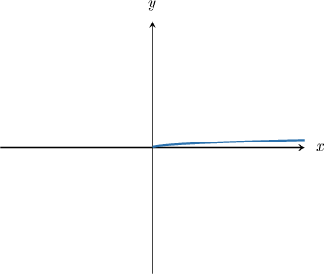

The positive root cannot be seen. However, if we zoom out twice, we get the following:

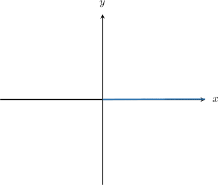

The problem here is that the $x$ and $y$-axes are so long that we cannot tell where the curve crosses the $x$-axis or if it even crosses it at all.

To get around this issue, instead of using zoom, we should adjust the window settings to increase the range for $x$ while keeping the range for $y$ very small.

Since the root lies well to the right of the origin, let's press the $\boxed{\color{gray}\,\text{window}\,}$ button and enter the following settings:

- for the horizontal axis, $x \in [0, 200]$

- for the vertical axis, $y \in [-1,1]$

Pressing $\boxed{\color{gray}\,\text{graph}\,}$ gives the following.

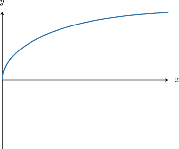

We now have a much clearer picture of the function's behavior.

We still haven't located the root, so let's extend the $x$-axis even further to the right while keeping the range for $y$ the same as before.

- for the horizontal axis, $x \in [200, 1200]$

- for the vertical axis, $y \in [-1,1]$

This gives the following graph.

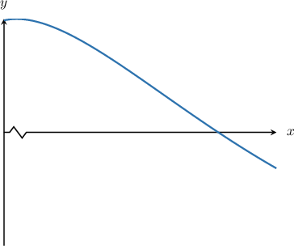

We have now managed to locate the root, and we can apply our usual root-finding procedures.

If we want to zoom into the root a little more, we can press $\boxed{\color{gray}\,\text{zoom}\,},$ select "zoom in," hover the cursor over the approximate location of the root and then press $\boxed{\color{gray}\,\text{enter}\,}.$ This will give a graph similar to the following.

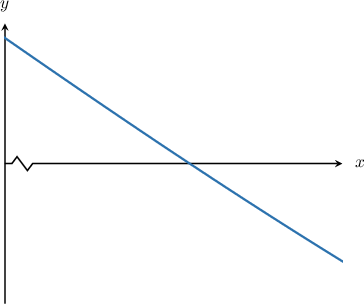

### Example: Approximating a Root of a Function: Roots Outside the Standard Range

#### Question

Find an approximation for the root of the function

$$

f(x) = \sin\left(\dfrac{\sqrt x}{10}\right).

$$

#### Explanation

First, we plot $y=f(x)$ using a graphing calculator to find an interval that contains the root. Since $f(x)$ contains trigonometric functions, we need to make sure that the calculator is in $\boxed{\color{gray}\,\text{RAD}\,}$ (radians) mode.

To plot the function, we press $\boxed{\color{gray}\,y=\,}$ and enter the function definition in the first available space. We then press $\boxed{\color{gray}\,\text{graph}\,}$ to graph the function.

The default view on most graphing calculators is $x \in [-10,10], y \in [-10,10].$ However, in this instance, the root falls outside the default view.

To get a better view, we might need to either

- zoom in or out, or

- adjust the window ranges.

We can adjust the window settings using the $\boxed{\color{gray}\,\text{window}\,}$ button (or equivalent).

In our case, the appropriate window ranges could be the following:

- for the horizontal axis, $x \in [850,1\,200]$

- for the vertical axis, $y \in [-1,1]$

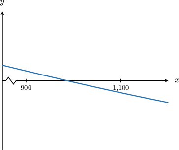

The graph shows that the smallest root lies inside the interval $x\in [900, 1100].$

To get a good approximation for the root, we use the $\boxed{\color{gray}\,\text{zero}\,}$ command (or equivalent). This is usually accessed by pressing the $\boxed{\color{gray}\,\text{calc}\,}$ button (or equivalent). Note that we sometimes need to press the $\boxed{\color{gray}\,\text{2nd}\,}$ or $\boxed{\color{gray}\,\text{shift}\,}$ button first.

We enter the following when prompted:

- The "left bound" should be a value close to the root on its left-hand side. Let's pick $900.$

- The "right bound" should be a value close to the root on its right-hand side. Let's pick $1\,100.$

- The "guess" could be any number from $[900,1\,100].$ Let's pick $1\,000.$

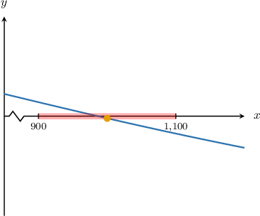

The calculator returns the zero

$\qquad$ $x \approx 986.960\,44.$

Rounding to $2$ decimal places, we obtain the following:

$\qquad$ $x \approx 986.96$
