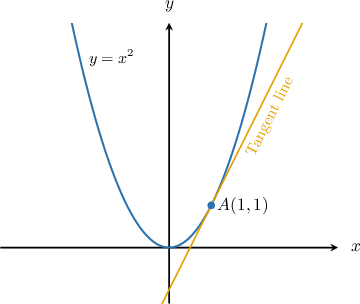

# Calculating the Slope of a Tangent Line Using Differentiation

Source: https://www.mathacademy.com/topics/332?courseId=21
Topic ID: 332

## Prerequisites

- [The Sum and Constant Multiple Rules for Differentiation](../ap-calculus-ab/278-the-sum-and-constant-multiple-rules-for-differentiation.md)

## Lesson

### Introduction

Remember that the derivative of a function represents the slope of the tangent line to the curve

For example, consider the curve, shown below. If we want to compute the slope of the tangent to the curve at the point then we compute and evaluate

If then by the power rule. Substituting into gives

Therefore, the slope of the tangent to the curve at the point is

### Example: Calculating the Slope of a Tangent Line of a Curve at a Given Point

#### Question

Find the slope of the tangent to the curve $y = x^2 + \dfrac {1}{x}$ at the point where $x=2.$

#### Explanation

Let $f(x)=x^2+\dfrac 1 x.$ The slope of the tangent at $x=2$ is equal to $f'(2).$ Computing the derivative, we get

$$

\begin{aligned}𝑓^{′}(𝑥) & =\frac{d}{d𝑥}(𝑥^{2}+\frac{1}{𝑥}) \\ & =\frac{d}{d𝑥}(𝑥^{2}+𝑥^{−1}) \\ & =2⋅𝑥−𝑥^{−2} \\ & =2𝑥−𝑥^{−2}.\end{aligned}

$$

Now, we evaluate at $x=2$ and get

$$

\begin{aligned}𝑓^{′}(2) & =2(2)−(2)^{−2} \\ & =4−\frac{1}{4} \\ & =\frac{15}{4}.\end{aligned}

$$

Therefore, the slope of the tangent to the curve is $\dfrac{15}{4}.$

### Example: Calculating the Slope of a Tangent Line of a Curve With Fractional Powers at a Given Point

#### Question

What is the slope of the tangent to the curve $y = x^4 + 3\sqrt [3]{x^2}$ at the point $(1,4)?$

#### Explanation

This time, we'll use $\dfrac{\textrm d y}{\textrm d x}$ notation. First, we compute the derivative, which gives

$$

\begin{aligned}\frac{d𝑦}{d𝑥} & =\frac{d}{d𝑥}(𝑥^{4}+3\sqrt[√𝑥^{2}]{3}) \\ & =\frac{d}{d𝑥}(𝑥^{4}+3𝑥^{2/3}) \\ & =4⋅𝑥^{3}+3⋅\frac{2}{3}⋅𝑥^{−1/3} \\ & =4𝑥^{3}+2𝑥^{−1/3}.\end{aligned}

$$

Evaluating at $x=1$ gives

$$

\begin{aligned}\frac{d𝑦}{d𝑥}_{𝑥=1} & =4(1)^{3}+2(1)^{−1/3} \\ & =4+2 \\ & =6\,.\end{aligned}

$$

Therefore, the slope of the tangent to the curve is $6.$

### Example: Finding a Point on a Curve With a Certain Slope

#### Question

Find the $x$-coordinate of the point on the curve $y=3x^2+1$ where the tangent line has a slope of $-1.$

#### Explanation

Let $f(x)=3x^2+1.$ The slope of the tangent at the point $x$ is equal to $f'(x).$ Computing the derivative, we get

$$

\begin{aligned}𝑓^{′}(𝑥) & =\frac{d}{d𝑥}(3𝑥^{2}+1) \\ & =3\frac{d}{d𝑥}(𝑥^{2})+\frac{d}{d𝑥}(1) \\ & =3⋅2𝑥+0 \\ & =6𝑥+0 \\ & =6𝑥.\end{aligned}

$$

We now set $f'(x) = -1$ and solve for $x\mathbin{:}$

$$

\begin{aligned}𝑓^{′}(𝑥) & =−1 \\ 6𝑥 & =−1 \\ 𝑥 & =−\frac{1}{6}\end{aligned}

$$

Therefore, the slope of the tangent is equal to $-1$ at the point where $x=-\dfrac 1 6.$
