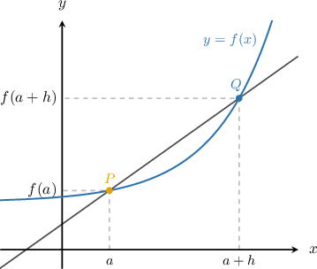
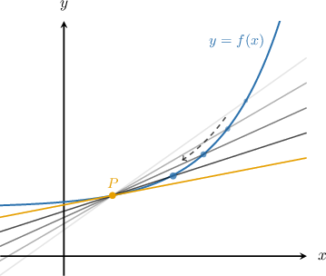
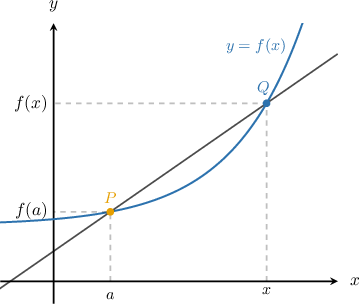

# The Instantaneous Rate of Change of a Function at a Point

Source: https://www.mathacademy.com/topics/337?courseId=21
Topic ID: 337

## Prerequisites

- [The Average Rate of Change of a Function over a Varying Interval](../ap-calculus-ab/1208-the-average-rate-of-change-of-a-function-over-a-varying-interval.md)
- [Calculating Limits of Rational Functions by Factoring](../ap-calculus-ab/1813-calculating-limits-of-rational-functions-by-factoring.md)
- [Describing Function Composition](../algebra-i/3817-describing-function-composition.md)

## Lesson

### Introduction

The average rate of change of the function on the interval is given by

This can be interpreted as the slope of the secant line that intersects the curve at the points and as shown below.

The **instantaneous rate of change** of the function at the point is the limit of the average rate of change as It is denoted by and given by

Geometrically, as, the point moves along the curve towards the point and the secant transforms into the line that touches the curve at exactly one point That line is called the **tangent line** to the curve at the point

The value of is equal to the slope of the tangent line to the curve at

### Example: Calculating the Instantaneous Rate of Change of a Function at a Point

#### Question

Find the instantaneous rate of change of $f(x)=3x^2$ at the point $x=5$ using the definition.

#### Explanation

Let's use the definition

$$

f'(a) = \lim_{h\to 0}\dfrac {f(a+h) - f(a)} {h}.

$$

In our problem, we have $a=5$, and so by the definition we have

$$

\begin{aligned}𝑓^{′}(5)=\underset{ℎ→0}{lim}\frac{𝑓(5+ℎ)−𝑓(5)}{ℎ}.\end{aligned}

$$

Applying this to $f(x)=3x^2$, we get

$$

\begin{aligned}𝑓^{′}(5) & =\underset{ℎ→0}{lim}(\frac{3(5+ℎ)^{2}−3(5)^{2}}{ℎ}) \\ & =\underset{ℎ→0}{lim}(\frac{75+30ℎ+3ℎ^{2}−75}{ℎ}) \\ & =\underset{ℎ→0}{lim}(\frac{30ℎ+3ℎ^{2}}{ℎ}) \\ & =\underset{ℎ→0}{lim}(30+3ℎ) \\ & =30+3(0) \\ & =30.\end{aligned}

$$

### An Equivalent Definition of Instantaneous Rate of Change

Another way of defining is

We arrive at this definition in the same way as before. But this time, we consider the interval instead of and then take the limit of the average rate of change as

Sometimes, this version is a bit easier to work with, so let's see an example of how to apply it. We should always arrive at the same answer regardless of which definition we use.

### Example: Calculating the Slope of the Tangent Line to a Curve at a Point Using the Equivalent Definition

#### Question

Using the limit of a difference quotient, calculate the slope of the tangent line to the curve $y=2x-x^2$ at the point $x=2.$

#### Explanation

Let $f(x)=2x-x^2.$ The slope of the tangent line is equal to $f'(2).$

Let's use the equivalent definition for $f'(a),$ given by

$$

f'(a) = \lim_{x\to a}\dfrac {f(x) - f(a)} {x-a}.

$$

Using the above definition with $a=2,$ we have

$$

f'(2) = \lim_{x\to 2}\dfrac {f(x) - f(2)} {x-2}.

$$

Applying this to $f(x)=2x-x^2,$ we get

$$

\begin{aligned}𝑓^{′}(2) & =\underset{𝑥→2}{lim}(\frac{[2𝑥−𝑥^{2}]−[2(2)−(2)^{2}]}{𝑥−2}) \\ & =\underset{𝑥→2}{lim}(\frac{−𝑥^{2}+2𝑥}{𝑥−2}) \\ & =\underset{𝑥→2}{lim}(\frac{−𝑥(𝑥−2)}{𝑥−2}) \\ & =\underset{𝑥→2}{lim}(−𝑥) \\ & =−2.\end{aligned}

$$

So the slope of the tangent line to the curve at $x=2$ is $-2.$
