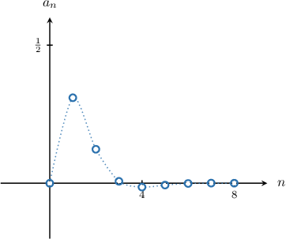

# Further Determining Limits of Sequences Using Relative Magnitudes

Source: https://www.mathacademy.com/topics/3539?courseId=21
Topic ID: 3539

## Prerequisites

- [Determining Limits of Sequences Using Relative Magnitudes](./1245-determining-limits-of-sequences-using-relative-magnitudes.md)

## Lesson

### Introduction

What is the limit of the following sequence?

$$

a_n = e^{-n}\sin{n}, \qquad n\geq 0

$$

First, notice that we can rewrite the sequence using a fraction:

$$

a_n = \dfrac{\sin{n}}{e^n}, \qquad n\geq 0

$$

Next, notice that the numerator is a bounded function, with

$$

|\sin{n}| \leq 1,

$$

while the denominator $e^n$ grows without bound as $n\to\infty.$ This means that the gap between the numerator and denominator grows as $n\to\infty.$

Therefore, we conclude that

$$

\lim_{n\to\infty} e^{-n}\sin{n} = 0.

$$

In other words, the limit of the sequence is zero. Plotting the sequence on a graph confirms our result.

In this lesson, we will determine the limits of sequences by comparing the relative magnitudes of their parts. To do this, recall that for large values of $n,$ we have

$$

n! \gg e^{n} \gg n^m \gg \ln(n),

$$

where $\gg$ means **much greater than**, and $m$ is *any* positive integer.

### Example: Determining Whether a Sequence Expressed as a Product Converges

#### Question

Does the sequence $a_n = \ln(2n)e^{-3n}+2$ for $n\geq 1$ converge or diverge? If the sequence converges, what is its limit?

#### Explanation

Notice that we can express the terms of the sequence using a fraction:

$$

a_n = \dfrac {\ln(2n)}{e^{3n}} + 2

$$

We need to calculate the limit of this sequence as $n$ approaches infinity:

$$

\lim_{n\to \infty} a_n = \lim_{n\to \infty} \left( \dfrac {\ln(2n)}{e^{3n}} + 2 \right)

$$

Both the numerator and denominator of the fraction approach infinity as $n\to\infty.$ However, the denominator is growing much faster than the numerator, and we conclude that

$$

\lim_{n\to \infty} \dfrac {\ln(2n)}{e^{3n}} = 0.

$$

Therefore,

$$

\begin{aligned}\underset{𝑛→∞}{lim}𝑎_{𝑛} & =\underset{𝑛→∞}{lim}(\frac{ln⁡(2𝑛)}{𝑒^{3𝑛}}+2) \\ & =\underset{𝑛→∞}{lim}(\frac{ln⁡(2𝑛)}{𝑒^{3𝑛}})+\underset{𝑛→∞}{lim}(2) \\ & =0+2 \\ & =2.\end{aligned}

$$

Therefore, the sequence converges, and its limit is $2.$

### Example: Determining the Convergence of Sequences Containing Trigonometric Functions

#### Question

What is the limit of the sequence $a_n = \dfrac{\cos n}{n^2+1}$ for $n\geq 0?$

#### Explanation

We calculate the limit of the sequence as $n$ approaches infinity:

$$

\lim_{n\to \infty} a_n = \dfrac{\cos n}{n^2+1}

$$

The numerator here is a bounded function with

$$

|\cos n| \leq 1.

$$

The denominator $n^2+1$ grows without bound as $n\to\infty.$ So we conclude that

$$

\lim_{n\to \infty}\dfrac{\cos n}{n^2+1} = 0.

$$

Therefore, the sequence converges, and its limit is $0.$

### Example: Determining the Convergence of Sequences Containing Factorials

#### Question

Does the sequence $a_n = \dfrac{2+\cos n}{n!}$ converge or diverge? If the sequence converges, what is its limit?

#### Explanation

We calculate the limit of the sequence as $n$ approaches infinity:

$$

\lim_{n\to \infty} a_n = \lim_{n\to \infty} \dfrac{2+\cos n}{n!}

$$

The numerator here is a bounded function with

$$

1\leq 2+\cos n \leq 3.

$$

The denominator $n!$ grows without bound as $n \to\infty.$ So we conclude that

$$

\lim_{n\to \infty} \dfrac{2+\cos n}{n!} = 0.

$$

Therefore, the sequence converges, and its limit is $0.$
