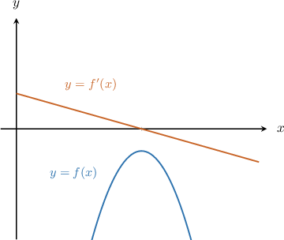
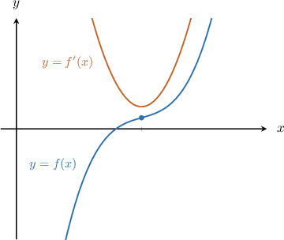
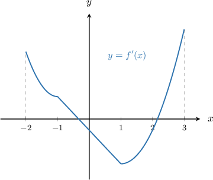
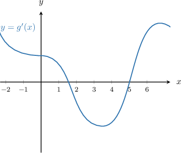
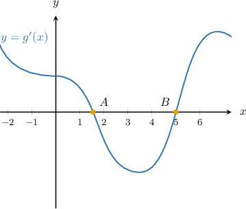
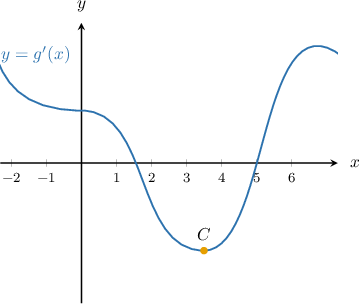

# Interpreting the Graph of a Function's Derivative: Concavity and Points of Inflection

Source: https://www.mathacademy.com/topics/3548?courseId=21
Topic ID: 3548

## Prerequisites

- [Interpreting the Graph of a Function's Derivative](../ap-calculus-ab/624-interpreting-the-graph-of-a-function-s-derivative.md)

## Lesson

### Introduction

Recall that we can use the second derivative to determine the concavity of a differentiable function $f(x)\mathbin{:}$

- $f(x)$ is concave up on an interval $(a,b)$ if $f''(x) > 0$ on $(a,b),$ while

- $f(x)$ is concave down on an interval $(a,b)$ if $f''(x) < 0$ on $(a,b).$

So, to determine intervals of concavity of $f(x)$ by looking at the graph of $f'(x),$ we need to pay attention to where $f'(x)$ is increasing or decreasing.

- If $f'(x)$ is increasing, then $f''(x)>0,$ which means $f(x)$ is concave up.

- If $f'(x)$ is decreasing, then $f''(x)<0,$ which means $f(x)$ is concave down.

Also, recall that $f(x)$ has an inflection point at $x=a$ if $f''(x)$ changes its sign around $x=a.$ So, to determine the inflection points of $f(x)$ by looking at a graph of $f'(x),$ we need to pay attention to where $f'(x)$ switches from increasing to decreasing (or vice versa).

In other words, we need to pay attention to relative extrema on the graph of $f'(x).$

### Example: Determining Inflection Points and Intervals of Concavity Given the Graph of a Derivative

#### Question

The graph of $y=f'(x)$, the derivative of $y=f(x)$, is defined on the interval $[-2,3]$ as shown below. Find all of the inflection points of $y=f(x)$ for $x\in(-2,3).$

#### Explanation

First, note that $f'(x)$ exists at every point on the interval $x\in [-2,3].$

We need to investigate the behavior of $f''(x).$ We recall the following:

- When $f'(x)$ is increasing, we have $f''(x)>0.$

- When $f'(x)$ is decreasing, we have $f''(x)< 0.$

The function $f(x)$ has an inflection point at $x=a,$ if the following two conditions are satisfied:

- $f''(x)=0$ or $f''(x)$ is undefined, and

- $f''(x)$ changes its sign (from negative to positive or vice versa) at that point.

We summarize the information from the given graph in the table below:

From the table, we see that $f''(x)$ changes its sign at the point $x=1.$ Therefore, $x=1$ is a point of inflection of $y=f(x).$

Note that the sign of $f''(x)$ does not change at $x=-1,$ and so this is ** a point of inflection.

### Example: Identifying True Statements Given the Graph of a Derivative

#### Question

The graph $y=g'(x),$ the derivative of $y=g(x),$ is shown below. Which of the following statements **** be true?

1. $g(x)$ has a relative maximum at $x=1.5$

2. $g(x)$ has a relative minimum at $x=5$

3. $g(x)$ has an inflection point at $x=3.5$

#### Explanation

First, notice that $y=g'(x)$ intersects the $x$-axis at the points $A$ and $B,$ as shown below.

An extremum of $y=g(x)$ occurs when the graph $y=g'(x)$ changes its sign. Checking the first derivative at the points $A$ and $B,$ we see that

- the point $A,$ at $x=1.5,$ is a relative maximum of $g(x)$ since the derivative $g'(x)$ switches from positive to negative, and

- the point $B,$ at $x=5,$ is a relative minimum of $g(x)$ since the derivative $g'(x)$ switches from negative to positive.

Therefore, statements I and II are true.

Now, an inflection point may occur where the second derivative $y=g''(x)$ is zero (the tangent line to $y=g'(x)$ is horizontal) or $y=g''(x)$ does not exist (a rapid change in the slope). Indeed, at the point $x=3.5,$ which we label as $C,$ we see that the slope of $g'(x)$ is zero, meaning that $g''(x)=0.$

We obtain an inflection point if the slope of the tangent line to $y=g'(x)$ changes its sign. Thus, we have an inflection point at $C$, where the slope goes from negative to positive. Therefore, statement III is true.

In conclusion, all three statements are true.
