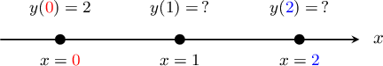
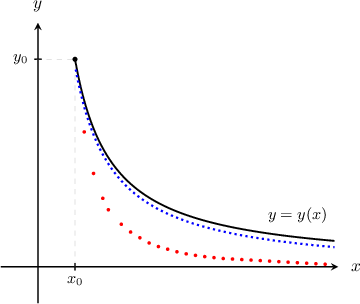

# Euler's Method: Calculating Multiple Steps

Source: https://www.mathacademy.com/topics/3668?courseId=21
Topic ID: 3668

## Prerequisites

- [Euler's Method: Calculating One Step](./602-euler-s-method-calculating-one-step.md)

## Lesson

### Introduction

Consider the following initial value problem:

$$

y' = x+y+1, \qquad y(0)=2

$$

Our goal here is to approximate $y(1)$ *and* $y(2)$ using Euler's method.

We will proceed using two steps of equal size. The step size $\Delta x$ is

$$

\Delta x = \dfrac{{\color{blue}{2}}-{\color{red}{0}}}{2} = 1.

$$

We will use a table to keep track of all the numbers. Let's start by adding the initial condition data $y(0) = 2.$

We now proceed in two steps.

**Step 1**: We compute $y'$ using the values of $x$ and $y$ in the first row of the table, and we calculate $\Delta y$ using Euler's method.

$$

\begin{aligned}𝑦^{′} & =𝑥+𝑦+1 \\ & =0+2+1 \\ & =3 \\ Δ𝑦 & =𝑦^{′}⋅Δ𝑥 \\ & =3⋅1 \\ & =3\end{aligned}

$$

Then, we find the values of $x_{\text{new}}$ and $y_{\text{new}}\mathbin{:}$

$$

\begin{aligned}𝑥_{new} & =𝑥+Δ𝑥 \\ & =0+1 \\ & =1 \\ 𝑦_{new} & =𝑦+Δ𝑦 \\ & =2+3 \\ & =5\end{aligned}

$$

Filling in our table, we get the following:

**Step 2**: We now repeat the process. We compute $y'$ using the values of $x$ and $y$ in the *second* row of the table, and we calculate $\Delta y$ using Euler's method.

$$

\begin{aligned}𝑦^{′} & =𝑥+𝑦+1 \\ & =1+5+1 \\ & =7 \\ Δ𝑦 & =𝑦^{′}⋅Δ𝑥 \\ & =7⋅1 \\ & =7\end{aligned}

$$

Then, we find new values for $x_{\text{new}}$ and $y_{\text{new}}\mathbin{:}$

$$

\begin{aligned}𝑥_{new} & =𝑥+Δ𝑥 \\ & =1+1 \\ & =2 \\ 𝑦_{new} & =𝑦+Δ𝑦 \\ & =5+7 \\ & =12\end{aligned}

$$

Filling in our table, we get the following:

Looking at the two leftmost columns, we conclude that $y(1)\approx 5$ and $y(2)\approx 12.$

### Example: Completing the Second Row of a Table Using Euler's Method

#### Question

Consider the following initial value problem:

$$

y'=xy^4, \qquad y(2) = 1

$$

We wish to approximate the solution using Euler's method. What entry should be placed in the column for $\Delta y$ in the second row of the table below if the step size is $\Delta x = \dfrac{1}{2}?$

#### Explanation

To get the values of $x$ and $y$ in the second row, we add $\Delta x$ to $x$ and $\Delta y$ to $y,$ as follows:

$$

\begin{aligned}𝑥_{new} & =𝑥+Δ𝑥 \\ & =2+\frac{1}{2} \\ & =\frac{5}{2} \\ 𝑦_{new} & =𝑦+Δ𝑦 \\ & =1+1 \\ & =2\end{aligned}

$$

Adding these results to our table gives the following:

Next, we compute $y'$ according to the given rule (using the values of $x$ and $y$ in the second row), and we compute $\Delta{y}$ using Euler's method:

$$

\begin{aligned}𝑦^{′} & =𝑥𝑦^{4} \\ & =\frac{5}{2}⋅(2)^{4} \\ & =40 \\ Δ𝑦 & =𝑦^{′}⋅Δ𝑥 \\ & =40⋅\frac{1}{2} \\ & =20\end{aligned}

$$

We add this to our table.

Therefore, the missing value is $\Delta y = 20.$

### Example: Approximating the Solution to an Initial Value Problem Using Euler's Method With Two Steps

#### Question

Given the initial value problem

$$

y' = 2xy, \qquad y(1)=3,

$$

use Euler's method to find an approximation to $y(2)$ using two steps of equal size.

#### Explanation

First, note that we are given $y(1)$ and asked to find $y(2).$ The distance from $x=1$ to $x=2$ is $1,$ and since we are asked to use two steps of equal size, our step size must be

$$

\Delta x = \dfrac{2-1}{2} = \dfrac{1}{2}.

$$

Now, let's proceed with Euler's method. We'll start by creating a table that includes the initial condition data $y(1)=3.$

**** We compute $y'$ and $\Delta{y}$ (using the values of $x$ and $y$ in the first row) and the values of $x_{\text{new}}$ and $y_{\text{new}}$ using Euler's method:

$$

\begin{aligned}𝑦^{′} & =2𝑥𝑦=2⋅1⋅3=6 \\ Δ𝑦 & =𝑦^{′}⋅Δ𝑥=6⋅\frac{1}{2}=3 \\ 𝑥_{new} & =𝑥+Δ𝑥=1+\frac{1}{2}=\frac{3}{2} \\ 𝑦_{new} & =𝑦+Δ𝑦=3+3=6\end{aligned}

$$

We add this to our table.

**** We compute $y'$ and $\Delta{y}$ (using the values of $x$ and $y$ in the second row) and new values of $x_{\text{new}}$ and $y_{\text{new}}$ using Euler's method:

$$

\begin{aligned}𝑦^{′} & =2𝑥𝑦=2⋅\frac{3}{2}⋅6=18 \\ Δ𝑦 & =𝑦^{′}⋅Δ𝑥=18⋅\frac{1}{2}=9 \\ 𝑥_{new} & =𝑥+Δ𝑥=\frac{3}{2}+\frac{1}{2}=2 \\ 𝑦_{new} & =𝑦+Δ𝑦=6+9=15\end{aligned}

$$

We add this to our table.

Therefore, we conclude that $y(2) \approx 15.$

### Example: Approximating the Solution to an Initial Value Problem Using Euler's Method With Three Steps

#### Question

Consider the following initial value problem:

$$

y' = x^3-y^2, \qquad y(0)=1

$$

Use Euler's method with three steps of equal size to approximate $y(3).$

#### Explanation

First, note that we are given $y(0)$ and asked to find $y(3).$ The distance from $x=0$ and $x=3$ is $3,$ and since we are asked to use three steps of equal size, our step size must be

$$

\Delta x = \dfrac{3-0}{3}=\dfrac{3}{3} = 1.

$$

Now, let's proceed with Euler's method. We'll start by creating a table that includes the initial condition data $y(0)=1.$

**** We compute $y'$ and $\Delta{y}$ (using the values of $x$ and $y$ in the first row) and the values of $x_{\text{new}}$ and $y_{\text{new}}$ using Euler's method:

$$

\begin{aligned}𝑦^{′} & =𝑥^{3}−𝑦^{2}=0^{3}−1^{2}=−1 \\ Δ𝑦 & =𝑦^{′}⋅Δ𝑥=−1⋅1=−1 \\ 𝑥_{new} & =𝑥+Δ𝑥=0+1=1 \\ 𝑦_{new} & =𝑦+Δ𝑦=1+(−1)=0\end{aligned}

$$

We add this to our table.

**** We compute $y'$ and $\Delta{y}$ (using the values of $x$ and $y$ in the second row) and new values of $x_{\text{new}}$ and $y_{\text{new}}$ using Euler's method:

$$

\begin{aligned}𝑦^{′} & =𝑥^{3}−𝑦^{2}=1^{3}−0^{2}=1 \\ Δ𝑦 & =𝑦^{′}⋅Δ𝑥=1⋅1=1 \\ 𝑥_{new} & =𝑥+Δ𝑥=1+1=2 \\ 𝑦_{new} & =𝑦+Δ𝑦=0+1=1\end{aligned}

$$

We add this to our table.

**** We compute $y'$ and $\Delta{y}$ (using the values of $x$ and $y$ in the third row) and new values of $x_{\text{new}}$ and $y_{\text{new}}$ using Euler's method:

$$

\begin{aligned}𝑦^{′} & =𝑥^{3}−𝑦^{2}=2^{3}−1^{2}=7 \\ Δ𝑦 & =𝑦^{′}⋅Δ𝑥=7⋅1=7 \\ 𝑥_{new} & =𝑥+Δ𝑥=2+1=3 \\ 𝑦_{new} & =𝑦+Δ𝑦=1+7=8\end{aligned}

$$

We add this to our table.

Therefore, we conclude that $y(3)\approx 8.$

### The Importance of Step Size in Euler's Method

When applying Euler's method, an important point to keep in mind is that the smaller the step size is, the better our approximation will be.

To demonstrate, consider the graph below.

The solid curve represents the actual solution $y = y(x)$ to an initial value problem with initial condition $y(x_0) = y_0.$ The dotted curves represent some Euler's approximations to the same initial value problem:

- The blue dots represent the approximation obtained using Euler's method with $\Delta x = 0.05.$

- The red dots represent the approximation obtained using Euler's method with $\Delta x = 0.25.$

The diagram shows that the sequence of points with the smaller step size approximates the actual solution better than the sequence with the larger step size.
