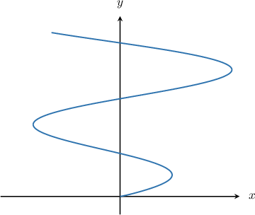
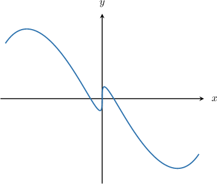
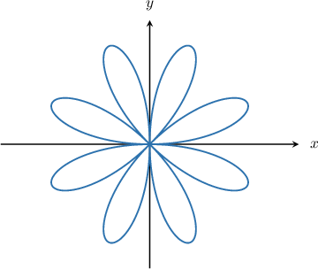
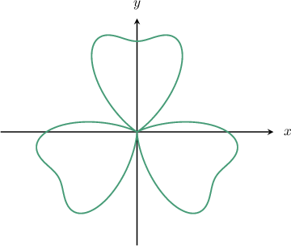

# Plotting Parametric and Polar Curves Using Technology

Source: https://www.mathacademy.com/topics/3812?courseId=21
Topic ID: 3812

## Prerequisites

- [Graphing Curves Defined Parametrically](../precalculus/803-graphing-curves-defined-parametrically.md)
- [Introduction to Polar Coordinates](../precalculus/935-introduction-to-polar-coordinates.md)
- [Evaluating Expressions Using a Graphing Calculator](../ap-calculus-ab/1832-evaluating-expressions-using-a-graphing-calculator.md)

## Lesson

### Introduction

In this lesson, we'll learn how to plot parametric and polar curves using a graphing calculator.

This lesson is designed to help prepare you for the parts of the AP Calculus exam where graphing calculators are needed.

**If you want to succeed on the AP Calculus exam, then you must acquire a physical graphing calculator and use it when completing this lesson.**

Do *not* use any other type of online tool, as you will not be allowed to use it during the exam. You need to practice with the specific calculator that you will use on the AP exam so that you can solve problems quickly without wasting any time troubleshooting your calculator.

A comprehensive list of calculators that are permitted in the AP Calculus exams can be found [here.](https://apcentral.collegeboard.org/exam-administration-ordering-scores/administering-exams/on-exam-day/calculator-policy#list)

Throughout this lesson, we will list buttons that feature on a TI-84 Plus CE-T graphing calculator. We'll also mention some common alternative buttons on other calculator models.

Similar models will have the same or similar buttons, and even dissimilar models may have similar buttons.

If you have a different calculator model and cannot find the right buttons to press, the best way to resolve this is to either to

$\qquad$ (a) consult your calculator's manual, or

$\qquad$ (b) search online for a video that explains how to operate your calculator.

The best way to get familiar with your calculator is to consult its manual. Manuals can usually be found online. For example, a link to the manual for a TI-84 Plus CE-T can be found by entering the following query into a search engine.

$\qquad$ online manual TI-84 Plus CE-T

If you have a different model calculator, replace "TI-84 Plus CE-T" in the query above with your calculator's model.

Answers to common questions can be found by searching for online videos explaining how the calculator works. For example, to find a video that shows how to use the $\pi$ button on a TI-84, you might type the following query into a search engine.

$\qquad$ video plot parametric curves on TI-84

Again, replace "TI-84" in the query above with your calculator's model. Also, bear in mind that videos for similar models might also help.

### Plotting Parametric Curves Using Technology

Let's use a graphing calculator to plot the following parametric curve:

$$

x(t) = \sqrt t \sin t, \qquad y(t) = \dfrac{t^2}{t+1}, \qquad t \in [0, \infty)

$$

Since our parametric curve involves trigonometric functions, our calculator must be in radians mode!

Before plotting the curve, we must put our calculator into parametric mode. To do this on most calculators, first press the $\boxed{\color{gray}\,\text{mode}\,}$ button. This brings up a menu where we can select $\boxed{\color{gray}\,\text{PAR}\,}$ or $\boxed{\color{gray}\,\text{PARAMETRIC}\,}$ (note that we might need to press the $\boxed{\color{gray}\,2\text{nd}\,}$ or $\boxed{\color{gray}\,\text{shift}\,}$ button to access $\boxed{\color{gray}\,\text{mode}\,}$). Press $\boxed{\color{gray}\,\text{enter}\,}$ to select.

Once the calculator is in parametric mode, we can plot our curve. To do this, we start by pressing the $\boxed{\color{gray}\,y=\,}$ button. We now need to enter the function definition as follows:

- In the slot labeled $X_{1T},$ enter the parametric equation for $x(t)$ by pressing the following sequence of buttons:

- In the slot labeled $Y_{1T},$ enter the parametric equation for $y(t)$ by pressing the following sequence of buttons:

We then press $\boxed{\color{gray}\,\text{graph}\,}$ to graph the function.

To get a better view of our function, we can adjust the window settings using the $\boxed{\color{gray}\,\text{window}\,}$ button. Press this button, and then enter the following settings:

$$

\begin{aligned}Tmin & =0 \\ Tmax & =10 \\ Xmin & =−3 \\ Xmax & =3 \\ Ymin & =−1 \\ Ymax & =10\end{aligned}

$$

Pressing $\boxed{\color{gray}\,\text{graph}\,}$ once more gives the following curve:

Note that the $x$ and $y$-axes have been restricted as follows:

- For the horizontal axis, we have $x \in [-3,3].$

- For the vertical axis, we have $y \in [-1,10].$

We have also specified the $t$-domain $t\in [0,10].$

### Example: Plotting Parametric Curves

#### Question

Consider the parametric curve

$$

x(t) = t - \sin{t}, \quad y(t) = t\cos t, \qquad t \in (-\infty, \infty).

$$

Plot this curve on a graphing calculator for $x \in [-5,-5]$ and $y \in [-4,4].$

#### Explanation

To plot a parametric curve on most graphing calculators, we press the $\boxed{\color{gray}\textrm{MODE}}$ button and select $\boxed{\color{gray}\textrm{PAR}}$ or $\boxed{\color{gray}\textrm{PARAMETRIC}}.$ You may also need to press $\boxed{\color{gray}\textrm{2nd}}$ or $\boxed{\color{gray}\textrm{SHIFT}}$ to access the menu.

To plot the function, we press $\boxed{\color{gray}\,y=\,}$ and enter the function definition as follows:

$$

\begin{aligned}𝑋_{1𝑇} & =𝑇−sin⁡(𝑇) \\ 𝑌_{1𝑇} & =𝑇cos⁡(𝑇)\end{aligned}

$$

We then press $\boxed{\color{gray}\,\text{graph}\,}$ to graph the function.

To get a better view, we might need to either

- zoom in or out, or

- adjust the window ranges.

We can adjust the $t$-domain and the window settings using the $\boxed{\color{gray}\,\text{window}\,}$ button (or equivalent).

In our case, appropriate $t$-domain and window ranges are as follows:

$$

\begin{aligned}Tmin & =−4 \\ Tmax & =4 \\ Xmin & =−5 \\ Xmax & =5 \\ Ymin & =−4 \\ Ymax & =4\end{aligned}

$$

This gives us the following graph:

### Plotting Polar Curves Using Technology

We can plot polar curves in a very similar way to parametric curves.

To demonstrate, let's use a graphing calculator to plot the following polar curve:

$$

r = 3\sin{(4\theta)},\qquad \theta \in \left[0,2\pi\right).

$$

As always, the first thing to do is check that our calculator is in radians mode.

Before plotting the curve, we must put our calculator into polar mode. To do this on most calculators, first press the $\boxed{\color{gray}\,\text{mode}\,}$ button. This brings up a menu where we can select $\boxed{\color{gray}\,\text{POL}\,}$ or $\boxed{\color{gray}\,\text{POLAR}\,}$ (note that we might need to press the $\boxed{\color{gray}\,2\text{nd}\,}$ or $\boxed{\color{gray}\,\text{shift}\,}$ button to access $\boxed{\color{gray}\,\text{mode}\,}$). Press $\boxed{\color{gray}\,\text{enter}\,}$ to select.

Once the calculator is in polar mode, we can plot our curve. To do this, we start by pressing the $\boxed{\color{gray}\,y=\,}$ button. We now enter the function definition in the $r_1=$ slot by pressing the following sequence of buttons:

$$

\boxed{\color{gray}\,3\,}\qquad \boxed{\color{gray}\,\sin\,} \qquad \boxed{\color{gray}\,4\,}\qquad \boxed{\color{gray}X,T,\theta,n}\qquad \boxed{\color{gray}\,)\,}

$$

We then press $\boxed{\color{gray}\,\text{graph}\,}$ to graph the function.

To get a better view of our function, we can adjust the window settings using the $\boxed{\color{gray}\,\text{window}\,}$ button. Press this button, and then enter the following settings:

$$

\begin{aligned}Θ_{min} & =0 \\ Θ_{min} & =2𝜋 \\ Xmin & =−3.5 \\ Xmax & =3.5 \\ Ymin & =−3.5 \\ Ymax & =3.5\end{aligned}

$$

Pressing $\boxed{\color{gray}\,\text{graph}\,}$ once more gives the following curve:

Note that the $x$ and $y$-axes have been restricted as follows:

- For the horizontal axis, we have $x \in [-3.5,3.5].$

- For the vertical axis, we have $y \in [-3.5,3.5].$

We have also specified the $\theta$-domain $\theta\in [0,2\pi).$

### Example: Plotting Polar Curves

#### Question

Consider the polar curve

$$

r = 1+ \cos^2 3\theta - \sin 3\theta, \qquad \theta \in [0, 2\pi).

$$

Which of the following gives a plot of this curve for $x\in [-2.5,2.5]$ and $y\in [-2.5,2.5]?$

#### Explanation

To plot a polar curve on most graphing calculators, we press the $\boxed{\color{gray}\textrm{MODE}}$ button and select $\boxed{\color{gray}\textrm{POL}}$ or $\boxed{\color{gray}\textrm{POLAR}}.$ You may also need to press $\boxed{\color{gray}\textrm{2nd}}$ or $\boxed{\color{gray}\textrm{SHIFT}}$ to access the menu.

To plot the function, we press $\boxed{\color{gray}\,y=\,}$ and enter the function definition as follows:

$$

\begin{aligned}𝑟_{1}=1+cos^{2}⁡3𝜃−sin⁡3𝜃\end{aligned}

$$

We then press $\boxed{\color{gray}\,\text{graph}\,}$ to graph the function.

To get a better view, we might need to either

- zoom in or out, or

- adjust the window ranges.

We can adjust the $\theta$-domain and the window settings using the $\boxed{\color{gray}\,\text{window}\,}$ button (or equivalent).

In our case, appropriate $\theta$-domain and window ranges are as follows:

$$

\begin{aligned}Θ_{min} & =0 \\ Θ_{max} & =2𝜋 \\ Xmin & =−2.5 \\ Xmax & =2.5 \\ Ymin & =−2.5 \\ Ymax & =2.5\end{aligned}

$$

This gives us the following graph:

