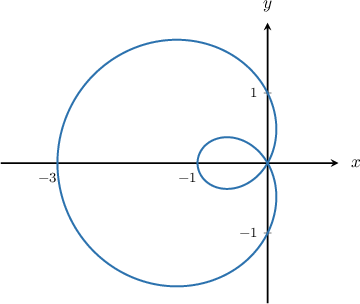
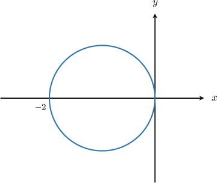

# Further Differentiation of Curves Given in Polar Form

Source: https://www.mathacademy.com/topics/3854?courseId=21
Topic ID: 3854

## Prerequisites

- [The Double-Angle Formula for Sine](../precalculus/271-the-double-angle-formula-for-sine.md)
- [The Double-Angle Formula for Cosine](../precalculus/831-the-double-angle-formula-for-cosine.md)
- [Differentiating Curves Given in Polar Form](./998-differentiating-curves-given-in-polar-form.md)

## Lesson

### Introduction

It's often helpful to use the double-angle formula for sine when computing the slope of the tangent to a polar curve, as this often makes the differentiation easier.

Let's consider the polar curve $r = 1-2\cos\theta,$ whose graph is shown below

Recall that the slope of the tangent (in terms of $\theta$) is given by

$$

\dfrac{\textrm{d}y}{\textrm{d}x} = \dfrac{y'(\theta)}{x'(\theta)}.

$$

First, to convert from polar coordinates to Cartesian coordinates, we use

$$

x = r \cos \theta, \qquad y = r \sin \theta.

$$

Using the fact that $r = 1-2\cos\theta,$ we get

$$

\begin{aligned}𝑥 & =(1−2cos⁡𝜃)cos⁡𝜃 \\ & =cos⁡𝜃−2cos^{2}⁡𝜃, \\ 𝑦 & =(1−2cos⁡𝜃)sin⁡𝜃 \\ & =sin⁡𝜃−2sin⁡𝜃cos⁡𝜃 \\ & =sin⁡𝜃−sin⁡2𝜃.\end{aligned}

$$

Notice that we used the double-angle formula $\color{black}\sin2\theta = 2\sin\theta\cos\theta$ to simplify our expression for $y.$

To compute our derivative, we need to calculate $x'(\theta)$ and $y'(\theta).$

- First, we compute the derivative of $x$ with respect to $\theta\mathbin{:}$

- Then, we compute the derivative of $y$ with respect to $\theta\mathbin{:}$

Finally, the slope of the tangent is given by

$$

\begin{aligned}\frac{d𝑦}{d𝑥} & =\frac{𝑦^{′}(𝜃)}{𝑥^{′}(𝜃)} \\ & =\frac{cos⁡𝜃−2 \,cos⁡2𝜃}{2 \,sin⁡2𝜃−sin⁡𝜃}.\end{aligned}

$$

### Example: Differentiating Polar Curves Using the Double-Angle Formula for Sine

#### Question

Find $\dfrac{\textrm{d}y}{\textrm{d}x}$ for the polar curve $r =-2 \cos\theta,$ shown above.

#### Explanation

To find $\dfrac{\textrm{d}y}{\textrm{d}x},$ we use the formula for differentiating parametric curves:

$$

\dfrac{\textrm{d}y}{\textrm{d}x} = \dfrac{y'(\theta)}{x'(\theta)}

$$

First, we recall that to convert from polar coordinates to Cartesian coordinates, we use

$$

x = r \cos \theta, \qquad y = r \sin \theta.

$$

Using the fact that $r=-2\cos\theta,$ we get

$$

\begin{aligned}𝑥 & =−2cos⁡𝜃cos⁡𝜃=−2cos^{2}⁡𝜃, \\ 𝑦 & =−2cos⁡𝜃sin⁡𝜃=−sin⁡2𝜃,\end{aligned}

$$

where we used the identity $\sin2\theta = 2\sin\theta\cos\theta.$

To compute our derivative, we first need to calculate $x'(\theta)$ and $y'(\theta).$

- First, we compute the derivative of $x$ with respect to $\theta\mathbin{:}$

- Then, we compute the derivative of $y$ with respect to $\theta\mathbin{:}$

Therefore,

$$

\begin{aligned}\frac{d𝑦}{d𝑥} & =\frac{𝑦^{′}(𝜃)}{𝑥^{′}(𝜃)} \\ & =\frac{−2cos⁡2𝜃}{2sin⁡2𝜃} \\ & =−cot⁡2𝜃.\end{aligned}

$$

### Calculating Second Derivatives of Polar Curves

To find the first derivative of a parametric curve, we use the formula

$$

\dfrac{\textrm dy}{\textrm dx} = \dfrac{y'(\theta)}{x'(\theta)}.

$$

A formula for the second derivative of a parametric curve can be found by applying the chain rule:

$$

\begin{aligned}\frac{d^{2}𝑦}{d𝑥^{2}} & =\frac{d}{d𝑥}(\frac{d𝑦}{d𝑥}) \\ & =\frac{d}{d𝜃}(\frac{d𝑦}{d𝑥})⋅\frac{d𝜃}{d𝑥} \\ & =\frac{\frac{d}{d𝜃}(\frac{d𝑦}{d𝑥})}{d𝜃}\end{aligned}

$$

Let's see an example of how to apply this.

### Example: Finding the Second Derivative of a Polar Curve

#### Question

Calculate $\dfrac{\textrm d^2 y}{\textrm d x^2}$ for the polar curve $r=5.$

#### Explanation

We will use the formula

$$

\begin{aligned}\frac{d^{2}𝑦}{d𝑥^{2}}=\frac{\frac{d}{d𝜃}(\frac{d𝑦}{d𝑥})}{d𝜃}.\end{aligned}

$$

First, we need to find $\dfrac{\mathrm{d}y}{\mathrm{d}x}$ and $\dfrac{\mathrm{d}x}{\mathrm{d}\theta}.$

To convert from polar coordinates to Cartesian coordinates, we use

$$

x = r \cos \theta, \qquad y = r \sin \theta

$$

as parametric equations of a curve in terms of $\theta.$

Using the fact that $r=5,$ we get

$$

x =5\cos\theta, \qquad y=5\sin\theta.

$$

Then, to find $\dfrac{\textrm{d}y}{\textrm{d}x}$ we use the rule

$$

\dfrac{\textrm{d}y}{\textrm{d}x} = \dfrac{y'(\theta)}{x'(\theta)}.

$$

Calculating the necessary derivatives, we have

$$

x'(\theta) = -5\sin\theta, \qquad y'(\theta) = 5\cos\theta.

$$

Therefore,

$$

\dfrac{\textrm{d}y}{\textrm{d}x} = \dfrac{ 5\cos\theta }{ -5\sin\theta} =-\cot\theta .

$$

Finally, substituting into our formula for the second derivative, we get

$$

\begin{aligned}\frac{d^{2}𝑦}{d𝑥^{2}} & =\frac{\frac{d}{d𝜃}(−cot⁡𝜃)}{d𝜃} \\ & =−\frac{1}{5}\frac{csc^{2}⁡𝜃}{sin⁡𝜃} \\ & =−\frac{1}{5}csc^{2}⁡𝜃⋅\frac{1}{sin⁡𝜃} \\ & =−\frac{1}{5}csc^{2}⁡𝜃⋅csc⁡𝜃 \\ & =−\frac{1}{5}csc^{3}⁡𝜃.\end{aligned}

$$
