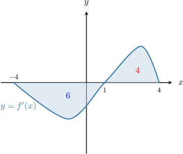
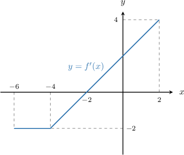
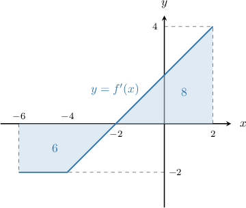
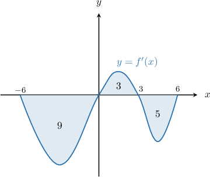
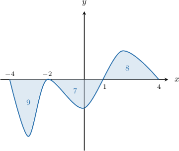
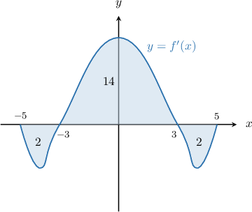

# Further Optimizing Functions Using Graphs of Derivatives

Source: https://www.mathacademy.com/topics/3896?courseId=21
Topic ID: 3896

## Prerequisites

- [Maximizing a Function Using the Graph of Its Derivative](../ap-calculus-ab/1230-maximizing-a-function-using-the-graph-of-its-derivative.md)
- [Minimizing a Function Using the Graph of its Derivative](../ap-calculus-ab/1250-minimizing-a-function-using-the-graph-of-its-derivative.md)

## Lesson

### Introduction

Recall that if a function $f'(x),$ the derivative of $f(x),$ is continuous over $[a,b],$ the fundamental theorem of calculus states that

$$

f(x) = f(a) + \int_{a}^{x} f'(t) \: \textrm{d}t,

$$

where $x \in [a,b].$ This form of the fundamental theorem of calculus is useful if we know $f'(x)$ and the value of $f(a).$

Now, suppose we're given $f(b)$ instead of $f(a).$ To rewrite the fundamental theorem in this case, we replace $a$ with $b$ in the above, and we get

$$

f(x) = f(b) + \int_{b}^{x} f'(t) \: \textrm{d}t.

$$

This form of the fundamental theorem of calculus will be helpful in this lesson, as we'll see.

### Optimizing a Function Using the Graph of its Derivative

Sometimes, when finding the global extrema of a function defined on a closed, bounded interval $[a,b]$ from the graph of its derivative, we need to integrate from right to left instead of left to right when applying the fundamental theorem of calculus. This occurs when we're given the value of $f$ at some value other than the left endpoint.

Consider the function $f(x)$ that's defined and differentiable on $[-4,4].$ The graph of $f'(x),$ the derivative of $f(x),$ is shown below.

The areas of the shaded regions are indicated on the diagram. Additionally, it is known that $f(4) = 8.$ Notice that we're given that value of $f(x)$ at the *right* endpoint.

Let's use the candidates test to find the maximum value of $f(x)$ on $[-4,4].$

According to the candidates test, the maximum value of $f(x)$ on $[-4,4]$ must occur at a critical point or an endpoint of the interval. Therefore, we proceed as follows:

**Step 1**: Find the critical points.

We see that $f'(x)$ is defined everywhere on $x \in (-4,4),$ and $f'(x) = 0$ at $x=1.$ Therefore, the candidates are $x=-4,1,4.$

**Step 2**: Compute the value of $f$ for each candidate using the fundamental theorem of calculus.

Using the given information and the fundamental theorem of calculus, we have the following:

- The value of $f(x)$ at the right endpoint is given:

- To compute $f(1),$ we apply the alternate form of the fundamental theorem of calculus that we saw earlier, as follows:

- Similarly, to compute $f(-4),$ we apply the alternate form of the fundamental theorem of calculus:

**Step 3**: Select the largest value of $f$ from our candidates.

Comparing the values of $f$ found in step $2,$ we have

$$

f_{\text{max}} = \max\{8, 4, 10\} = 10.

$$

Therefore, the maximum value of $f$ is $f_\text{max} = 10,$ and the value of $x$ that maximizes $f(x)$ is $x_\text{max} = -4.$

### Example: Finding a Maximum Value Given a Derivative Graph and a Value at the Right Endpoint

#### Question

The function $f(x)$ is defined and differentiable on $[-6,2].$ The graph of $f'(x),$ the derivative of $f(x),$ is shown above. Find the maximum value of the function $f(x)$ on the interval $[-6,2]$ given that $f(2) = 4.$

#### Explanation

According to the candidates test, the maximum value of $f(x)$ on $[-6,2]$ must occur at a critical point or an endpoint of the interval.

****: Find the critical points.

We see that $f'(x)$ is defined everywhere on $x\in (-6,2),$ and $f'(x)=0$ at $x=-2$ Therefore, the candidates are $x=-6,-2,2.$

****: Compute the value of $f$ for each candidate using the fundamental theorem of calculus.

The function is made up of $1$ trapezoid and $1$ triangle. Let's add the areas bounded by these shapes to our diagram:

Using the given information and the fundamental theorem of calculus, we have the following:

$$

\begin{aligned}𝑓(2) & =4 \\ 𝑓(−2) & =𝑓(2)+∫_{−22}^{}𝑓^{′}(𝑥)\,d𝑥 \\ & =𝑓(2)−∫_{2−2}^{}𝑓^{′}(𝑥)\,d𝑥 \\ & =4−8 \\ & =−4 \\ 𝑓(−6) & =𝑓(2)+∫_{−62}^{}𝑓^{′}(𝑥)\,d𝑥 \\ & =𝑓(2)−∫_{2−6}^{}𝑓^{′}(𝑥)\,d𝑥 \\ & =4−(−6+8) \\ & =4−2 \\ & =2\end{aligned}

$$

****: Select the largest value of $f$ from our candidates.

Comparing the values of $f$ found in step $2,$ we have

$$

f_{\text{max}} = \max\{4,-4,2\} = 4.

$$

Therefore, the maximum value of $f$ is $f_{\text{max}}=4,$ and the value of $x$ that maximizes $f(x)$ is $x_\text{max}=2.$

### Example: Finding a Minimum Value Given a Derivative Graph and a Value at the Right Endpoint

#### Question

The function $f(x)$ is defined and differentiable on $[-6,6].$ The graph of $f'(x)$, the derivative of $f(x),$ is shown below, where the areas of the regions between the graph and the $x$-axis are $9, 3$ and $5,$ respectively (from left to right). Find the minimum value of $f(x)$ on the interval $[-6,6]$ given that $f(6) = 2.$

#### Explanation

According to the candidates test, the minimum value of $f(x)$ on $[-6,6]$ must occur at a critical point or an endpoint of the interval.

****: Find the critical points.

We see that $f'(x)$ is defined everywhere on $x \in (-6,6),$ and $f'(x) = 0$ at $x=0$ and $x=3.$ Therefore, the candidates are $x=-6,0,3,6.$

****: Compute the value of $f$ for each candidate using the fundamental theorem of calculus.

Using the given information and the fundamental theorem of calculus, we have the following:

$$

\begin{aligned}𝑓(6) & =2 \\ 𝑓(3) & =𝑓(6)+∫_{36}^{}𝑓^{′}(𝑥)\,d𝑥 \\ & =𝑓(6)−∫_{63}^{}𝑓^{′}(𝑥)\,d𝑥 \\ & =2−(−5) \\ & =7 \\ 𝑓(0) & =𝑓(6)+∫_{06}^{}𝑓^{′}(𝑥)\,d𝑥 \\ & =𝑓(6)−∫_{60}^{}𝑓^{′}(𝑥)\,d𝑥 \\ & =2−(3−5) \\ & =4 \\ 𝑓(−6) & =𝑓(6)+∫_{−66}^{}𝑓^{′}(𝑥)\,d𝑥 \\ & =𝑓(6)−∫_{6−6}^{}𝑓^{′}(𝑥)\,d𝑥 \\ & =2−(−9+3−5) \\ & =13\end{aligned}

$$

****: Select the smallest value of $f$ from our candidates.

Comparing the values of $f$ found in step $2,$ we have

$$

f_{\text{min}} = \min\{2, 7, 4, 13\} = 2.

$$

Therefore, the minimum value of $f$ is $f_\text{min} = 2,$ and the value of $x$ that minimizes $f(x)$ is $x_\text{min} = 6.$

### Example: Finding a Maximum Value Given a Derivative Graph and a Value at an Interior Point

#### Question

The function $f(x)$ is defined and differentiable on $[-4,4].$ The graph of $f'(x),$ the derivative of $f(x),$ is shown above, where the areas of the regions between the graph and the $x$-axis are $9,$ $7$ and $8,$ respectively (from left to right). Find the maximum value of $f(x)$ on the interval $[-4,4]$ given that $f(1) = 10.$

#### Explanation

According to the candidates test, the maximum value of $f(x)$ on $[-4,4]$ must occur at a critical point or an endpoint of the interval.

****: Find the critical points.

We see that $f'(x)$ is defined everywhere on $x \in (-4,4),$ and $f'(x) = 0$ at $x=-2$ and $x=1.$ Therefore, the candidates are $x=-4,-2,1,4.$

****: Compute the value of $f$ for each candidate using the fundamental theorem of calculus.

Using the given information and the fundamental theorem of calculus, we have the following:

$$

\begin{aligned}𝑓(1) & =10 \\ 𝑓(−2) & =𝑓(1)+∫_{−21}^{}𝑓^{′}(𝑡)\,d𝑡 \\ & =𝑓(1)−∫_{1−2}^{}𝑓^{′}(𝑡)\,d𝑡 \\ & =10−(−7) \\ & =10+7 \\ & =17 \\ 𝑓(−4) & =𝑓(1)+∫_{−41}^{}𝑓^{′}(𝑡)\,d𝑡 \\ & =𝑓(1)−∫_{1−4}^{}𝑓^{′}(𝑡)\,d𝑡 \\ & =10−(−9−7) \\ & =10−(−16) \\ & =10+16 \\ & =26 \\ 𝑓(4) & =𝑓(1)+∫_{41}^{}𝑓^{′}(𝑡)\,d𝑡 \\ & =10+8 \\ & =18.\end{aligned}

$$

****: Select the largest value of $f$ from our candidates.

Comparing the values of $f$ found in step $2,$ we have

$$

f_{\text{max}} = \max\{10,17,26,18\} = 26.

$$

Therefore, the maximum value of $f$ is $f_\text{max} = 26,$ and the value of $x$ that maximizes $f(x)$ is $x_\text{max} = -4.$

### Example: Finding a Minimum Value Given a Derivative Graph and a Value at an Interior Point

#### Question

The function $f(x)$ is defined and differentiable on $[-5,5].$ The graph of $f'(x),$ the derivative of $f(x),$ is shown below, where the areas of the regions between the graph and the $x$-axis are $2,$ $14$ and $2,$ respectively (from left to right). Find the minimum value of $f(x)$ on the interval $[-5,5]$ given that $f(3) = -2.$

#### Explanation

According to the candidates test, the minimum value of $f(x)$ on $[-5,5]$ must occur at a critical point or an endpoint of the interval.

****: Find the critical points.

We see that $f'(x)$ is defined everywhere on $x \in (-5,5),$ and $f'(x) = 0$ at $x=-3$ and $x=3.$ Therefore, the candidates are $x=-5,-3,3,5.$

****: Compute the value of $f$ for each candidate using the fundamental theorem of calculus.

Using the given information and the fundamental theorem of calculus, we have the following:

$$

\begin{aligned}𝑓(3) & =−2 \\ 𝑓(5) & =𝑓(3)+∫_{53}^{}𝑓^{′}(𝑥)\,d𝑥 \\ & =−2+(−2) \\ & =−4 \\ 𝑓(−3) & =𝑓(3)+∫_{−33}^{}𝑓^{′}(𝑥)\,d𝑥 \\ & =𝑓(3)−∫_{3−3}^{}𝑓^{′}(𝑥)\,d𝑥 \\ & =−2−14 \\ & =−16 \\ 𝑓(−5) & =𝑓(3)+∫_{−53}^{}𝑓^{′}(𝑥)\,d𝑥 \\ & =𝑓(3)−∫_{3−5}^{}𝑓^{′}(𝑥)\,d𝑥 \\ & =−2−(−2+14) \\ & =−14\end{aligned}

$$

****: Select the smallest value of $f$ from our candidates.

Comparing the values of $f$ found in step $2,$ we have

$$

f_{\text{min}} = \min\{-2, -4, -16, -14\} = -16.

$$

Therefore, the minimum value of $f$ is $f_\text{min} = -16,$ and the value of $x$ that minimizes $f(x)$ is $x_\text{min} = -3.$
