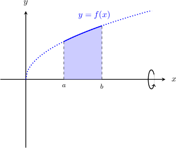
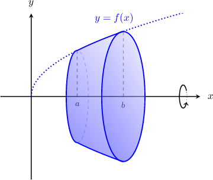

# Approximating Areas Under Graphs of Composite Functions

Source: https://www.mathacademy.com/topics/3950?courseId=21
Topic ID: 3950

## Prerequisites

- [Approximating Areas With the Left Riemann Sum](../ap-calculus-ab/477-approximating-areas-with-the-left-riemann-sum.md)
- [The Area Bounded by a Curve and the X-Axis](../ap-calculus-ab/1040-the-area-bounded-by-a-curve-and-the-x-axis.md)
- [Approximating Areas With the Right Riemann Sum](../ap-calculus-ab/1281-approximating-areas-with-the-right-riemann-sum.md)
- [Determining Intervals on Which a Function Is Increasing or Decreasing](../ap-calculus-ab/1359-determining-intervals-on-which-a-function-is-increasing-or-decreasing.md)

## Lesson

### Introduction

In this lesson, we'll learn how to use Riemann sums to approximate definite integrals of *composite* functions. As we'll see, this has some interesting applications.

For example, suppose $f(x)$ is a positive, continuous function. Some values for $f(x)$ over the interval $x\in [1,5]$ are given by the following table:

Let's use this data to approximate the following integral:

$$

\int_{1}^{5} x^2 \cdot f(x) \,\textrm{d}x

$$

To approximate this definite integral, we first define a new function $g(x)$ as

$$

g(x) = x^2\cdot f(x).

$$

Now, our task is to approximate

$$

\int_{1}^{5} g(x) \,\textrm{d}x.

$$

Let's approximate this integral using a left Riemann sum with $4$ equal subintervals.

The (regular) step size $\Delta x$ is given by

$$

\Delta x = \dfrac{5-1}{4} = 1.

$$

We can approximate this integral using a left Riemann sum with $4$ equal subintervals and step size $\Delta x$ as follows:

$$

\int_{1}^{5} g(x) \,\textrm{d}x \approx (g(1) + g(2) + g(3) + g(4)) \cdot \Delta x

$$

Let's add a row to our table with values of $g(x)$ at each point:

Finally, we obtain the following approximation for our definite integral:

$$

\begin{aligned}A & =∫_{51}^{}𝑔(𝑥)\,d𝑥 \\ & ≈(3+8+9+16)⋅1 \\ & =36⋅1 \\ & =36\end{aligned}

$$

Let's now look at an example involving a right Riemann sum.

### Example: Computing a Riemann Sum of a Composite Function

#### Question

The table below gives the values of a positive, continuous function $f(x)$ over the closed interval $[-2,2].$ Estimate the area under the curve $y = (x+3) \cdot f(x)$ over the interval $[-2,2]$ using a ** Riemann sum with $4$ equal subintervals.

#### Explanation

The area under the curve $y = (x+3) \cdot f(x)$ over the interval $[-2,2]$ is given by the integral

$$

\mathcal{A} = \int_{-2}^{2} (x+3) \cdot f(x) \,\textrm{d}x.

$$

Let $g(x) = (x+3) \cdot f(x).$ Since $f(x) > 0,$ we have that $g(x) > 0$ for all $x\in [-2,2].$ Therefore, the area under the curve $y=g(x)$ can be approximated using a Riemann sum.

The (regular) step size $\Delta x$ is given by

$$

\Delta x = \dfrac{2 - (-2)}{4} = 1.

$$

We can approximate the integral above using a ** Riemann sum with $4$ equal subintervals and step size $\Delta x$ as follows:

$$

\int_{-2}^{2} g(x) \,\textrm{d}x \approx (g(-1) + g(0) + g(1) + g(2)) \cdot \Delta x

$$

We set up a table with values of $g(x)$ at each point:

Finally, we obtain the following approximation for our area:

$$

\begin{aligned}A & =∫_{2−2}^{}(𝑥+3)⋅𝑓(𝑥)\,d𝑥 \\ & ≈(8+9+4+10)⋅1 \\ & =31⋅1 \\ & =31\end{aligned}

$$

### Volumes of Revolution

Consider the finite region bounded by the curve $y=f(x),$ the $x$-axis, and the vertical lines $x=a$ and $x=b,$ as shown in the picture below.

When we rotate this region $360^\circ$ about the $x$-axis (called the **axis of revolution**), we get a **solid of revolution,** as shown below.

It can be shown that the volume $V$ of this solid of revolution is given by the formula

$$

V = \pi \int_{a}^{b} y^2 \:\textrm{d}x = \pi \int_{a}^{b} \left[ f(x) \right]^2 \:\textrm{d}x.

$$

### Example: Approximating Volumes of Revolution

#### Question

The table below gives the values of a positive, continuous function $f(x)$ over the closed interval $[1,9].$ Using a left Riemann sum with $4$ equal subintervals, estimate the volume of the solid generated when the region bounded by the curve $y=f(x),$ the $x$-axis, and the vertical lines $x=1$ and $x=9$ is rotated $2\pi$ radians about the $x$-axis.

**

$$

V = \pi \int_a^b [f(x)]^2 \,\textrm{d}x.

$$

#### Explanation

Using the hint, the volume of the solid generated when the region bounded by a curve $y=f(x),$ the $x$-axis, and the vertical lines $x=1$ and $x=9$ is rotated $2\pi$ radians about the $x$-axis is given by

$$

V = \pi \int_1^{9} [f(x)]^2 \,\textrm{d}x.

$$

Let $g(x) = \left(f(x)\right)^2.$ The (regular) step size $\Delta x$ is given by

$$

\Delta x = \dfrac{9-1}{4} = 2.

$$

We can approximate the integral above using a ** Riemann sum with $4$ equal subintervals and step size $\Delta x$ as follows:

$$

\pi \int_1^{9} g(x) \,\textrm{d}x \approx \pi\cdot (g(1) + g(3) + g(5) + g(7)) \cdot \Delta x

$$

We set up a table with values of $g(x)$ at each point:

Finally, we obtain the following approximation for our volume:

$$

\begin{aligned}𝑉 & =𝜋∫_{91}^{}𝑔(𝑥)\,d𝑥 \\ & ≈𝜋⋅(𝑔(1)+𝑔(3)+𝑔(5)+𝑔(7))⋅Δ𝑥 \\ & =𝜋⋅(1+9+1+0)⋅2 \\ & =𝜋⋅11⋅2 \\ & =22𝜋\end{aligned}

$$

### Arc Length

Consider the curve $y=f(x)$ between two points where $x=a$ and $x=b.$

The length of the curve between these two points is known as the **arc length** of the curve.

It can be shown that the arc length is given by the formula

$$

L = \int_a^b \sqrt{1+\left[f'(x)\right]^2}\,\mathrm{d} x,

$$

where $f'(x)$ is the derivative of $f(x).$

We can use Riemann sums to approximate arc lengths. Let's see an example.

### Example: Approximating Arc Length

#### Question

The table below gives the values of a positive, continuous function $f(x)$ and its derivative $f'(x)$ over the closed interval $[1,4].$ Using a right Riemann sum with $3$ equal subintervals, estimate the arc length of the curve $y=f(x)$ between $x=1$ and $x=4.$

**

$$

L = \int_a^b \sqrt{1+[f'(x)]^2} \,\textrm{d}x.

$$

#### Explanation

Using the hint, we have that the arc length of a curve $y=f(x)$ between $x=1$ and $x=4$ is given by

$$

L = \int_1^4 \sqrt{1+[f'(x)]^2} \,\textrm{d}x.

$$

Let $g(x) = \sqrt{1+[f'(x)]^2}.$ The (regular) step size $\Delta x$ is given by

$$

\Delta x = \dfrac{4-1}{3} = 1.

$$

We can approximate the integral above using a ** Riemann sum with $3$ equal subintervals and step size $\Delta x$ as follows:

$$

\int_1^4 g(x) \,\textrm{d}x \approx (g(2) + g(3) + g(4) ) \cdot \Delta x

$$

Now, we set up a table with values of $g(x)$ at each point:

Finally, we obtain the following approximation for our arc length:

$$

\begin{aligned}𝐿 & =∫_{41}^{}𝑔(𝑥)\,d𝑥 \\ & ≈(𝑔(2)+𝑔(3)+𝑔(4))⋅Δ𝑥 \\ & =(10+1+2)⋅1 \\ & =13⋅1 \\ & =13\end{aligned}

$$

### Determining Overestimates and Underestimates

We've seen how to use Riemann sums to approximate areas under curves of composite functions. Our final task is determining whether these approximations overestimate or underestimate the true areas.

We start by considering *right* Riemann sums. Recall the following facts:

- If a function is strictly *increasing*, the right Riemann sum *overestimates* the area under the curve $y = g(x).$

- If a function is strictly *decreasing*, the right Riemann sum *underestimates* the area under the curve $y = g(x).$

Let $f(x)$ be positive and strictly increasing for $x \in [1,2],$ and differentiable for $x \in (1,2).$ Now, consider the function

$$

g(x) = x^2 \cdot f(x).

$$

Suppose we use a right Riemann sum to approximate the area under the curve $y = g(x)$ over $x\in [1,2]$. Does the right Riemann sum overestimate or underestimate the true area?

We note the following:

- Since $f(x)$ is strictly increasing, we have $f'(x) \gt 0.$

- Differentiating our expression for $g(x)$ using the product rule, we get We now examine the sign of each factor in this expression to determine the sign of $g'(x).$ Since $f(x)$ is positive and strictly increasing over the interval $(1,2),$ we have Hence, we obtain

Therefore, since $g'(x) \gt 0,$ the function $g(x)$ is strictly increasing. Therefore, the right Riemann sum *overestimates* the area under the curve $y = g(x).$

Let's now look at an example involving a left Riemann sum.

### Example: Determining Whether a Riemann Sum Gives an Overestimate or an Underestimate

#### Question

Let $f(x)$ be negative and strictly increasing for $x \in [-2,-1],$ and differentiable for $x \in (-2,-1).$ Suppose we approximate the area under the curve $y =g(x)= x \cdot f(x)$ over the interval $[-2,-1]$ using a left Riemann sum. Given that $g(x)> 0,$ which of the following statements must be true?

1. $f'(x) \gt 0$

2. $g'(x) \gt 0$

3. The left Riemann sum underestimates the true area.

#### Explanation

We're given that $g(x) = x\cdot f(x) > 0.$ Now, recall the following:

- If $g(x)$ is strictly increasing, the left Riemann sum gives an ** of the area under the curve $y = g(x).$

- If $g(x)$ is strictly decreasing, the left Riemann sum gives an ** of the area under the curve $y = g(x).$

Let's now consider each statement in turn:

- Statement I is true. Since $f(x)$ is strictly increasing, we have $f'(x) \gt 0.$

- Statement II is false. Differentiating $g(x) = x \cdot f(x),$ we get Now, since $f(x)$ is negative and strictly increasing over the interval $(-2,-1),$ we have Hence, we obtain

- Statement III is false. Since $g'(x) \lt 0,$ the function $g(x)$ is strictly decreasing. Therefore, the left Riemann sum gives an ** of the area under the curve $y = x \cdot f(x).$

Therefore, the correct answer is "I only."
