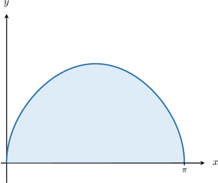
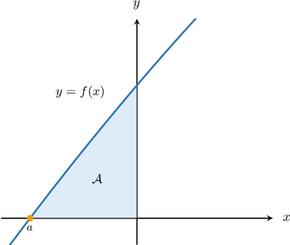
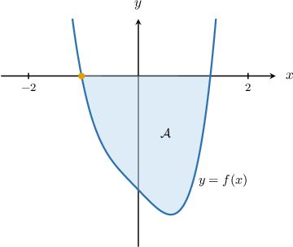

# Finding Definite Integrals Using a Graphing Calculator

Source: https://www.mathacademy.com/topics/4080?courseId=21
Topic ID: 4080

## Prerequisites

- [The Area Bounded by a Curve and the X-Axis](../ap-calculus-ab/1040-the-area-bounded-by-a-curve-and-the-x-axis.md)
- [Finding Roots of Functions Using a Graphing Calculator](../ap-calculus-ab/3116-finding-roots-of-functions-using-a-graphing-calculator.md)

## Lesson

### Introduction

In this lesson, we'll learn how to use a scientific or graphing calculator to approximate definite integrals of functions.

This lesson is designed to help prepare you for the parts of the AP Calculus exam where graphing calculators are needed.

**If you want to succeed on the AP Calculus exam, then you must acquire a physical graphing calculator and use it when completing this lesson.**

Do *not* use any other type of online tool, as you will not be allowed to use it during the exam. You need to practice with the specific calculator that you will use on the AP exam so that you can solve problems quickly without wasting any time troubleshooting your calculator.

A comprehensive list of calculators that are permitted in the AP Calculus exams can be found [here.](https://apcentral.collegeboard.org/exam-administration-ordering-scores/administering-exams/on-exam-day/calculator-policy#list)

Throughout this lesson, we will list buttons that feature on a TI-84 Plus CE-T graphing calculator. We'll also mention some common alternative buttons on other calculator models.

Similar models will have the same or similar buttons, and even dissimilar models may have similar buttons.

If you have a different calculator model and cannot find the right buttons to press, the best way to resolve this is to either to

$\qquad$ (a) consult your calculator's manual, or

$\qquad$ (b) search online for a video that explains how to operate your calculator.

The best way to get familiar with your calculator is to consult its manual. Manuals can usually be found online. For example, a link to the manual for a TI-84 Plus CE-T can be found by entering the following query into a search engine.

$\qquad$ online manual TI-84 Plus CE-T

If you have a different model calculator, replace "TI-84 Plus CE-T" in the query above with your calculator's model.

Answers to common questions can be found by searching for online videos explaining how the calculator works. For example, to find a video that shows how to calculate an integral on a TI-84, you might type the following query into a search engine.

$\qquad$ video compute integral on a TI-84 calculator

Again, replace "TI-84" in the query above with your calculator's model. Also, bear in mind that videos for similar models might also help.

**Watch Out!** Some scientific calculators are *not* capable of approximating integrals! Check your calculator's manual to be sure.

### Calculating an Integral

Consider the function $f(x),$ defined as

$$

f(x)=\sqrt{\sin x}.

$$

A sketch of this function is shown below.

The finite area $\mathcal A$ bounded by $f(x)$ and the $x$-axis over the interval $x\in [0,\pi]$ is given by

$$

\mathcal{A} = \int_{0}^{\pi} \sqrt{\sin x} \: \textrm{d}x.

$$

Let's use our graphing calculator to approximate this area. Since the function we want to integrate contains trigonometric functions, your calculator *must* be in radians mode!

We bring up the definite integral option on most calculators in one of the following ways:

1. Using the $\boxed{\displaystyle\color{gray}\,\int_{\boxed{\,\phantom{0}}}^{\boxed{\,\phantom{0}}} \boxed{\,\phantom{\big|0\big|}}\,}$ button. You may need to press $\boxed{\color{gray}\,2\text{nd}\,}$ (or $\boxed{\color{gray}\,\text{shift}\,}$) first.

2. Using the $\boxed{\color{gray}\,\text{math}\,}$ (or $\boxed{\color{gray}\,\text{calc}\,}$) button and selecting the "integration" option. Note that this might be called $\boxed{\color{gray}\,\text{fnInt}\,}$ or similar.

The next steps depend on whether your calculator uses derivative or function notation. We'll discuss both. You're encouraged to read both instructions as there are several parallels.

#### Integral Notation

If your calculator uses derivative notation, you should see a prompt that looks similar to the following:

$$

\int_{\boxed{\,\phantom{0}}}^{\boxed{\,\phantom{0}}} \boxed{\,\phantom{\big|0\big|}} \,\textrm{d}\,{\boxed{\,\phantom{0}}}

$$

In this case, we fill in the empty boxes as follows:

- Enter $0$ for the lower integration limit. Then, press $\boxed{\color{gray}\,\blacktriangleright\,}$ to move the cursor to the upper integration limit, and enter the value $\pi.$ The prompt should now look as follows:

- Navigate the cursor to the next empty box by pressing $\boxed{\color{gray}\,\blacktriangleright\,}.$ Enter the function definition by pressing the following keys: The prompt should now look as follows:

- Navigate the cursor to the next empty box by pressing $\boxed{\color{gray}\,\blacktriangleright\,}.$ Press $\boxed{\color{gray}X,T,\theta,n}$ to enter the variable that we're integrating with respect to. The prompt should now look as follows:

- Finally, press $\boxed{\color{gray}\,\textrm{enter}\,},$ and the calculator will return the numerical value of the integral.

Following the above steps, we obtain

$$

\int_{0}^{\pi} \sqrt{\sin x} \: \textrm{d}x\approx 2.396

$$

rounded to three decimal places.

#### Function Notation

If your calculator uses function notation, then instead of being presented with

$$

\int_{\boxed{\,\phantom{0}}}^{\boxed{\,\phantom{0}}} \boxed{\,\phantom{\big|0\big|}} \,\textrm{d}\,{\boxed{\,\phantom{0}}}

$$

you'll instead see a prompt that looks similar to the following:

$$

\text{integral}\Big( \boxed{\color{white}\phantom{\Big|}\text{expression}\phantom{\Big|}}, \boxed{\color{white}\phantom{\Big|}\text{variable}\phantom{\Big|}}, \boxed{\color{white}\phantom{\Big|}\text{lowerBound}\phantom{\Big|}}, \boxed{\color{white}\phantom{\Big|}\text{upperBound}\phantom{\Big|}}\Big)

$$

In this case, we place the function definition in the first box, the variable in the second box, and the lower and upper limits in the third and fourth boxes, respectively.

By entering this information, the prompt will look as follows:

$$

\text{integral}\Big( \,\sqrt{\sin x}\,, \,x\,, \,0\,, \,\pi\, \Big)

$$

Once you're done, press $\boxed{\color{gray}\,\textrm{enter}\,}.$

Following the above steps, we obtain

$$

\int_{0}^{\pi} \sqrt{\sin x} \: \textrm{d}x\approx 2.396

$$

rounded to three decimal places.

**Watch Out!**

- It's important to remember that the graphing calculator finds a numerical *approximation* of the definite integral.

- Moreover, different calculators use different algorithms to arrive at their approximations.

- For that reason, different calculators may give slightly different answers when approximating the definite integral of a function.

- Despite this, the answers returned by different calculators will agree when the answer is rounded to two or three decimal places in most cases.

### Example: Approximating the Definite Integral of a Function

#### Question

Use a calculator to compute $\displaystyle\int_{0}^{1} e^{-x^2} \, \textrm{d}x.$ Round your answer to $2$ decimal places.

#### Explanation

We bring up the definite integral option on most calculators in one of the following ways:

- Press the $\boxed{\color{gray}\,2\text{nd}\,}$ (or $\boxed{\color{gray}\,\text{shift}\,}$) button, then the $\boxed{\displaystyle\color{gray}\,\int_{\boxed{\,\phantom{0}}}^{\boxed{\,\phantom{0}}} \boxed{\,\phantom{\big|0\big|}}\,}$ button.

- Press the $\boxed{\color{gray}\,\text{math}\,}$ (or $\boxed{\color{gray}\,\text{calc}\,}$) button and choose the integral option. Note that this might be called $\boxed{\color{gray}\,\text{fnInt}\,}$ or similar.

Evaluating our integral using a calculator, we obtain

$$

\int_{0}^{1} e^{-x^2} \, \textrm{d}x \approx 0.75

$$

rounded to $2$ decimal places.

### Finding Limits of Integration Numerically

Consider the function $f(x),$ defined as

$$

f(x)=2x + \sqrt{\cos x}.

$$

A sketch of this function is shown below.

The finite area $\mathcal A$ bounded by $f(x)$ and the $x$-axes over the interval $x\in [a,0]$ is given by

$$

\mathcal{A} = \int_{a}^{0} 2x + \sqrt{\cos x} \: \textrm{d}x

$$

where $a$ is the root of $f(x)$ that's shown in the diagram.

To compute this integral numerically, we must first find an approximation for $a.$ We can do this using our graphing calculator's root-finding functionality.

Following the usual procedure for approximating roots, we find that the lower limit (rounded to three decimal places) is

$$

a \approx -0.472.

$$

So, the area $\mathcal A$ is approximately equal to

$$

\int_{-0.472}^{0} 2x + \sqrt{\cos x} \: \textrm{d}x.

$$

Finally, evaluating this integral using our graphing calculator in the usual way, we get

$$

\int_{-0.472}^{0} 2x+\sqrt{\cos x} \, \textrm{d}x \approx 0.240

$$

rounded to $3$ decimal places.

### Example: Finding Limits of Integration and Computing an Integral

#### Question

The integral

$$

\mathcal{A} = \int_{a}^{1.312} f(x) \, \textrm{d}x

$$

represents the (signed) area of the finite region bounded by the curve $f(x) = x^4 - 2 -\sin{x}$ and the $x$-axis. Find the lower limit $a$ to $3$ decimal places, and use your answer to estimate the area $\mathcal{A}.$

#### Explanation

First, let's plot our region using a graphing calculator.

To get a better view, we might need to either

- zoom in or out, or

- adjust the window ranges.

We can adjust the window settings using the $\boxed{\color{gray}\,\text{window}\,}$ button (or equivalent).

In our case, the appropriate window ranges could be the following:

- for the horizontal axis, $x \in [-2.5,2.5]$

- for the vertical axis, $y \in [-3,1]$

This gives us the following graph:

According to the graph, the lower limit corresponds to the root of the function $f(x)$ that lies in the interval $x \in [-2,0].$

Using a graphing calculator, we find that this root, rounded to $3$ decimal places, is

$\qquad$ $a \approx -1.034.$

Finally, we can evaluate the integral with the lower limit $a=-1.034{:}$

$$

\mathcal{A} = \int_{-1.034}^{1.312} f(x) \, \textrm{d}x

$$

We bring up the integral option on most calculators in one of the following ways:

- Press the $\boxed{\color{gray}\,2\text{nd}\,}$ (or $\boxed{\color{gray}\,\text{shift}\,}$) button, then the $\boxed{\displaystyle\color{gray}\,\int_{\boxed{\,\phantom{0}}}^{\boxed{\,\phantom{0}}} \boxed{\,\phantom{\big|0\big|}}\,}$ button.

- Press the $\boxed{\color{gray}\,\text{math}\,}$ (or $\boxed{\color{gray}\,\text{calc}\,}$) button and choose the integral option. Note that this might be called $\boxed{\color{gray}\,\text{fnInt}\,}$ or similar.

Evaluating our integral using a calculator, we obtain

$$

\mathcal{A} = \int_{-1.034}^{1.312} f(x) \, \textrm{d}x \approx -3.934,

$$

rounded to $3$ decimal places.
