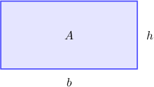
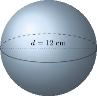

# Rates of Change in Applied Contexts

Source: https://www.mathacademy.com/topics/620?courseId=21
Topic ID: 620

## Prerequisites

- [Interpreting the Meaning of the Derivative in Context](../ap-calculus-ab/296-interpreting-the-meaning-of-the-derivative-in-context.md)
- [Selecting Procedures for Calculating Derivatives](../ap-calculus-ab/1115-selecting-procedures-for-calculating-derivatives.md)
- [Areas of Circles](../geometry/1745-areas-of-circles.md)
- [Surface Areas of Spheres](../geometry/1765-surface-areas-of-spheres.md)

## Lesson

### Introduction

If we know the relationship between two quantities, we can use differentiation to find the rate at which one quantity varies with respect to the second quantity. This gives us additional information about a system that might be of interest.

For example, suppose that the price $p,$ in cents, of a particular stock can be modeled by the function $p(t) = 100e^{2t},$ where $t$ is the time, in months, since the stock was first listed on the stock market.

We can find the instantaneous rate of change in the stock price at time $t$ by computing $p'(t).$

First, we calculate the derivative, which gives

$$

\begin{aligned}𝑝^{′}(𝑡) & =\frac{d}{d𝑡}(100𝑒^{2𝑡}) \\ & =100\frac{d}{d𝑡}(𝑒^{2𝑡}) \\ & =100⋅2𝑒^{2𝑡} \\ & =200𝑒^{2𝑡}\end{aligned}

$$

Now for the units. Since $p'(t)$ measures a change in the price $p$ over a change in time $t,$ the units of the derivative are "cents per month."

Therefore, the rate of change in the stock price after $t$ months is $200e^{2t}$ cents per month.

### Example: Determining a Rate of Change for a Given Function

#### Question

A particle moves in a straight line. After $t$ seconds the particle is $\, f(t)=2t^3 - 5t + 9\,$ feet away from its initial position. What is the instantaneous rate of change of the particle's position as a function of $t?$

#### Explanation

The instantaneous rate of change of the particle's position is equal to $f'(t).$

We take the derivative and get

$$

\begin{aligned}𝑓^{′}(𝑡) & =\frac{d}{d𝑡}(2𝑡^{3}−5𝑡+9) \\ & =6𝑡^{2}−5\end{aligned}

$$

Therefore, after $t$ seconds, the instantaneous rate of change of the particle's position is $6t^2 - 5$ feet per second.

### Example: Determining a Rate of Change for a Given Function at a Point

#### Question

Lizzie buys $b$ pounds of bananas at a price $p,$ in dollars, that can be modeled by the function $p(b)=5e^{-0.2b}.$ What is the instantaneous rate of change of the price when $b=5$ pounds?

#### Explanation

The instantaneous rate of change of the price when $b=5$ pounds is equal to $p'(5).$

First, we take the derivative and get

$$

\begin{aligned}𝑝^{′}(𝑏) & =\frac{d}{d𝑏}(5𝑒^{−0.2𝑏}) \\ & =5𝑒^{−0.2𝑏}⋅(−0.2) \\ & =−𝑒^{−0.2𝑏}.\end{aligned}

$$

Now, substituting $b=5,$ we get

$$

\begin{aligned}𝑝^{′}(5) & =−𝑒^{−0.2(5)} \\ & =−𝑒^{−1} \\ & =−\frac{1}{𝑒}.\end{aligned}

$$

Therefore, the instantaneous rate change of the price when $b=5$ pounds is $-\dfrac{1}{e}$ dollars per pound.

### Rates of Change in a Geometrical Setting

In more advanced math, we often study shapes that are changing. In these situations, we might be interested to know how one quantity varies with another as a particular shape changes.

For example, suppose that the area of a rectangle is increasing and that the base's length is twice that of the height. Can we find the instantaneous rate of change of the area of the rectangle with respect to its height?

The area $A$ of a rectangle is given by

$$

A= b h,

$$

where $b$ is the base, and $h$ is the height of the rectangle.

The instantaneous rate of change of the area of the rectangle with respect to its height is given by $A'(h).$ As it stands, we cannot find $A'(h),$ because $A$ is expressed as a function of two variables, $b$, and $h.$

However, we are given that $b=2h,$ so we can express the area $A$ as a function of the height $h$ only by substituting $b=2h$ in the formula above. We get

$$

A= (2h)h= 2h^2.

$$

Now that we have the area $A$ expressed as a function of $h$ only, we can differentiate. Therefore, the rate of change of $A(h)$ with respect to $h$ is

$$

\begin{aligned} A'(h) &= \dfrac{\textrm d }{\textrm d h}\left( 2 h^2\right)\\\[5pt] &= 2\dfrac{\textrm d }{\textrm d h}\left(h^2\right)\\\[5pt] & = 2(2 h)\\\[5pt] &= 4 h.\end{aligned}

$$

### Example: Further Determining Rates of Change in Geometrical Settings

#### Question

A spherical balloon is being inflated so that its volume is increasing. Find the instantaneous rate at which the volume of the balloon is changing with respect to the radius at the moment when the diameter of the balloon is equal to $12\, \text{cm}.$

#### Explanation

Since we are given that the diameter of the balloon is $12\, \text{cm},$ its radius is $r =6\, \text{cm}.$ Now, we know that the volume of a sphere with radius $r$ is given by

$$

V= V(r) = \dfrac{4}{3}\pi r^3.

$$

Taking the derivative, the rate of change of $V(r)$ with respect to $r$ is

$$

\begin{aligned} V'(r) &= \dfrac{\textrm d }{\textrm d r}\left( \dfrac{4}{3}\pi r^3\right)\\\[5pt] & = \dfrac{4}{3}\pi (3r^2)\\\[5pt] &= 4\pi r^2, \end{aligned}

$$

and evaluating at $r=6$ gives

$$

V'(6)= 4\pi (6)^2= 144\pi.

$$

Therefore, the instantaneous rate at which the volume of the balloon is changing when its diameter is $12\, \text{cm}\,$ is $\, 144\pi \, \text{cm}^3/\text{cm}.$

**** We read $\text{cm}^3/\text{cm}$ as "centimeters cubed per centimeter".
