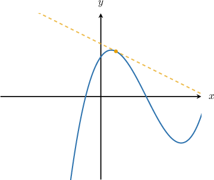
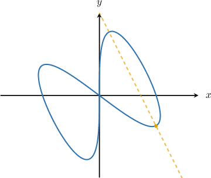

# Calculating Tangent and Normal Lines with Parametric Equations

Source: https://www.mathacademy.com/topics/799?courseId=21
Topic ID: 799

## Prerequisites

- [Differentiating Parametric Curves](./798-differentiating-parametric-curves.md)
- [Calculating the Equation of a Normal Line Using Differentiation](../ap-calculus-ab/987-calculating-the-equation-of-a-normal-line-using-differentiation.md)

## Lesson

### Introduction

Remember that to find the slope $m$ of a tangent line to a function $y=f(x),$ we compute the derivative:

$$

m = \dfrac{\textrm dy}{\textrm dx} = f'(x)

$$

Likewise, to find the slope $m_n$ of a normal line to a function $y=f(x),$ we take the negative reciprocal of the tangent slope:

$$

m_n = -\dfrac{1}{m} = -\dfrac{1}{f'(x)}

$$

With parametric equations $x=x(t), \, y=y(t),$ it works the same way. The slope of the tangent line is still the derivative of $y$ with respect to $x\mathbin{:}$

$$

m = \dfrac{\textrm dy}{\textrm dx} = \dfrac{y'(t)}{x'(t)}

$$

Likewise, the slope of the normal line is still given by the negative reciprocal:

$$

m_n = -\dfrac{1}{m} = -\dfrac{x'(t)}{y'(t)}

$$

### Example: Computing the Tangent Line to a Parametric Curve

#### Question

Suppose that we have a curve defined by the parametric equations

$$

x=2t+3, \quad y=t^3-4t, \qquad -\infty < t <\infty.

$$

What is the equation of the tangent line to the curve at the point where $t=-1?$

#### Explanation

First, we find the coordinates of the point by substituting $t=-1$ into the parametric equations:

$$

\begin{aligned}𝑥 & =2(−1)+3=1, \\ 𝑦 & =(−1)^{3}−4(−1)=−1+4=3.\end{aligned}

$$

So we're looking to find the equation of the tangent line to the curve at the point $(1,3).$ The plot below shows the curve and the tangent line at this point.

To find the slope of the tangent line, we need to find $\dfrac{\mathrm{d}y}{\mathrm{d}x}.$ To compute it, we first need to find the derivatives of $x$ and $y,$ as follows:

$$

x'(t) = 2, \qquad y'(t) = 3t^2-4 .

$$

So, we have

$$

\frac{\mathrm{d}y}{\mathrm{d}x} = \dfrac{y'(t)}{x'(t)} = \dfrac{3t^2-4}{2}.

$$

At the point where $t=-1,$ the slope of the tangent line is given by

$$

\begin{aligned}𝑚=\frac{d𝑦}{d𝑥}_{𝑡=−1} & =\frac{3(−1)^{2}−4}{2}=−\frac{1}{2}.\end{aligned}

$$

Finally, to calculate the equation of the tangent line, we use point-slope form with the point $(x_1,y_1) = (1,3)$ and the slope $m=-\dfrac{1}{2}.$ We get

$$

y - 3 = -\frac{1}{2}\left(x-1\right).

$$

### Horizontal or Vertical Tangents to Parametric Curves

The slope $m$ of the tangent to a parametric curve $x=x(t), y=y(t),$ is given by

$$

m = \dfrac{y'(t)}{x'(t)}.

$$

Suppose that we want to find all of the locations where the tangent to the curve is horizontal. If the tangent is horizontal, this means that $m=0,$ and so provided that $x'(t)\neq 0,$ we have

$$

\dfrac{y'(t)}{x'(t)} = 0\quad \Longrightarrow\quad y'(t) = 0.

$$

So, to find the locations where the tangent is horizontal, we solve the equation $y'(t) = 0.$ We also need to double-check that $x'(t)\neq 0$ for each solution. The final step is necessary because a slope of $\dfrac00$ is meaningless, and we cannot deduce any information regarding the tangent slope from this expression.

Similarly, if we want to find the locations where the tangent line is *vertical,* we solve the equation $x'(t)=0,$ and we also need to check that $y'(t)\neq 0$ for each solution.

Let's see some examples.

### Example: Determining the Points Where the Tangent is Horizontal or Vertical

#### Question

A curve is defined by the parametric equations

$$

x=t^2+3, \quad y=-t+1, \qquad -\infty < t < \infty.

$$

Determine the value of $t$ at which the tangent to the curve is vertical.

#### Explanation

The slope $m$ of a tangent line to a curve defined parametrically is given by

$$

m = \dfrac{y'(t)}{x'(t)}.

$$

The tangent line is vertical if $x'(t)=0$ while $y'(t) \neq 0.$

So, we first find the derivatives of $x$ and $y\mathbin{:}$

$$

x'(t) = 2t, \qquad y'(t) = -1 .

$$

Solving $x'(t) = 0$ gives

$$

2t=0\quad\Longrightarrow\quad t=0.

$$

Note that $y'(0) = -1\neq 0.$ Therefore, we conclude that when $t = 0,$ the tangent to the curve is vertical.

### Example: Computing the Normal Line to a Parametric Curve

#### Question

The following parametric equations define the curve shown above:

$$

x=2\cos{t} +\sin{2t},\quad y=\cos{t} - 2\sin{2t},\qquad 0\leq t<2\pi

$$

Calculate the equation of the normal to the curve at the point where $t=\dfrac{\pi}{4}$ (shown as a dashed line in the plot above).

#### Explanation

First, we find the coordinates of the point by substituting $t=\dfrac{\pi}{4}$ into the parametric equations:

$$

\begin{aligned}𝑥 & =2cos⁡(\frac{𝜋}{4})+sin⁡(2⋅\frac{𝜋}{4}) \\ & =2⋅\frac{\sqrt{√2}}{2}+sin⁡(\frac{𝜋}{2}) \\ & =\sqrt{√2}+1, \\ & \\ 𝑦 & =cos⁡(\frac{𝜋}{4})−2sin⁡(2⋅\frac{𝜋}{4}) \\ & =\frac{\sqrt{√2}}{2}−2sin⁡(\frac{𝜋}{2}) \\ & =\frac{\sqrt{√2}}{2}−2(1) \\ & =\frac{\sqrt{√2}}{2}−2.\end{aligned}

$$

So we're looking to find the equation of the normal at the point $\left(\sqrt{2}+1,\dfrac{\sqrt{2}}{2} -2\right).$ For this, we need to find $\dfrac{\textrm{d}y}{\textrm{d}x},$ which means we first need to find the derivatives of $x$ and $y,$ as follows:

$$

x'(t) = -2\sin t + 2\cos 2t, \qquad y'(t) = -\sin t - 4 \cos 2t .

$$

So, we have

$$

\begin{aligned}\frac{d𝑦}{d𝑥} & =\frac{𝑦^{′}(𝑡)}{𝑥^{′}(𝑡)} \\ & =\frac{−sin⁡𝑡−4cos⁡2𝑡}{−2sin⁡𝑡+2cos⁡2𝑡} \\ & =−\frac{sin⁡𝑡+4cos⁡2𝑡}{2(cos⁡2𝑡−sin⁡𝑡)}.\end{aligned}

$$

At the point where $t=\dfrac{\pi}{4},$ the slope $m$ of the tangent line is given by

$$

\begin{aligned}𝑚 & =\frac{d𝑦}{d𝑥}_{𝑡=𝜋/4} \\ & =−\frac{sin⁡(\frac{𝜋}{4})+4cos⁡(\frac{𝜋}{2})}{4} \\ & =−\frac{\frac{1}{2}\sqrt{√2}+4(0)}{2} \\ & =\frac{1}{2}.\end{aligned}

$$

To find the slope $m_n$ of the normal line, we take the negative reciprocal of $m$:

$$

m_n = -\dfrac{1}{m} = -\dfrac{1}{\left(\dfrac{1}{2}\right)} = -2

$$

Finally, to calculate the equation of the normal line, we use the point-slope form

$$

y - y_1 = m_n(x-x_1),

$$

with

$$

(x_1,y_1) = \left(\sqrt{2}+1,\dfrac{\sqrt{2}}{2} -2\right), \qquad m_n=-2,

$$

and we get

$$

\begin{aligned}𝑦−(\frac{\sqrt{√2}}{2}−2) & =−2(𝑥−(\sqrt{√2}+1)) \\ 𝑦−\frac{\sqrt{√2}}{2}+2 & =−2𝑥+2\sqrt{√2}+2 \\ 𝑦+2𝑥 & =\frac{5\sqrt{√2}}{2}.\end{aligned}

$$

### Example: Determining the Points Where the Normal is Horizontal or Vertical

#### Question

A curve is defined by the parametric equations

$$

x=2t^3-1,\quad y=t^2-t+1,\qquad-\infty < t <\infty.

$$

Determine the values of $t$ at which the **** to the curve is horizontal.

#### Explanation

The normal is horizontal if the tangent is vertical. Therefore, we require $x'(t)=0$ while $y'(t) \neq 0.$

So, we first find the derivatives of $x$ and $y\mathbin{:}$

$$

\begin{aligned}𝑥^{′}(𝑡)=6𝑡^{2},\,𝑦^{′}(𝑡)=2𝑡−1.\end{aligned}

$$

Solving $x'(t) = 0$ gives

$$

6t^2 = 0 \quad\Longrightarrow\quad t = 0.

$$

Now, we note that

$$

\begin{aligned}𝑦^{′}(0) & =2⋅0−1=−1≠0,\end{aligned}

$$

which confirms that the normal to the curve is indeed horizontal when $t = 0.$
