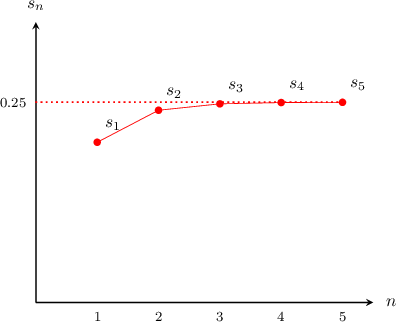

# Convergent and Divergent Infinite Series

Source: https://www.mathacademy.com/topics/982?courseId=21
Topic ID: 982

## Prerequisites

- [Piecewise Functions](../algebra-i/165-piecewise-functions.md)
- [Infinite Series and Partial Sums](./981-infinite-series-and-partial-sums.md)
- [Convergence of Geometric Sequences](./1088-convergence-of-geometric-sequences.md)

## Lesson

### Introduction

Consider the infinite series $\displaystyle\sum_{n=1}^\infty \frac{1}{5^n}.$ The first five partial sums of this series are:

$$

\begin{aligned}𝑠_{1} & =0.2 \\ 𝑠_{2} & =0.24 \\ 𝑠_{3} & =0.248 \\ 𝑠_{4} & =0.2496 \\ 𝑠_{5} & =0.24992\end{aligned}

$$

Let's plot these values on a graph of $s_n$ versus $n.$

Looking at the graph above, it appears as though

$$

\lim_{n\to\infty} s_n = 0.25.

$$

Although we haven't shown it rigorously, the above statement is indeed true. We say that **the limit of the sequence of partial sums** is equal to $0.25,$ and we write

$$

\sum_{n=1}^\infty \frac{1}{5^n} = 0.25.

$$

In general, if the limit of the partial sums of a series $\displaystyle\sum_{n=1}^\infty a_n$ is some finite number $S,$ i.e.,

$$

\lim_{n\to\infty} s_n = S

$$

then we say that the infinite series is **convergent** and that it **converges** to $S.$ We also write

$$

\sum_{n=1}^\infty a_n = S.

$$

On the other hand, if the limit does not exist or is infinite, we say that the series is **divergent**.

### Example: Determining Whether a Constant Infinite Series Converges or Diverges

#### Question

Consider the series $\displaystyle\sum_{n=1}^\infty 2.$ Does it converge or diverge? If it converges, what is the sum of the series?

#### Explanation

Let's compute the first few partial sums:

$$

\begin{aligned}𝑠_{1} & =2 \\ 𝑠_{2} & =2+2=2⋅2 \\ 𝑠_{3} & =2+2+2=2⋅3 \\ 𝑠_{4} & =2+2+2+2=2⋅4.\end{aligned}

$$

Looking at the sequence of partial sums, we can see that the formula for the $n$th partial sum is

$$

s_n=2n.

$$

The sequence of partial sums is divergent:

$$

\lim\limits_{n\to \infty} s_n = \lim\limits_{n\to \infty} 2n = \infty

$$

Therefore, the series $\displaystyle\sum_{n=1}^\infty 2$ is also divergent.

### Example: Determining Whether an Oscillating Infinite Series Converges or Diverges

#### Question

Consider the series $\displaystyle\sum_{n=1}^\infty 2(-1)^n.$ Does it converge or diverge? If it converges, what is the sum of the series?

#### Explanation

Let's compute the first few partial sums:

$$

\begin{aligned}𝑠_{1} & =2(−1)^{1}=−2 \\ 𝑠_{2} & =𝑠_{1}+2(−1)^{2}=−2+2=0 \\ 𝑠_{3} & =𝑠_{2}+2(−1)^{3}=0−2=−2 \\ 𝑠_{4} & =𝑠_{3}++2(−1)^{4}=−2+2=0\end{aligned}

$$

From the above, we can see that the sequence of partial sums oscillates between $-2$ and $0$ forever.

So the limit of the sequence of partial sums does not exist, and therefore the series is divergent.

### Example: Determining Whether a Piecewise Infinite Series Converges or Diverges

#### Question

Given that the sequence $a_n$ is defined by

$$

\begin{aligned}1,\,𝑛=1 \\ 0,\,𝑛≥2,\end{aligned}

$$

does $\displaystyle \sum_{n=1}^\infty a_n$ converge or diverge? If it converges, what is the sum of the series?

#### Explanation

Let's compute the first few partial sums:

$$

\begin{aligned}𝑠_{1} & =1 \\ 𝑠_{2} & =𝑠_{1}+0=1+0=1 \\ 𝑠_{3} & =𝑠_{2}+0=1+0=1 \\ 𝑠_{4} & =𝑠_{3}+0=1+0=1\end{aligned}

$$

Looking at the sequence of partial sums, we can see that the formula for the $n$th partial sum is

$$

s_n=1.

$$

Therefore, we have

$$

\lim\limits_{n \to \infty} s_n = 1,

$$

which means that

$$

\sum_{n=1}^\infty a_n = 1.

$$

We conclude that the series $\displaystyle \sum\limits_{n=1}^\infty a_n$ is convergent and it converges to $1.$

### Example: Determining Whether an Infinite Arithmetic Series Converges or Diverges

#### Question

Consider the series $\displaystyle\sum_{n=1}^\infty n.$ Does it converge or diverge? If it converges, what is the sum of the series?

#### Explanation

The given series is an arithmetic series. Its first term is

$$

a_1 = 1,

$$

and its $n$th term is

$$

a_n=n.

$$

Using the formula for the sum of an arithmetic series, we get the following formula for the $n$th partial sum:

$$

\begin{aligned}𝑠_{𝑛}=\frac{𝑛}{2}(𝑎_{1}+𝑎_{𝑛}) & =\frac{𝑛(𝑛+1)}{2}.\end{aligned}

$$

Taking the limit of the partial sums, we get

$$

\begin{aligned}\underset{𝑛→∞}{lim}𝑠_{𝑛} & =\underset{𝑛→∞}{lim}\frac{𝑛(𝑛+1)}{2} \\ & =\underset{𝑛→∞}{lim}\frac{𝑛^{2}+𝑛}{2} \\ & =\frac{1}{2}\underset{𝑛→∞}{lim}(𝑛^{2}+𝑛) \\ & =\frac{1}{2}(\underset{𝑛→∞}{lim}𝑛^{2}+\underset{𝑛→∞}{lim}𝑛) \\ & =\frac{1}{2}(∞+∞) \\ & =∞.\end{aligned}

$$

Therefore, since the limit of the sequence of partial sums is infinite, the series is divergent.
