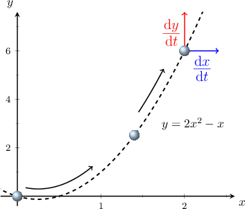

# Introduction to Related Rates

Source: https://www.mathacademy.com/topics/1044?courseId=105
Topic ID: 1044

## Prerequisites

- [Implicit Differentiation](./57-implicit-differentiation.md)
- [Calculating Velocity for Straight-Line Motion Using Differentiation](./284-calculating-velocity-for-straight-line-motion-using-differentiation.md)
- [Rates of Change in Applied Contexts](./620-rates-of-change-in-applied-contexts.md)

## Lesson

### Introduction

Consider a marble moving in a horizontal plane along the curve $y=2x^2-x,$ as shown below.

Let $x$ and $y$ be the coordinates of the marble's position at time $t.$ Since the $x$- and $y$-coordinates of the marble's position change with time, we can write

$$

x = x(t),\qquad y=y(t).

$$

Note that

- the velocity of the marble in the $x$-direction is $\dfrac{\textrm d x}{\textrm d t},$ and

- the velocity of the marble in the $y$-direction is $\dfrac{\textrm d y}{\textrm d t}.$

These velocities are said to be **related rates** because if we know one, we can easily compute the other.

For example, suppose we know that $\dfrac{\textrm d x}{\textrm d t}=3$ when $x=2.$ Let's use this information to compute $\dfrac{\textrm d y}{\textrm d t}$ at this point.

To calculate $\dfrac{\textrm d y}{\textrm d t},$ we start with the equation

$$

y=2x^2-x.

$$

Then, we differentiate both sides with respect to $t.$ This gives

$$

\begin{aligned}\frac{d}{d𝑡}(𝑦) & =\frac{d}{d𝑡}(2𝑥^{2}−𝑥) \\ \frac{d𝑦}{d𝑡} & =\frac{d}{d𝑡}(2𝑥^{2}−𝑥).\end{aligned}

$$

Now, note the following:

- We cannot explicitly differentiate the right-hand side with respect to $t$ because it's written as a function of $x$ only.

- To get around this problem, we use implicit differentiation: We differentiate the right-hand side with respect to $x,$ and then multiply the result by $\dfrac{\textrm d x}{\textrm d t}.$

By doing this, we get

$$

\begin{aligned}\frac{d𝑦}{d𝑡} & =\frac{d}{d𝑡}(2𝑥^{2}−𝑥) \\ & =\frac{d𝑥}{d𝑡}⋅\frac{d}{d𝑥}(2𝑥^{2}−𝑥) \\ & =\frac{d𝑥}{d𝑡}⋅(4𝑥−1).\end{aligned}

$$

Now, we substitute the given information

$$

\dfrac{\textrm d x}{\textrm d t}=3, \qquad x=2,

$$

and we get

$$

\begin{aligned}\frac{d𝑦}{d𝑡} & =3⋅(4⋅2−1)=21.\end{aligned}

$$

### Example: Determining a Rate of Change Given a Related Rate and an Explicit Function

#### Question

Given that $y=x^3+e^x$ for $x=x(t),$ and that $\dfrac{\textrm d y}{\textrm d t}=2$ at the point where $x=1,$ find $\dfrac{\textrm d x}{\textrm d t}.$

#### Explanation

Differentiating the given relation with respect to $t$ using implicit differentiation, we get

$$

\begin{aligned}𝑦 & =𝑥^{3}+𝑒^{𝑥} \\ \frac{d}{d𝑡}(𝑦) & =\frac{d}{d𝑡}(𝑥^{3}+𝑒^{𝑥}) \\ \frac{d𝑦}{d𝑡} & =\frac{d𝑥}{d𝑡}⋅\frac{d}{d𝑥}(𝑥^{3}+𝑒^{𝑥}) \\ \frac{d𝑦}{d𝑡} & =\frac{d𝑥}{d𝑡}⋅(3𝑥^{2}+𝑒^{𝑥}).\end{aligned}

$$

Now we can substitute the given information $\dfrac{\textrm d y}{\textrm d t}=2$ and $x=1,$ and solve for $\dfrac{\textrm d x}{\textrm d t}.$ We get

$$

\begin{aligned}2 & =\frac{d𝑥}{d𝑡}⋅(3⋅1^{2}+𝑒^{1}) \\ 2 & =\frac{d𝑥}{d𝑡}⋅(3+𝑒) \\ \frac{d𝑥}{d𝑡} & =\frac{2}{3+𝑒}.\end{aligned}

$$

### Example: Determining an Angular Rate Given a Related Rate

#### Question

Given that $r=\sin\theta$ for $\theta = \theta(t),$ and that $\dfrac{\textrm d r}{\textrm d t}=\sqrt{2}$ at the point where $\theta=\dfrac{\pi}{4},$ find $\dfrac{\textrm d \theta}{\textrm d t}.$

#### Explanation

Differentiating the given relation with respect to $t$ using implicit differentiation, we get

$$

\begin{aligned}𝑟 & =sin⁡𝜃 \\ \frac{d}{d𝑡}(𝑟) & =\frac{d}{d𝑡}(sin⁡𝜃) \\ \frac{d𝑟}{d𝑡} & =\frac{d𝜃}{d𝑡}⋅\frac{d}{d𝜃}(sin⁡𝜃) \\ \frac{d𝑟}{d𝑡} & =\frac{d𝜃}{d𝑡}⋅cos⁡𝜃.\end{aligned}

$$

Now we can substitute the given information $\dfrac{\textrm d r}{\textrm d t}=\sqrt{2}$ and $\theta=\dfrac{\pi}{4},$ and solve for $\dfrac{\textrm d \theta}{\textrm d t}.$ We get

$$

\begin{aligned}\frac{d𝑟}{d𝑡} & =\frac{d𝜃}{d𝑡}⋅cos⁡𝜃 \\ \sqrt{√2} & =\frac{d𝜃}{d𝑡}⋅cos⁡(\frac{𝜋}{4}) \\ \sqrt{√2} & =\frac{d𝜃}{d𝑡}⋅\frac{\sqrt{√2}}{2} \\ \frac{d𝜃}{d𝑡} & =\sqrt{√2}⋅\frac{2}{\sqrt{√2}} \\ \frac{d𝜃}{d𝑡} & =2.\end{aligned}

$$

### Example: Determining the Rate of Change of an XY-Coordinate

#### Question

A particle $P$ is moving along the curve $y=x+e^x$ such that the $x$-coordinate of $P$ is changing at the rate of $2 \,\textrm{cm}/\textrm{s}.$ Find the rate of change of the $y$-coordinate when $x=5\,\textrm{cm}.$

#### Explanation

Differentiating the given relation with respect to $t$ using implicit differentiation, we get

$$

\begin{aligned}𝑦 & =𝑥+𝑒^{𝑥} \\ \frac{d}{d𝑡}(𝑦) & =\frac{d}{d𝑡}(𝑥+𝑒^{𝑥}) \\ \frac{d𝑦}{d𝑡} & =\frac{d𝑥}{d𝑡}⋅\frac{d}{d𝑥}(𝑥+𝑒^{𝑥}) \\ \frac{d𝑦}{d𝑡} & =\frac{d𝑥}{d𝑡}⋅(1+𝑒^{𝑥}).\end{aligned}

$$

Now, we can substitute the given information $\dfrac{\textrm d x}{\textrm d t}=2 \,\textrm{cm}/\textrm{s}$ and $x=5$ and get

$$

\begin{aligned}\frac{d𝑦}{d𝑡} & =2(1+𝑒^{5})\,cm/s.\end{aligned}

$$
