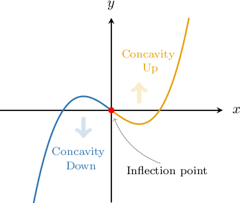
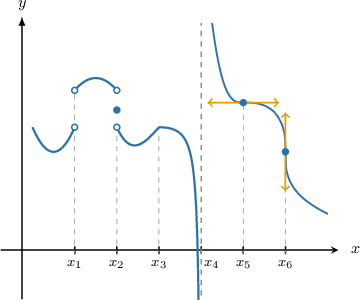
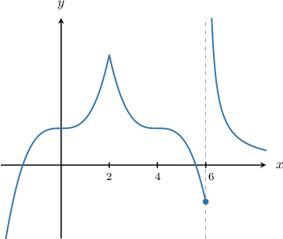
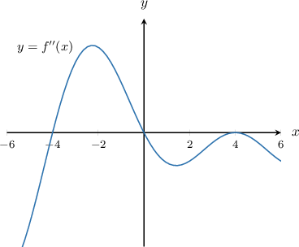

# Points of Inflection

Source: https://www.mathacademy.com/topics/1046?courseId=105
Topic ID: 1046

## Prerequisites

- [Relating Concavity to the Second Derivative](./3846-relating-concavity-to-the-second-derivative.md)

## Lesson

### Introduction

A **point of inflection** of a function $f(x)$ is a point $P$ that lies on $f(x)$ such that

- the function's concavity changes sign at $P$, and

- the tangent line to the graph of $y=f(x)$ exists at $P$.

For example, let's have a look at a plot of $f(x) = x^3-x,$ shown below.

The point $x=0$ is a point of inflection of $f(x)\mathbin{:}$

- The curve is concave down on $(-\infty, 0)$ and concave up on $(0,\infty).$ So, the function's concavity changes sign at this point.

- The function $f(x) = x^3-x$ is differentiable at $x=0.$ So, the tangent line to the graph of $y=f(x)$ exists at this point.

### Some Particular Cases

It's important to note that a change in concavity about a point $P$ does not guarantee that $P$ is an inflection point. We also require the existence of the tangent line at $P.$

Let's consider some edge cases by considering the graph below.

Which of the points indicated are points of inflection?

Recall that points of inflection are those points where

- the function's concavity changes sign, and

- the tangent line to the graph exists.

With this in mind, we examine our graph using a table to check where these conditions are satisfied:

Notice that the concavity changes at all six points. However, the first four points are *not* inflection points:

- The function is not continuous at $x_1,$ $x_2,$ and $x_4.$ So, we cannot have a tangent line at these points.

- The function is continuous at $x_3,$ but it's not smooth (there is a rapid change in the slope). So, we cannot have a tangent line here either.

The points $x_5$ and $x_6$ *are* inflection points:

- The tangent line clearly exists at $x_5.$

- There is a vertical tangent at $x_6.$ Since the tangent exists, $x_6$ is an inflection point.

### Example: Identifying Points of Inflection From the Graph of a Function

#### Question

Consider the function $y = f(x)$ below, defined on $x\in(-2,8).$ At what value(s) of $x$ does $f(x)$ have a point of inflection?

#### Explanation

The points of inflection are the points where

- the function's concavity changes sign, and

- the tangent line to the graph exists.

With that in mind, let's examine our graph.

- The point $x=0$ is a point of inflection. Indeed: the graph changes concavity from concave down to concave up at $x=0,$ and the tangent line exists at this point.

- The point $x=2$ is ** a point of inflection for two reasons. First, the function does not change concavity. It's concave up both to the left and to the right of $x=2.$ Second, the tangent line does not exist at this point.

- The point $x=4$ is a point of inflection. Indeed: the graph changes concavity from concave up to concave down at $x=4,$ and the tangent line exists at this point.

- The point $x=6$ is ** a point of inflection. Although the graph changes concavity from concave down to concave up at $x = 6,$ the tangent line does not exist at this point.

Therefore, the points of inflection are $x=0$ and $x=4$ only.

### Example: Identifying Points of Inflection From the Graph of the Second Derivative of a Function

#### Question

The function $f(x)$ is twice-differentiable for all $x.$ The graph $y = f''(x)$ is shown below. At what value(s) of $x$ does $f(x)$ have a point of inflection?

#### Explanation

First, notice that since $f(x)$ is twice-differentiable, the tangent line to the graph exists for all real $x.$

Inflection points occur when a graph changes concavity. In order for the graph to change concavity, the value of the second derivative $f''(x)$ must switch sign. So, we are looking for points where the graph of $f''(x)$ crosses the $x$-axis.

We can see that the graph $y=f''(x)$ crosses the $x$-axis at $x = -4$ and $x=0.$

Therefore, $f(x)$ has points of inflection at $x=-4$ and $x=0.$

### Calculating Points of Inflection Using Differentiation

If a function $f(x)$ has an inflection point $P,$ and $f''(x)$ exists at $P,$ then we must have $f''(x) = 0$ at $P.$

Therefore, we can determine possible points of inflection by solving the equation

$$

f''(x) =0.

$$

However, we must be sure to check that the concavity does indeed change at whatever points we find.

Let's see some examples.

### Example: Finding Points of Inflection Using Differentiation

#### Question

Find the $x$-coordinates of all points of inflection (if any) for $f(x) = x^3 + 9x^2 + 24 x + 22.$

#### Explanation

For continuous, twice-differentiable functions, we can determine possible points of inflection by solving the equation $f''(x) =0.$ However, we must be sure to check that the concavity does indeed change at whatever points we find.

First, we calculate the second derivative:

$$

\begin{aligned} f(x) & = x^3 + 9x^2 + 24 x + 22\\f'(x) & = 3x^2 + 18x + 24 \\f''(x) & = 6x + 18 \end{aligned}

$$

Next, we solve $f''(x) = 0,$ and get

$$

\begin{aligned} 6x+ 18 &= 0\\6x &= -18\\x &= -3. \end{aligned}

$$

Finally, we need to check that the concavity changes at $x=-3.$ So we pick two points around it, say, $x=-4$ and $x=-2$, and compute the sign of $f''(x)\mathbin{:}$

$$

\begin{aligned}𝑓^{″}(−4) & =6(−4)+18=−6<0 \\ 𝑓^{″}(−2) & =6(−2)+18=6>0\end{aligned}

$$

Therefore, since the concavity changes at $x=-3,$ we conclude that $x=-3$ is indeed a point of inflection.

### Example: Finding Points of Inflection Using Differentiation When Some Points Must Be Discarded

#### Question

Find the $x$-coordinate of all points of inflection for $f(x) = x^4 - 4x^3 + 6 x^2.$

#### Explanation

For continuous, twice-differentiable functions, we can determine possible points of inflection by solving the equation $f''(x) =0.$ However, we must be sure to check that the concavity does indeed change at whatever points we find.

First, we calculate the second derivative:

$$

\begin{aligned}𝑓(𝑥) & =𝑥^{4}−4𝑥^{3}+6𝑥^{2} \\ 𝑓^{′}(𝑥) & =4𝑥^{3}−12𝑥^{2}+12𝑥 \\ 𝑓^{″}(𝑥) & =12𝑥^{2}−24𝑥+12.\end{aligned}

$$

Next, we solve $f''(x) = 0,$ and get

$$

\begin{aligned}12𝑥^{2}−24𝑥+12 & =0 \\ 𝑥^{2}−2𝑥+1 & =0 \\ (𝑥−1)^{2} & =0 \\ 𝑥 & =1.\end{aligned}

$$

Finally, we need to check that the concavity changes at $x=1.$ So we pick two points around it, say,

$\qquad$ $x=0 \quad$ and $\quad x=2,$

and compute the sign of $f''(x)\mathbin{:}$

$$

\begin{aligned}𝑓^{″}(0) & =12(0)^{2}−24(0)+12=12>0 \\ 𝑓^{″}(2) & =12(2)^{2}−24(2)+12=12>0\end{aligned}

$$

Therefore, since the concavity does ** change at $x=1,$ we conclude that $x=1$ is ** a point of inflection.
