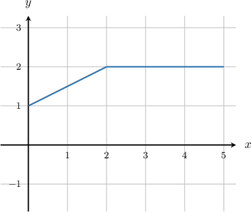
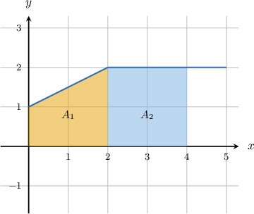
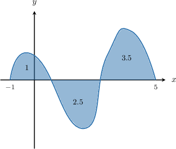
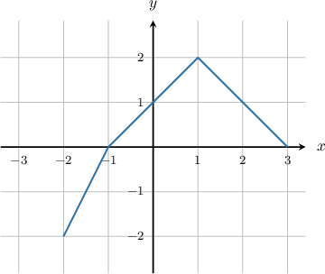

# Calculating the Definite Integral of a Function's Derivative Given its Graph

Source: https://www.mathacademy.com/topics/1201?courseId=105
Topic ID: 1201

## Prerequisites

- [Calculating the Definite Integral of a Function Given Its Graph](./1200-calculating-the-definite-integral-of-a-function-given-its-graph.md)

## Lesson

### Introduction

Suppose the function $f(x)$ is defined and differentiable on the interval $[0,5].$ The graph of $y=f'(x),$ which consists of two line segments, is shown below. Additionally, we know that ${f(0)=2}.$ How can we find, for example, the value of $f(4)?$

The fundamental theorem of calculus states that

$$

\int_{0}^{4} f'(x) \: \textrm{d}x = f(4) - f(0),

$$

and we know that $f(0)=2,$ so we can find $f(4)$ if we can figure out the value of the integral.

Remember that the integral represents the signed area between the curve and the $x$-axis. To compute the area under the curve, let's split up the integral into two integrals which represent areas that are easier to compute:

$$

\int_{0}^{4} f'(x)\: \textrm{d}x = \underbrace{\int_{0}^{2} f'(x)\: \textrm{d}x}_{A_1} + \underbrace{\int_{2}^{4} f'(x)\: \textrm{d}x}_{A_2}.

$$

The two corresponding areas $A_1$ and $A_2$ shown in the graph below:

The $1$st integral represents the signed area between the curve and the $x$-axis, where $x \in [0,2].$ The corresponding region is a trapezoid, so we find the area using the formula

$$

\begin{aligned}𝐴_{1} & =\frac{1}{2}(𝑎+𝑏)ℎ \\ & =\frac{1}{2}⋅(1+2)⋅2 \\ & =3.\end{aligned}

$$

The $2$nd integral represents the signed area between the curve and the $x$-axis, where $x \in [2,4].$ The corresponding region is a rectangle, so we find the area using the formula

$$

\begin{aligned}𝐴_{2} & =𝑎𝑏 \\ & =2⋅2 \\ & =4.\end{aligned}

$$

So, the value of the original integral is

$$

\begin{aligned}∫_{40}^{}𝑓^{′}(𝑥)\,d𝑥 & =𝐴_{1}+𝐴_{2} \\ & =3+4 \\ & =7.\end{aligned}

$$

Finally, using the value above and the fact that $f(0)=2,$ we get

$$

\begin{aligned}∫_{40}^{}𝑓^{′}(𝑥)\,d𝑥 & =𝑓(4)−𝑓(0) \\ 7 & =𝑓(4)−2 \\ 𝑓(4) & =9.\end{aligned}

$$

### Example: Finding the Value of a Function Given a Graph With Labeled Areas

#### Question

The function $f(x)$ is defined and differentiable on the interval $[-1,5].$ The graph of $y=f'(x)$ is shown below, where the areas of the regions between the graph and the $x$-axis are $1,$ $2.5,$ and $3.5$ respectively (from left to right). Find $f(-1)$ if ${f(5)=-2}.$

#### Explanation

From the fundamental theorem of calculus, we find that

$$

\begin{aligned}∫_{5−1}^{}𝑓^{′}(𝑥)\,d𝑥 & =𝑓(5)−𝑓(−1) \\ ∫_{5−1}^{}𝑓^{′}(𝑥)\,d𝑥 & =−2−𝑓(−1) \\ 𝑓(−1) & =−2−∫_{5−1}^{}𝑓^{′}(𝑥)\,d𝑥.\end{aligned}

$$

Now, remember that the integral represents the signed area between the curve and the $x$-axis, where we take the area as negative if the curve lies below the $x$-axis. So, using the labels on the graph, the integral is

$$

\int_{-1}^{5} f'(x)\: \textrm{d}x = 1 +(- 2.5) + 3.5 = 2.

$$

Finally, using the value of the integral, we can find $f(-1)\mathbin{:}$

$$

\begin{aligned}𝑓(−1) & =−2−∫_{5−1}^{}𝑓^{′}(𝑥)\,d𝑥 \\ & =−2−2 \\ & =−4.\end{aligned}

$$

### Example: Finding the Value of a Function Given a Graph Without Labeled Areas

#### Question

The function $f(x)$ is defined and differentiable on the interval $[-2,3].$ The graph of $y=f'(x)$ is shown below. It consists of three line segments. Find $f(0)$ if ${f(2)=3}.$

#### Explanation

The fundamental theorem of calculus states that

$$

\int_{0}^{2} f'(x) \: \textrm{d}x = f(2) - f(0),

$$

and we know that $f(2)=3,$ so we can find $f(0)$ if we can figure out the value of the integral.

Remember that the integral represents the signed area between the curve and the $x$-axis. To compute the area under the curve, let's split up the integral into two integrals which represent areas that are easier to compute:

$$

\int_{0}^{2} f'(x)\: \textrm{d}x = \underbrace{\int_{0}^{1} f'(x)\: \textrm{d}x}_{A_1} + \underbrace{\int_{1}^{2} f'(x)\: \textrm{d}x}_{A_2}.

$$

The $1$st integral represents the signed area between the curve and the $x$-axis, where $x \in [0,1].$ The corresponding region is a trapezoid, so we find the area using the formula

$$

\begin{aligned}𝐴_{1} & =\frac{1}{2}(𝑎+𝑏)ℎ \\ & =\frac{1}{2}⋅(1+2)⋅1 \\ & =\frac{3}{2}.\end{aligned}

$$

The $2$nd integral represents the signed area between the curve and the $x$-axis, where $x \in [1,2].$ The corresponding region is a trapezoid, so we find the area using the formula

$$

\begin{aligned}𝐴_{2} & =\frac{1}{2}(𝑎+𝑏)ℎ \\ & =\frac{1}{2}⋅(1+2)⋅1 \\ & =\frac{3}{2}.\end{aligned}

$$

So, the value of the original integral is

$$

\begin{aligned}∫_{20}^{}𝑓^{′}(𝑥)\,d𝑥 & =𝐴_{1}+𝐴_{2} \\ & =\frac{3}{2}+\frac{3}{2} \\ & =3.\end{aligned}

$$

Finally, using the value above and the fact that $f(2)=3,$ we get

$$

\begin{aligned}3 & =𝑓(2)−𝑓(0) \\ 3 & =3−𝑓(0) \\ 𝑓(0) & =0.\end{aligned}

$$
