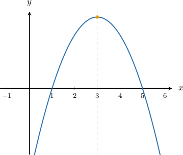
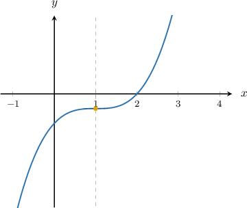
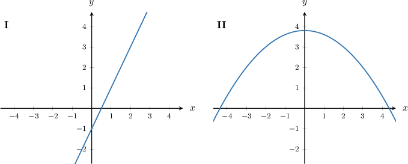
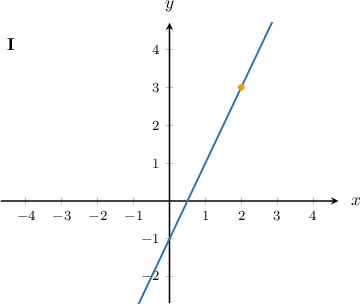
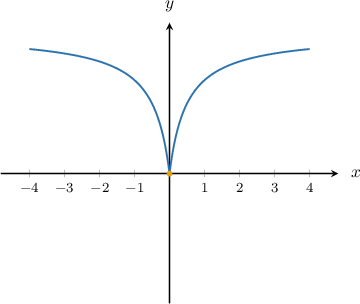

# Sketching a Function Given Some Derivative Properties

Source: https://www.mathacademy.com/topics/1207?courseId=105
Topic ID: 1207

## Prerequisites

- [Using the First Derivative Test to Classify Local Extrema](./1360-using-the-first-derivative-test-to-classify-local-extrema.md)
- [Relating Concavity to the Second Derivative](./3846-relating-concavity-to-the-second-derivative.md)

## Lesson

### Introduction

Suppose we want to sketch a possible graph of a function $f(x)$ that satisfies the following conditions:

- $f'(3)=0$

- if $x \in (-\infty,3)$ then $f'(x)> 0$

- if $x \in (3,+\infty)$ then $f'(x)<0$

- $f''(x) < 0$ for all $x \in (-\infty,\infty)$

We summarize all the given information in the following table:

Now, let's sketch our graph:

- We draw a point on the vertical line $x=3$, where the tangent to the graph is horizontal.

- Since $x=3$ is a local maximum, the graph must go down to the left and to the right of that point.

- Finally, the graph must be concave down everywhere.

Therefore, a possible graph of $f$ is as follows:

### Example: Sketching the Graph of a Smooth Function With One Critical Point Given Some Derivative Properties

#### Question

Sketch a possible graph of the function $f(x)$ that satisfies the conditions below.

- $f'(1)=f''(1)=0$

- $f'(x) \geq 0$ for all $x \in (-\infty,\infty)$

- if $x \in (-\infty,1)$ then $f''(x) < 0$

- if $x \in (1,\infty)$ then $f''(x) > 0$

#### Explanation

We summarize all the given information in the following table:

Now, let's sketch our graph:

- We draw a point on the vertical line $x=1$, where the tangent to the graph is horizontal.

- The graph must go down to the left of $x=1$ and go up to the right of that point.

- Finally, the graph must be concave down on $(-\infty,1)$ and concave up on $(1,\infty).$

Therefore, a possible graph of $f$ could be as follows:

### Example: Identifying the Graph of a Smooth Function Given Some Derivative Properties

#### Question

Which of the following could be the graph of the function $f(x)$ that satisfies the conditions below?

- $f'(x) > 0$ for all $x \in (-\infty,\infty)$

- $f(2) = 3$

#### Explanation

We summarize all the given information in the following table:

This gives us the following information about the graph of $f\mathbin{:}$

So, we can conclude that

- the graph of $y=f(x)$ must pass through the point $(2,3),$ and

- $f(x)$ is increasing on $(-\infty,\infty).$

With that in mind, let's examine each graph:

Therefore, a possible graph of $f$ is as follows:

### Example: Sketching a Continuous Function Given Some Derivative Properties

#### Question

Sketch a possible graph of the continuous function $f(x)$ that satisfies the conditions below.

- $f'(x)$ and $f''(x)$ are undefined at $x=0$

- if $x \in (-\infty,0)$ then $f'(x)<0$ and if $x \in (0,\infty)$ then $f'(x)>0$

- $f''(x)<0$ for all $x \in (-\infty,0)\cup(0,\infty)$

#### Explanation

First, we summarize all the given information in the following table:

Now, let's sketch our graph:

- We draw a point on the vertical line $x=0$, where the derivative is undefined.

- Since $x=0$ is a local minimum, the graph must go up to the left and to the right of that point.

- The graph must be concave down on $(-\infty,0) \cup (0,\infty).$

- Finally, we are told that the function is continuous.

Therefore, a possible graph of $f$ could be as follows:

